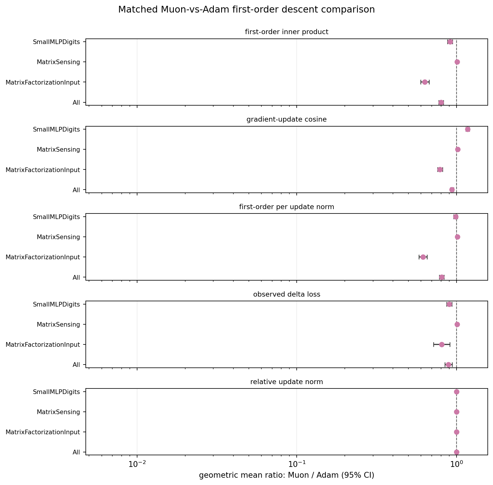
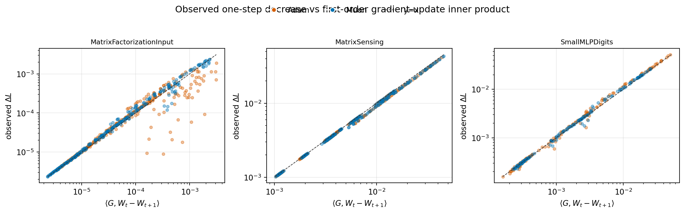
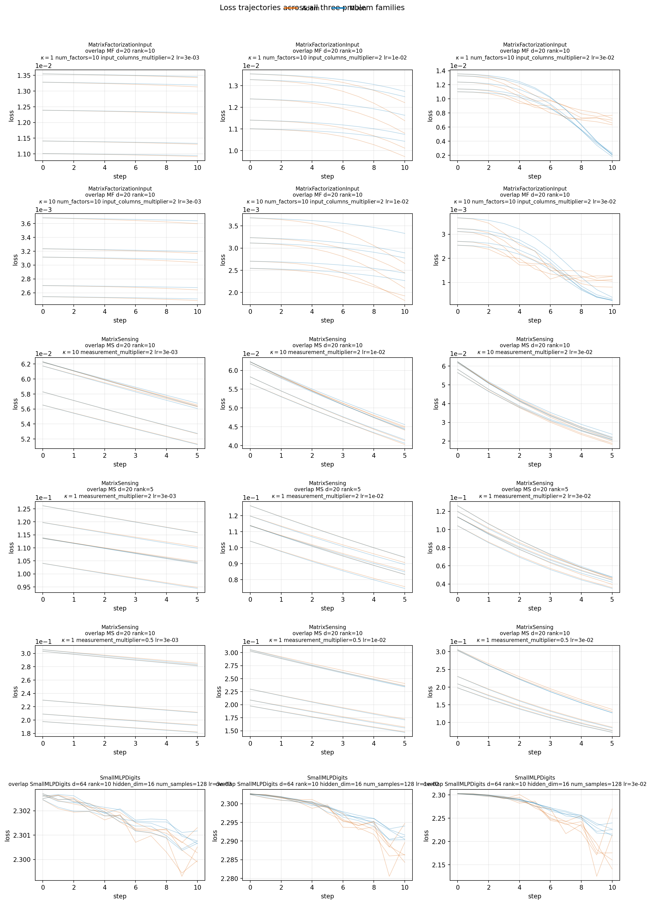

# E11 Overlap Follow-Up

## Purpose

This follow-up runs a small set of settings selected from the initial-geometry overlap scan. The goal is to test Muon-vs-Adam one-step progress in settings whose spectral diagnostics are closer to the existing global support, rather than only extrapolating between the original separated families.

All runs use the equal-update control: Adam and Muon start from matched initialization, propose their own update direction, and are rescaled to the same global relative update norm at each step.

## Selected Settings

- MF-with-input: `d=20`, `rank=10`, 10 factors, `input_columns_multiplier=2`, `kappa in {1, 10}`.
- Matrix Sensing: `d=20`, selected rank/measurement settings from the scan.
- Small MLP digits: `hidden_dim=16`, `num_samples=128`.
- Learning rates: `3e-3`, `1e-2`, `3e-2`; seeds: 0 to 4.

## First-Order Pair Comparison

Ratios above 1 mean Muon is larger than Adam in the matched setting/seed/step pair.

Main observed pattern:

- `update_grad_inner`: MatrixFactorizationInput: ratio=0.6332, 95% CI=[0.5954, 0.6733], Muon-higher pairs=29/300.
- `update_grad_inner`: MatrixSensing: ratio=1.008, 95% CI=[1.002, 1.015], Muon-higher pairs=145/225.
- `update_grad_inner`: SmallMLPDigits: ratio=0.9114, 95% CI=[0.8785, 0.9456], Muon-higher pairs=53/150.
- `delta_loss`: MatrixFactorizationInput: ratio=0.8085, 95% CI=[0.7186, 0.9096], Muon-higher pairs=51/300.
- `delta_loss`: MatrixSensing: ratio=1.008, 95% CI=[1.002, 1.014], Muon-higher pairs=145/225.
- `delta_loss`: SmallMLPDigits: ratio=0.8998, 95% CI=[0.866, 0.935], Muon-higher pairs=46/150.

| metric             | problem_family           |   n_pairs |   muon_higher_pairs |   geomean_ratio_muon_over_adam |   ratio_ci95_low |   ratio_ci95_high | ratio_ci95_above_one   |
|:-------------------|:-------------------------|----------:|--------------------:|-------------------------------:|-----------------:|------------------:|:-----------------------|
| delta_loss         | All                      |       675 |                 242 |                         0.8912 |           0.8449 |            0.9401 | False                  |
| delta_loss         | MatrixFactorizationInput |       300 |                  51 |                         0.8085 |           0.7186 |            0.9096 | False                  |
| delta_loss         | MatrixSensing            |       225 |                 145 |                         1.008  |           1.002  |            1.014  | True                   |
| delta_loss         | SmallMLPDigits           |       150 |                  46 |                         0.8998 |           0.866  |            0.935  | False                  |
| update_grad_inner  | All                      |       675 |                 227 |                         0.8017 |           0.7759 |            0.8285 | False                  |
| update_grad_inner  | MatrixFactorizationInput |       300 |                  29 |                         0.6332 |           0.5954 |            0.6733 | False                  |
| update_grad_inner  | MatrixSensing            |       225 |                 145 |                         1.008  |           1.002  |            1.015  | True                   |
| update_grad_inner  | SmallMLPDigits           |       150 |                  53 |                         0.9114 |           0.8785 |            0.9456 | False                  |
| update_grad_cosine | All                      |       675 |                 331 |                         0.9376 |           0.9179 |            0.9578 | False                  |
| update_grad_cosine | MatrixFactorizationInput |       300 |                  36 |                         0.7886 |           0.7602 |            0.8181 | False                  |
| update_grad_cosine | MatrixSensing            |       225 |                 166 |                         1.017  |           1.011  |            1.022  | True                   |
| update_grad_cosine | SmallMLPDigits           |       150 |                 129 |                         1.174  |           1.144  |            1.205  | True                   |

## First-Order Calibration

| group                    |   points |   positive_points |   spearman_delta_vs_first_order |   spearman_ci95_low |   spearman_ci95_high |   within_factor_2 |
|:-------------------------|---------:|------------------:|--------------------------------:|--------------------:|---------------------:|------------------:|
| All                      |     1350 |              1338 |                          0.9862 |              0.9846 |               0.9876 |            0.9731 |
| MatrixFactorizationInput |      600 |               588 |                          0.9038 |              0.888  |               0.9175 |            0.9388 |
| MatrixSensing            |      450 |               450 |                          0.9992 |              0.9991 |               0.9993 |            1      |
| SmallMLPDigits           |      300 |               300 |                          0.9978 |              0.9972 |               0.9982 |            1      |
| Adam                     |      675 |               663 |                          0.974  |              0.9698 |               0.9776 |            0.9517 |
| Muon                     |      675 |               675 |                          0.9987 |              0.9985 |               0.9989 |            0.9941 |

## Performance Context

| problem_family           | setting                                                                             | algo   |   runs |   median_final_loss |   median_recovery |   median_delta_loss |   median_nrG |   median_stA |   median_condition_score |
|:-------------------------|:------------------------------------------------------------------------------------|:-------|-------:|--------------------:|------------------:|--------------------:|-------------:|-------------:|-------------------------:|
| MatrixFactorizationInput | overlap MF d=20 rank=10 kappa=1 num_factors=10 input_columns_multiplier=2 lr=1e-02  | Adam   |      5 |           0.01081   |            0.9664 |           0.0001209 |        2.611 |        2.239 |                  1.5     |
| MatrixFactorizationInput | overlap MF d=20 rank=10 kappa=1 num_factors=10 input_columns_multiplier=2 lr=1e-02  | Muon   |      5 |           0.01163   |            0.9769 |           6.022e-05 |        7.123 |        5.009 |                  1.433   |
| MatrixFactorizationInput | overlap MF d=20 rank=10 kappa=1 num_factors=10 input_columns_multiplier=2 lr=3e-02  | Adam   |      5 |           0.006986  |            0.8548 |           0.0004805 |        3.288 |        3.017 |                  1.511   |
| MatrixFactorizationInput | overlap MF d=20 rank=10 kappa=1 num_factors=10 input_columns_multiplier=2 lr=3e-02  | Muon   |      5 |           0.002068  |            0.5546 |           0.0009193 |        6.398 |        5.17  |                  1.242   |
| MatrixFactorizationInput | overlap MF d=20 rank=10 kappa=1 num_factors=10 input_columns_multiplier=2 lr=3e-03  | Adam   |      5 |           0.01227   |            0.9969 |           1.079e-05 |        3.914 |        3.048 |                  1.44    |
| MatrixFactorizationInput | overlap MF d=20 rank=10 kappa=1 num_factors=10 input_columns_multiplier=2 lr=3e-03  | Muon   |      5 |           0.01231   |            0.9975 |           7.639e-06 |        6.119 |        4.394 |                  1.394   |
| MatrixFactorizationInput | overlap MF d=20 rank=10 kappa=10 num_factors=10 input_columns_multiplier=2 lr=1e-02 | Adam   |      5 |           0.002098  |            0.8993 |           7.69e-05  |        2.482 |        2.062 |                  1.34    |
| MatrixFactorizationInput | overlap MF d=20 rank=10 kappa=10 num_factors=10 input_columns_multiplier=2 lr=1e-02 | Muon   |      5 |           0.002776  |            0.9613 |           2.664e-05 |        4.75  |        5.013 |                  1.006   |
| MatrixFactorizationInput | overlap MF d=20 rank=10 kappa=10 num_factors=10 input_columns_multiplier=2 lr=3e-02 | Adam   |      5 |           0.001121  |            0.6742 |           0.0001357 |        2.84  |        2.736 |                  1.191   |
| MatrixFactorizationInput | overlap MF d=20 rank=10 kappa=10 num_factors=10 input_columns_multiplier=2 lr=3e-02 | Muon   |      5 |           0.0002636 |            0.4583 |           0.0002763 |        4.721 |        3.825 |                  1.151   |
| MatrixFactorizationInput | overlap MF d=20 rank=10 kappa=10 num_factors=10 input_columns_multiplier=2 lr=3e-03 | Adam   |      5 |           0.003037  |            0.9922 |           6.364e-06 |        2.836 |        2.788 |                  1.08    |
| MatrixFactorizationInput | overlap MF d=20 rank=10 kappa=10 num_factors=10 input_columns_multiplier=2 lr=3e-03 | Muon   |      5 |           0.003077  |            0.9958 |           3.634e-06 |        4.338 |        4.355 |                  1.026   |
| MatrixSensing            | overlap MS d=20 rank=10 kappa=1 measurement_multiplier=0.5 lr=1e-02                 | Adam   |      5 |           0.1727    |            0.9803 |           0.01143   |       14.5   |       45.68  |                  0.3154  |
| MatrixSensing            | overlap MS d=20 rank=10 kappa=1 measurement_multiplier=0.5 lr=1e-02                 | Muon   |      5 |           0.1709    |            0.9789 |           0.01179   |       14.24  |       45.68  |                  0.3109  |
| MatrixSensing            | overlap MS d=20 rank=10 kappa=1 measurement_multiplier=0.5 lr=3e-02                 | Adam   |      5 |           0.08673   |            0.9426 |           0.02907   |       14.43  |       45.68  |                  0.3139  |
| MatrixSensing            | overlap MS d=20 rank=10 kappa=1 measurement_multiplier=0.5 lr=3e-02                 | Muon   |      5 |           0.08479   |            0.9406 |           0.02961   |       13.66  |       45.68  |                  0.2987  |
| MatrixSensing            | overlap MS d=20 rank=10 kappa=1 measurement_multiplier=0.5 lr=3e-03                 | Adam   |      5 |           0.2117    |            0.9968 |           0.003638  |       14.53  |       45.68  |                  0.3156  |
| MatrixSensing            | overlap MS d=20 rank=10 kappa=1 measurement_multiplier=0.5 lr=3e-03                 | Muon   |      5 |           0.211     |            0.996  |           0.00377   |       14.45  |       45.68  |                  0.3142  |
| MatrixSensing            | overlap MS d=20 rank=10 kappa=10 measurement_multiplier=2 lr=1e-02                  | Adam   |      5 |           0.04411   |            0.9334 |           0.003393  |       12.56  |      100.6   |                  0.124   |
| MatrixSensing            | overlap MS d=20 rank=10 kappa=10 measurement_multiplier=2 lr=1e-02                  | Muon   |      5 |           0.04427   |            0.9536 |           0.003357  |       11.34  |      100.6   |                  0.1126  |
| MatrixSensing            | overlap MS d=20 rank=10 kappa=10 measurement_multiplier=2 lr=3e-02                  | Adam   |      5 |           0.02      |            0.8236 |           0.00791   |       12.14  |      100.6   |                  0.1193  |
| MatrixSensing            | overlap MS d=20 rank=10 kappa=10 measurement_multiplier=2 lr=3e-02                  | Muon   |      5 |           0.02165   |            0.8816 |           0.007552  |        9.091 |      100.6   |                  0.09037 |
| MatrixSensing            | overlap MS d=20 rank=10 kappa=10 measurement_multiplier=2 lr=3e-03                  | Adam   |      5 |           0.05631   |            0.9855 |           0.001118  |       12.73  |      100.6   |                  0.1262  |
| MatrixSensing            | overlap MS d=20 rank=10 kappa=10 measurement_multiplier=2 lr=3e-03                  | Muon   |      5 |           0.05606   |            0.9911 |           0.001113  |       12.39  |      100.6   |                  0.1233  |
| MatrixSensing            | overlap MS d=20 rank=5 kappa=1 measurement_multiplier=2 lr=1e-02                    | Adam   |      5 |           0.08574   |            0.9653 |           0.005969  |       13.6   |       70.46  |                  0.1975  |
| MatrixSensing            | overlap MS d=20 rank=5 kappa=1 measurement_multiplier=2 lr=1e-02                    | Muon   |      5 |           0.08487   |            0.9734 |           0.006061  |       13.05  |       70.46  |                  0.1881  |
| MatrixSensing            | overlap MS d=20 rank=5 kappa=1 measurement_multiplier=2 lr=3e-02                    | Adam   |      5 |           0.04466   |            0.8962 |           0.01462   |       13.37  |       70.46  |                  0.1873  |
| MatrixSensing            | overlap MS d=20 rank=5 kappa=1 measurement_multiplier=2 lr=3e-02                    | Muon   |      5 |           0.04429   |            0.9269 |           0.01413   |       11.55  |       70.46  |                  0.1628  |
| MatrixSensing            | overlap MS d=20 rank=5 kappa=1 measurement_multiplier=2 lr=3e-03                    | Adam   |      5 |           0.1047    |            0.9943 |           0.001879  |       13.73  |       70.46  |                  0.1982  |
| MatrixSensing            | overlap MS d=20 rank=5 kappa=1 measurement_multiplier=2 lr=3e-03                    | Muon   |      5 |           0.1043    |            0.9966 |           0.001956  |       13.55  |       70.46  |                  0.1956  |
| SmallMLPDigits           | overlap SmallMLPDigits d=64 rank=10 hidden_dim=16 num_samples=128 lr=1e-02          | Adam   |      5 |           2.286     |            0.7891 |           0.00192   |        4.122 |        1.296 |                  3.194   |
| SmallMLPDigits           | overlap SmallMLPDigits d=64 rank=10 hidden_dim=16 num_samples=128 lr=1e-02          | Muon   |      5 |           2.291     |            0.4062 |           0.001753  |        5.265 |        1.409 |                  3.73    |
| SmallMLPDigits           | overlap SmallMLPDigits d=64 rank=10 hidden_dim=16 num_samples=128 lr=3e-02          | Adam   |      5 |           2.176     |            0.75   |           0.01542   |        3.841 |        1.276 |                  2.876   |
| SmallMLPDigits           | overlap SmallMLPDigits d=64 rank=10 hidden_dim=16 num_samples=128 lr=3e-02          | Muon   |      5 |           2.226     |            0.3828 |           0.01211   |        5.539 |        1.419 |                  3.859   |
| SmallMLPDigits           | overlap SmallMLPDigits d=64 rank=10 hidden_dim=16 num_samples=128 lr=3e-03          | Adam   |      5 |           2.3       |            0.7422 |           0.0003052 |        4.745 |        1.333 |                  3.627   |
| SmallMLPDigits           | overlap SmallMLPDigits d=64 rank=10 hidden_dim=16 num_samples=128 lr=3e-03          | Muon   |      5 |           2.301     |            0.7109 |           0.0003172 |        5.12  |        1.455 |                  3.531   |

## Current Interpretation

These overlap settings are not meant to replace the main experiment. They are a targeted check of whether the Matrix Sensing advantage persists when the spectral support is pulled toward the other families. The result is mixed but useful: Matrix Sensing still gives Muon a small first-order advantage, SmallMLPDigits becomes Muon-favorable after moving to a smaller hidden layer, and MF-with-input remains Adam-favorable in first-order descent. This suggests the useful predictor is not simply the problem-family label, but also not yet captured by the current rank/spectral features alone.

The key quantity remains `update_grad_inner = <G, W_t-W_(t+1)>`, because it is the direct first-order progress term.
