# result for discussion

## Research Question

Does Muon act as a geometry-shaping optimizer that induces a quantitatively different spectral/rank geometry from Adam? When does that geometry explain one-step loss decrease or actual optimization progress?

For a stricter paper-facing summary of the current claims, evidence, and caveats, see [E11 research synthesis](e11_research_synthesis.md). That generated note is the recommended entry point before using the longer exploratory tables below.

## Experiment Scope

The evidence uses three problem families, treated as parallel experiments rather than primary/auxiliary cases:

1. **MF-with-input:** 10-factor matrix factorization with explicit input matrix, `kappa = 10 ... 1e5`, 5 seeds, 10 steps.
2. **Matrix Sensing:** direct matrix variable, same `kappa` sweep, 5 seeds, 5 steps.
3. **Small torch MLP:** sklearn digits classifier, 5 seeds, 10 steps.

For every trainable matrix or linear layer, \(G_i = \nabla_{W_i}L\). For MF-with-input, \(A_i = W_{i+1}\cdots W_{10}Z\). For Matrix Sensing, `A` is the measurement-operator proxy. The default core settings use noisy mini-batch optimization (`train_batch_size < num_samples`, `noise_std > 0`), while activation diagnostics use the full sampled problem instance. Therefore MF-with-input is the strict theory-aligned activation-product case; the other two are problem-specific spectral diagnostics.

`delta_loss` is recorded as the same-batch pre/post-update decrease: the loss before the optimizer step minus the loss after applying that step, evaluated on the same training batch used for the gradient. This keeps the one-step decrease calibration aligned with `update_grad_inner` rather than with independent mini-batch noise.

The rank quantities are:

$$
nr(G_i)=\frac{\|G_i\|_*^2}{\|G_i\|_F^2},\qquad
sr(A_i)=\frac{\|A_i\|_F^2}{\|A_i\|_{op}^2},\qquad
C_i=\frac{nr(G_i)}{sr(A_i)}.
$$

## Finding 1: Geometry Separation

**Finding:** Muon and Adam occupy measurably different rank-geometry regions in `(nrG, stA)`, but the direction and implication differ by problem family.

**Interpretation:** This supports the geometry-shaping claim more directly than an optimization-superiority claim.

**Reasoning:** Geometry-only separation is visible when paired `Muon - Adam` differences and nearest-centroid balanced accuracy stay away from zero/chance, but performance must be checked separately.

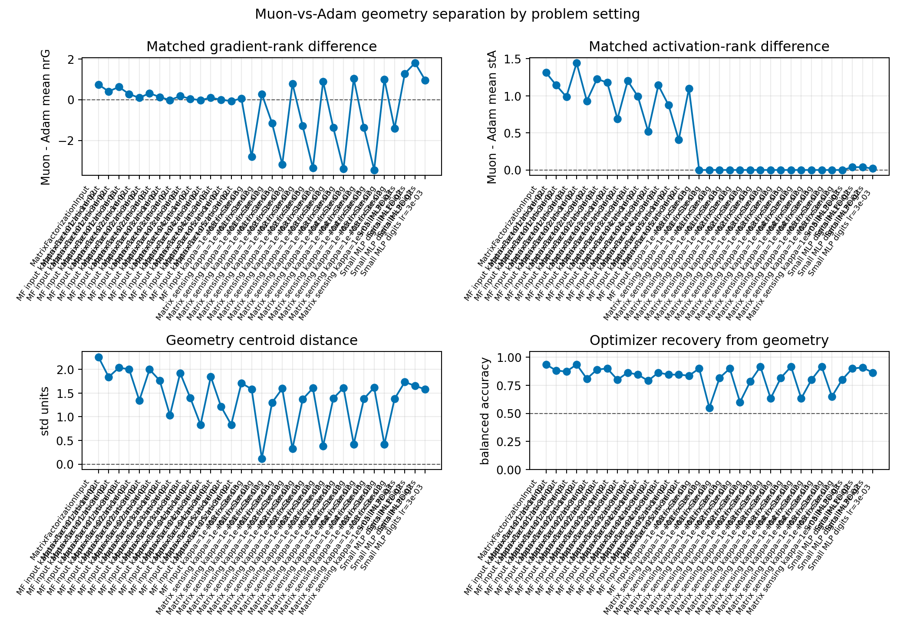

| problem_family | setting | seed_count | mean_delta_nrG | nrG_muon_higher_seed_count | mean_delta_stA | delta_stA_95ci | stA_ci95_excludes_zero | mean_delta_loss | mean_delta_recovery | centroid_distance_std | nearest_centroid_balanced_accuracy |
|---|---|---|---|---|---|---|---|---|---|---|---|
| MatrixFactorizationInput | MF input kappa=1e+01 lr=1e-02 | 5 | 0.7655 | 5 | 1.264 | [1.056, 1.472] | True | 7.621e-05 | 0.2354 | 2.162 | 0.9182 |
| MatrixFactorizationInput | MF input kappa=1e+01 lr=3e-02 | 5 | 0.3444 | 5 | 1.065 | [0.948, 1.181] | True | 4.147e-05 | 0.1476 | 1.784 | 0.8636 |
| MatrixFactorizationInput | MF input kappa=1e+01 lr=3e-03 | 5 | 0.5754 | 5 | 0.8782 | [0.4564, 1.3] | True | 1.727e-05 | 0.04141 | 1.827 | 0.8364 |
| MatrixFactorizationInput | MF input kappa=1e+02 lr=1e-02 | 5 | 0.3032 | 5 | 1.4 | [1.22, 1.58] | True | 6.848e-05 | 0.2927 | 2.021 | 0.9364 |
| MatrixFactorizationInput | MF input kappa=1e+02 lr=3e-02 | 5 | -0.0213 | 2 | 0.8921 | [0.7156, 1.069] | True | 4.582e-05 | 0.2336 | 1.293 | 0.8455 |
| MatrixFactorizationInput | MF input kappa=1e+02 lr=3e-03 | 5 | 0.3606 | 5 | 1.135 | [0.9283, 1.342] | True | 1.789e-05 | 0.05742 | 1.928 | 0.8455 |
| MatrixFactorizationInput | MF input kappa=1e+03 lr=1e-02 | 5 | 0.1417 | 5 | 1.192 | [0.9738, 1.41] | True | 6.661e-05 | 0.314 | 1.744 | 0.8818 |
| MatrixFactorizationInput | MF input kappa=1e+03 lr=3e-02 | 5 | -0.04235 | 2 | 0.6791 | [0.4773, 0.8809] | True | 4.295e-05 | 0.2344 | 1.051 | 0.8182 |
| MatrixFactorizationInput | MF input kappa=1e+03 lr=3e-03 | 5 | 0.209 | 5 | 1.148 | [0.9129, 1.383] | True | 1.8e-05 | 0.06216 | 1.872 | 0.8636 |
| MatrixFactorizationInput | MF input kappa=1e+04 lr=1e-02 | 5 | 0.06304 | 5 | 1.027 | [0.8701, 1.184] | True | 6.637e-05 | 0.3234 | 1.499 | 0.8364 |
| MatrixFactorizationInput | MF input kappa=1e+04 lr=3e-02 | 5 | -0.0651 | 0 | 0.537 | [0.3803, 0.6938] | True | 4.442e-05 | 0.2464 | 0.9822 | 0.8545 |
| MatrixFactorizationInput | MF input kappa=1e+04 lr=3e-03 | 5 | 0.1227 | 5 | 1.133 | [0.8927, 1.374] | True | 1.826e-05 | 0.06475 | 1.826 | 0.8636 |
| MatrixFactorizationInput | MF input kappa=1e+05 lr=1e-02 | 5 | 0.005733 | 3 | 0.9096 | [0.7867, 1.032] | True | 6.645e-05 | 0.328 | 1.239 | 0.8545 |
| MatrixFactorizationInput | MF input kappa=1e+05 lr=3e-02 | 5 | -0.1026 | 0 | 0.4027 | [0.2591, 0.5463] | True | 4.598e-05 | 0.2601 | 1.051 | 0.8 |
| MatrixFactorizationInput | MF input kappa=1e+05 lr=3e-03 | 5 | 0.07103 | 5 | 1.105 | [0.8939, 1.317] | True | 1.839e-05 | 0.06578 | 1.722 | 0.8273 |
| MatrixSensing | Matrix sensing kappa=1e+01 lr=1e-02 | 5 | -0.1725 | 1 | 0 | [0, 0] | False | -0.01132 | -0.111 | 0.4485 | 0.5833 |
| MatrixSensing | Matrix sensing kappa=1e+01 lr=3e-02 | 5 | -0.1248 | 1 | 0 | [0, 0] | False | -0.133 | -0.8292 | 0.3797 | 0.6 |
| MatrixSensing | Matrix sensing kappa=1e+01 lr=3e-03 | 5 | -0.04549 | 1 | 0 | [0, 0] | False | 0.003988 | 0.01622 | 0.1313 | 0.5667 |
| MatrixSensing | Matrix sensing kappa=1e+02 lr=1e-02 | 5 | -0.1576 | 0 | 0 | [0, 0] | False | -0.01213 | -0.1478 | 0.4314 | 0.6333 |
| MatrixSensing | Matrix sensing kappa=1e+02 lr=3e-02 | 5 | -0.08562 | 1 | 0 | [0, 0] | False | -0.1323 | -1.002 | 0.3069 | 0.6167 |
| MatrixSensing | Matrix sensing kappa=1e+02 lr=3e-03 | 5 | -0.1327 | 0 | 0 | [0, 0] | False | 0.003002 | 0.01303 | 0.3505 | 0.5833 |
| MatrixSensing | Matrix sensing kappa=1e+03 lr=1e-02 | 5 | -0.1987 | 1 | 0 | [0, 0] | False | -0.01211 | -0.158 | 0.5685 | 0.6167 |
| MatrixSensing | Matrix sensing kappa=1e+03 lr=3e-02 | 5 | -0.07212 | 3 | 0 | [0, 0] | False | -0.1314 | -1.05 | 0.2263 | 0.5833 |
| MatrixSensing | Matrix sensing kappa=1e+03 lr=3e-03 | 5 | -0.1727 | 0 | 0 | [0, 0] | False | 0.002784 | 0.01207 | 0.4683 | 0.5333 |
| MatrixSensing | Matrix sensing kappa=1e+04 lr=1e-02 | 5 | -0.188 | 1 | 0 | [0, 0] | False | -0.01202 | -0.1601 | 0.5442 | 0.6333 |
| MatrixSensing | Matrix sensing kappa=1e+04 lr=3e-02 | 5 | -0.05435 | 2 | 0 | [0, 0] | False | -0.1318 | -1.062 | 0.171 | 0.6 |
| MatrixSensing | Matrix sensing kappa=1e+04 lr=3e-03 | 5 | -0.1857 | 0 | 0 | [0, 0] | False | 0.002684 | 0.01175 | 0.5205 | 0.5667 |
| MatrixSensing | Matrix sensing kappa=1e+05 lr=1e-02 | 5 | -0.1857 | 1 | 0 | [0, 0] | False | -0.01207 | -0.1601 | 0.5515 | 0.65 |
| MatrixSensing | Matrix sensing kappa=1e+05 lr=3e-02 | 5 | -0.05032 | 1 | 0 | [0, 0] | False | -0.1311 | -1.067 | 0.1649 | 0.6 |
| MatrixSensing | Matrix sensing kappa=1e+05 lr=3e-03 | 5 | -0.1843 | 0 | 0 | [0, 0] | False | 0.002626 | 0.01155 | 0.5345 | 0.5833 |
| SmallMLPDigits | Small MLP digits lr=1e-02 | 5 | 1.267 | 5 | 0.03654 | [0.01112, 0.06197] | True | 0.1995 | -0.1388 | 1.729 | 0.9 |
| SmallMLPDigits | Small MLP digits lr=3e-02 | 5 | 1.807 | 5 | 0.03803 | [0.01899, 0.05708] | True | 0.6871 | -0.1033 | 1.642 | 0.9182 |
| SmallMLPDigits | Small MLP digits lr=3e-03 | 5 | 0.9486 | 5 | 0.01849 | [-0.002854, 0.03984] | False | 0.03123 | 0.1244 | 1.557 | 0.8455 |

MatrixFactorizationInput: Muon shows higher matched mean `stA`; `stA` CI excludes zero in 15/15 settings; minimum geometry-only balanced accuracy is 0.800. MatrixSensing: Muon shows a non-uniform coordinate-wise difference; `stA` CI excludes zero in 0/15 settings; minimum geometry-only balanced accuracy is 0.533. SmallMLPDigits: Muon shows higher matched mean `nrG` and higher matched mean `stA`; `stA` CI excludes zero in 2/3 settings; minimum geometry-only balanced accuracy is 0.845.

## Finding 2: One-Step Decrease Prediction

**Finding:** Paper-style predicted decrease quantities are compared against observed \(\Delta L = L_t - L_{t+1}\) in all three problem families.

**Interpretation:** The correlations test trend alignment, not exact equality, because Adam and Muon are not identical to the theoretical GD/Spec updates and `A` has problem-specific definitions outside MF.

**Reasoning:** If a predicted decrease is informative, larger predicted values should rank-order larger observed one-step loss decreases.

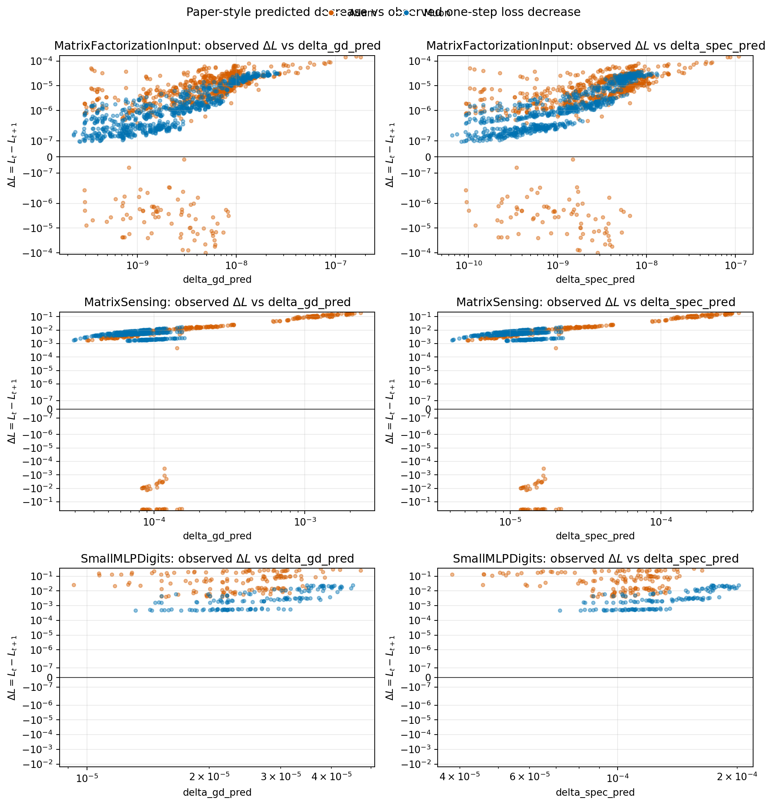

| problem_family | setting | algo | predictor | points | positive_delta_points | spearman_all_delta_loss | pearson_log_positive_delta_loss |
|---|---|---|---|---|---|---|---|
| MatrixFactorizationInput | MF input kappa=1e+01 lr=3e-03 | Adam | delta_gd_pred | 50 | 50 | 0.9409 | 0.9101 |
| MatrixFactorizationInput | MF input kappa=1e+01 lr=3e-03 | Adam | delta_spec_pred | 50 | 50 | 0.9656 | 0.9293 |
| MatrixFactorizationInput | MF input kappa=1e+01 lr=3e-03 | Adam | update_grad_inner | 50 | 50 | 0.9971 | 0.996 |
| MatrixFactorizationInput | MF input kappa=1e+01 lr=3e-03 | Muon | delta_gd_pred | 50 | 50 | 0.6111 | 0.6958 |
| MatrixFactorizationInput | MF input kappa=1e+01 lr=3e-03 | Muon | delta_spec_pred | 50 | 50 | 0.6741 | 0.7798 |
| MatrixFactorizationInput | MF input kappa=1e+01 lr=3e-03 | Muon | update_grad_inner | 50 | 50 | 0.986 | 0.9962 |
| MatrixFactorizationInput | MF input kappa=1e+01 lr=1e-02 | Adam | delta_gd_pred | 50 | 49 | 0.7849 | 0.7767 |
| MatrixFactorizationInput | MF input kappa=1e+01 lr=1e-02 | Adam | delta_spec_pred | 50 | 49 | 0.8553 | 0.8297 |
| MatrixFactorizationInput | MF input kappa=1e+01 lr=1e-02 | Adam | update_grad_inner | 50 | 49 | 0.7376 | 0.7642 |
| MatrixFactorizationInput | MF input kappa=1e+01 lr=1e-02 | Muon | delta_gd_pred | 50 | 50 | 0.9286 | 0.9269 |
| MatrixFactorizationInput | MF input kappa=1e+01 lr=1e-02 | Muon | delta_spec_pred | 50 | 50 | 0.9696 | 0.9516 |
| MatrixFactorizationInput | MF input kappa=1e+01 lr=1e-02 | Muon | update_grad_inner | 50 | 50 | 0.9959 | 0.9963 |
| MatrixFactorizationInput | MF input kappa=1e+01 lr=3e-02 | Adam | delta_gd_pred | 50 | 40 | 0.5939 | 0.7099 |
| MatrixFactorizationInput | MF input kappa=1e+01 lr=3e-02 | Adam | delta_spec_pred | 50 | 40 | 0.6301 | 0.7155 |
| MatrixFactorizationInput | MF input kappa=1e+01 lr=3e-02 | Adam | update_grad_inner | 50 | 40 | 0.7573 | 0.8456 |
| MatrixFactorizationInput | MF input kappa=1e+01 lr=3e-02 | Muon | delta_gd_pred | 50 | 50 | 0.9697 | 0.9777 |
| MatrixFactorizationInput | MF input kappa=1e+01 lr=3e-02 | Muon | delta_spec_pred | 50 | 50 | 0.9025 | 0.9451 |
| MatrixFactorizationInput | MF input kappa=1e+01 lr=3e-02 | Muon | update_grad_inner | 50 | 50 | 0.9692 | 0.9819 |
| MatrixFactorizationInput | MF input kappa=1e+02 lr=3e-03 | Adam | delta_gd_pred | 50 | 50 | 0.9399 | 0.8994 |
| MatrixFactorizationInput | MF input kappa=1e+02 lr=3e-03 | Adam | delta_spec_pred | 50 | 50 | 0.9731 | 0.9429 |
| MatrixFactorizationInput | MF input kappa=1e+02 lr=3e-03 | Adam | update_grad_inner | 50 | 50 | 0.9976 | 0.9947 |
| MatrixFactorizationInput | MF input kappa=1e+02 lr=3e-03 | Muon | delta_gd_pred | 50 | 50 | 0.6997 | 0.7002 |
| MatrixFactorizationInput | MF input kappa=1e+02 lr=3e-03 | Muon | delta_spec_pred | 50 | 50 | 0.7537 | 0.7802 |
| MatrixFactorizationInput | MF input kappa=1e+02 lr=3e-03 | Muon | update_grad_inner | 50 | 50 | 0.9938 | 0.9962 |
| MatrixFactorizationInput | MF input kappa=1e+02 lr=1e-02 | Adam | delta_gd_pred | 50 | 45 | 0.8052 | 0.8007 |
| MatrixFactorizationInput | MF input kappa=1e+02 lr=1e-02 | Adam | delta_spec_pred | 50 | 45 | 0.8274 | 0.8259 |
| MatrixFactorizationInput | MF input kappa=1e+02 lr=1e-02 | Adam | update_grad_inner | 50 | 45 | 0.7843 | 0.7449 |
| MatrixFactorizationInput | MF input kappa=1e+02 lr=1e-02 | Muon | delta_gd_pred | 50 | 50 | 0.9215 | 0.9211 |
| MatrixFactorizationInput | MF input kappa=1e+02 lr=1e-02 | Muon | delta_spec_pred | 50 | 50 | 0.9424 | 0.9486 |
| MatrixFactorizationInput | MF input kappa=1e+02 lr=1e-02 | Muon | update_grad_inner | 50 | 50 | 0.9984 | 0.9962 |
| MatrixFactorizationInput | MF input kappa=1e+02 lr=3e-02 | Adam | delta_gd_pred | 50 | 40 | 0.5361 | 0.5634 |
| MatrixFactorizationInput | MF input kappa=1e+02 lr=3e-02 | Adam | delta_spec_pred | 50 | 40 | 0.5406 | 0.5422 |
| MatrixFactorizationInput | MF input kappa=1e+02 lr=3e-02 | Adam | update_grad_inner | 50 | 40 | 0.6057 | 0.6424 |
| MatrixFactorizationInput | MF input kappa=1e+02 lr=3e-02 | Muon | delta_gd_pred | 50 | 50 | 0.9842 | 0.9769 |
| MatrixFactorizationInput | MF input kappa=1e+02 lr=3e-02 | Muon | delta_spec_pred | 50 | 50 | 0.9523 | 0.9631 |
| MatrixFactorizationInput | MF input kappa=1e+02 lr=3e-02 | Muon | update_grad_inner | 50 | 50 | 0.9818 | 0.9849 |
| MatrixFactorizationInput | MF input kappa=1e+03 lr=3e-03 | Adam | delta_gd_pred | 50 | 50 | 0.9266 | 0.884 |
| MatrixFactorizationInput | MF input kappa=1e+03 lr=3e-03 | Adam | delta_spec_pred | 50 | 50 | 0.9647 | 0.9358 |
| MatrixFactorizationInput | MF input kappa=1e+03 lr=3e-03 | Adam | update_grad_inner | 50 | 50 | 0.9979 | 0.9929 |
| MatrixFactorizationInput | MF input kappa=1e+03 lr=3e-03 | Muon | delta_gd_pred | 50 | 50 | 0.7683 | 0.7431 |
| MatrixFactorizationInput | MF input kappa=1e+03 lr=3e-03 | Muon | delta_spec_pred | 50 | 50 | 0.8012 | 0.7988 |
| MatrixFactorizationInput | MF input kappa=1e+03 lr=3e-03 | Muon | update_grad_inner | 50 | 50 | 0.9955 | 0.9962 |
| MatrixFactorizationInput | MF input kappa=1e+03 lr=1e-02 | Adam | delta_gd_pred | 50 | 44 | 0.7848 | 0.7156 |
| MatrixFactorizationInput | MF input kappa=1e+03 lr=1e-02 | Adam | delta_spec_pred | 50 | 44 | 0.8256 | 0.7451 |
| MatrixFactorizationInput | MF input kappa=1e+03 lr=1e-02 | Adam | update_grad_inner | 50 | 44 | 0.7864 | 0.7596 |
| MatrixFactorizationInput | MF input kappa=1e+03 lr=1e-02 | Muon | delta_gd_pred | 50 | 50 | 0.9202 | 0.9193 |
| MatrixFactorizationInput | MF input kappa=1e+03 lr=1e-02 | Muon | delta_spec_pred | 50 | 50 | 0.943 | 0.9422 |
| MatrixFactorizationInput | MF input kappa=1e+03 lr=1e-02 | Muon | update_grad_inner | 50 | 50 | 0.9975 | 0.9959 |
| MatrixFactorizationInput | MF input kappa=1e+03 lr=3e-02 | Adam | delta_gd_pred | 50 | 39 | 0.4872 | 0.6247 |
| MatrixFactorizationInput | MF input kappa=1e+03 lr=3e-02 | Adam | delta_spec_pred | 50 | 39 | 0.481 | 0.5759 |
| MatrixFactorizationInput | MF input kappa=1e+03 lr=3e-02 | Adam | update_grad_inner | 50 | 39 | 0.6583 | 0.8088 |
| MatrixFactorizationInput | MF input kappa=1e+03 lr=3e-02 | Muon | delta_gd_pred | 50 | 50 | 0.9847 | 0.9741 |
| MatrixFactorizationInput | MF input kappa=1e+03 lr=3e-02 | Muon | delta_spec_pred | 50 | 50 | 0.9494 | 0.9585 |
| MatrixFactorizationInput | MF input kappa=1e+03 lr=3e-02 | Muon | update_grad_inner | 50 | 50 | 0.9905 | 0.9853 |
| MatrixFactorizationInput | MF input kappa=1e+04 lr=3e-03 | Adam | delta_gd_pred | 50 | 50 | 0.9285 | 0.8841 |
| MatrixFactorizationInput | MF input kappa=1e+04 lr=3e-03 | Adam | delta_spec_pred | 50 | 50 | 0.9608 | 0.9344 |
| MatrixFactorizationInput | MF input kappa=1e+04 lr=3e-03 | Adam | update_grad_inner | 50 | 50 | 0.9981 | 0.9913 |
| MatrixFactorizationInput | MF input kappa=1e+04 lr=3e-03 | Muon | delta_gd_pred | 50 | 50 | 0.8065 | 0.7814 |
| MatrixFactorizationInput | MF input kappa=1e+04 lr=3e-03 | Muon | delta_spec_pred | 50 | 50 | 0.8286 | 0.8103 |
| MatrixFactorizationInput | MF input kappa=1e+04 lr=3e-03 | Muon | update_grad_inner | 50 | 50 | 0.9944 | 0.9961 |
| MatrixFactorizationInput | MF input kappa=1e+04 lr=1e-02 | Adam | delta_gd_pred | 50 | 44 | 0.8075 | 0.7657 |
| MatrixFactorizationInput | MF input kappa=1e+04 lr=1e-02 | Adam | delta_spec_pred | 50 | 44 | 0.8316 | 0.7895 |
| MatrixFactorizationInput | MF input kappa=1e+04 lr=1e-02 | Adam | update_grad_inner | 50 | 44 | 0.7981 | 0.6921 |
| MatrixFactorizationInput | MF input kappa=1e+04 lr=1e-02 | Muon | delta_gd_pred | 50 | 50 | 0.9363 | 0.9303 |
| MatrixFactorizationInput | MF input kappa=1e+04 lr=1e-02 | Muon | delta_spec_pred | 50 | 50 | 0.9443 | 0.9424 |
| MatrixFactorizationInput | MF input kappa=1e+04 lr=1e-02 | Muon | update_grad_inner | 50 | 50 | 0.9978 | 0.9957 |
| MatrixFactorizationInput | MF input kappa=1e+04 lr=3e-02 | Adam | delta_gd_pred | 50 | 37 | 0.5065 | 0.504 |
| MatrixFactorizationInput | MF input kappa=1e+04 lr=3e-02 | Adam | delta_spec_pred | 50 | 37 | 0.5111 | 0.4558 |
| MatrixFactorizationInput | MF input kappa=1e+04 lr=3e-02 | Adam | update_grad_inner | 50 | 37 | 0.6814 | 0.6883 |
| MatrixFactorizationInput | MF input kappa=1e+04 lr=3e-02 | Muon | delta_gd_pred | 50 | 50 | 0.9858 | 0.9713 |
| MatrixFactorizationInput | MF input kappa=1e+04 lr=3e-02 | Muon | delta_spec_pred | 50 | 50 | 0.9662 | 0.9569 |
| MatrixFactorizationInput | MF input kappa=1e+04 lr=3e-02 | Muon | update_grad_inner | 50 | 50 | 0.9915 | 0.9856 |
| MatrixFactorizationInput | MF input kappa=1e+05 lr=3e-03 | Adam | delta_gd_pred | 50 | 50 | 0.9247 | 0.881 |
| MatrixFactorizationInput | MF input kappa=1e+05 lr=3e-03 | Adam | delta_spec_pred | 50 | 50 | 0.961 | 0.9316 |
| MatrixFactorizationInput | MF input kappa=1e+05 lr=3e-03 | Adam | update_grad_inner | 50 | 50 | 0.9983 | 0.9897 |
| MatrixFactorizationInput | MF input kappa=1e+05 lr=3e-03 | Muon | delta_gd_pred | 50 | 50 | 0.8305 | 0.8028 |
| MatrixFactorizationInput | MF input kappa=1e+05 lr=3e-03 | Muon | delta_spec_pred | 50 | 50 | 0.8356 | 0.817 |
| MatrixFactorizationInput | MF input kappa=1e+05 lr=3e-03 | Muon | update_grad_inner | 50 | 50 | 0.9952 | 0.9961 |
| MatrixFactorizationInput | MF input kappa=1e+05 lr=1e-02 | Adam | delta_gd_pred | 50 | 44 | 0.8143 | 0.7893 |
| MatrixFactorizationInput | MF input kappa=1e+05 lr=1e-02 | Adam | delta_spec_pred | 50 | 44 | 0.8293 | 0.8147 |
| MatrixFactorizationInput | MF input kappa=1e+05 lr=1e-02 | Adam | update_grad_inner | 50 | 44 | 0.7924 | 0.723 |
| MatrixFactorizationInput | MF input kappa=1e+05 lr=1e-02 | Muon | delta_gd_pred | 50 | 50 | 0.9411 | 0.9326 |
| MatrixFactorizationInput | MF input kappa=1e+05 lr=1e-02 | Muon | delta_spec_pred | 50 | 50 | 0.947 | 0.9424 |
| MatrixFactorizationInput | MF input kappa=1e+05 lr=1e-02 | Muon | update_grad_inner | 50 | 50 | 0.9977 | 0.9956 |
| MatrixFactorizationInput | MF input kappa=1e+05 lr=3e-02 | Adam | delta_gd_pred | 50 | 39 | 0.5286 | 0.5314 |
| MatrixFactorizationInput | MF input kappa=1e+05 lr=3e-02 | Adam | delta_spec_pred | 50 | 39 | 0.53 | 0.4668 |
| MatrixFactorizationInput | MF input kappa=1e+05 lr=3e-02 | Adam | update_grad_inner | 50 | 39 | 0.7414 | 0.7196 |
| MatrixFactorizationInput | MF input kappa=1e+05 lr=3e-02 | Muon | delta_gd_pred | 50 | 50 | 0.9854 | 0.9676 |
| MatrixFactorizationInput | MF input kappa=1e+05 lr=3e-02 | Muon | delta_spec_pred | 50 | 50 | 0.9643 | 0.9553 |
| MatrixFactorizationInput | MF input kappa=1e+05 lr=3e-02 | Muon | update_grad_inner | 50 | 50 | 0.9907 | 0.9857 |
| MatrixSensing | Matrix sensing kappa=1e+01 lr=3e-03 | Adam | delta_gd_pred | 25 | 25 | 0.9162 | 0.9288 |
| MatrixSensing | Matrix sensing kappa=1e+01 lr=3e-03 | Adam | delta_spec_pred | 25 | 25 | 0.9131 | 0.9272 |
| MatrixSensing | Matrix sensing kappa=1e+01 lr=3e-03 | Adam | update_grad_inner | 25 | 25 | 0.9985 | 0.9981 |
| MatrixSensing | Matrix sensing kappa=1e+01 lr=3e-03 | Muon | delta_gd_pred | 25 | 25 | 0.9969 | 0.9976 |
| MatrixSensing | Matrix sensing kappa=1e+01 lr=3e-03 | Muon | delta_spec_pred | 25 | 25 | 1 | 0.9999 |
| MatrixSensing | Matrix sensing kappa=1e+01 lr=3e-03 | Muon | update_grad_inner | 25 | 25 | 1 | 0.9999 |
| MatrixSensing | Matrix sensing kappa=1e+01 lr=1e-02 | Adam | delta_gd_pred | 25 | 23 | 0.8985 | 0.51 |
| MatrixSensing | Matrix sensing kappa=1e+01 lr=1e-02 | Adam | delta_spec_pred | 25 | 23 | 0.8985 | 0.5122 |
| MatrixSensing | Matrix sensing kappa=1e+01 lr=1e-02 | Adam | update_grad_inner | 25 | 23 | -0.2554 | -0.6163 |
| MatrixSensing | Matrix sensing kappa=1e+01 lr=1e-02 | Muon | delta_gd_pred | 25 | 25 | 0.9962 | 0.9984 |
| MatrixSensing | Matrix sensing kappa=1e+01 lr=1e-02 | Muon | delta_spec_pred | 25 | 25 | 0.9985 | 0.9994 |
| MatrixSensing | Matrix sensing kappa=1e+01 lr=1e-02 | Muon | update_grad_inner | 25 | 25 | 0.9985 | 0.9994 |
| MatrixSensing | Matrix sensing kappa=1e+01 lr=3e-02 | Adam | delta_gd_pred | 25 | 20 | 0.9454 | 0.9336 |
| MatrixSensing | Matrix sensing kappa=1e+01 lr=3e-02 | Adam | delta_spec_pred | 25 | 20 | 0.9431 | 0.9371 |
| MatrixSensing | Matrix sensing kappa=1e+01 lr=3e-02 | Adam | update_grad_inner | 25 | 20 | 0.5462 | 0.4376 |
| MatrixSensing | Matrix sensing kappa=1e+01 lr=3e-02 | Muon | delta_gd_pred | 25 | 25 | 0.9908 | 0.9886 |
| MatrixSensing | Matrix sensing kappa=1e+01 lr=3e-02 | Muon | delta_spec_pred | 25 | 25 | 0.9923 | 0.9882 |
| MatrixSensing | Matrix sensing kappa=1e+01 lr=3e-02 | Muon | update_grad_inner | 25 | 25 | 0.9923 | 0.9882 |
| MatrixSensing | Matrix sensing kappa=1e+02 lr=3e-03 | Adam | delta_gd_pred | 25 | 25 | 0.9108 | 0.925 |
| MatrixSensing | Matrix sensing kappa=1e+02 lr=3e-03 | Adam | delta_spec_pred | 25 | 25 | 0.9115 | 0.9249 |
| MatrixSensing | Matrix sensing kappa=1e+02 lr=3e-03 | Adam | update_grad_inner | 25 | 25 | 0.9969 | 0.9972 |
| MatrixSensing | Matrix sensing kappa=1e+02 lr=3e-03 | Muon | delta_gd_pred | 25 | 25 | 0.9954 | 0.9959 |
| MatrixSensing | Matrix sensing kappa=1e+02 lr=3e-03 | Muon | delta_spec_pred | 25 | 25 | 0.9992 | 0.9999 |
| MatrixSensing | Matrix sensing kappa=1e+02 lr=3e-03 | Muon | update_grad_inner | 25 | 25 | 0.9992 | 0.9999 |
| MatrixSensing | Matrix sensing kappa=1e+02 lr=1e-02 | Adam | delta_gd_pred | 25 | 20 | 0.9369 | 0.9701 |
| MatrixSensing | Matrix sensing kappa=1e+02 lr=1e-02 | Adam | delta_spec_pred | 25 | 20 | 0.9392 | 0.9716 |
| MatrixSensing | Matrix sensing kappa=1e+02 lr=1e-02 | Adam | update_grad_inner | 25 | 20 | -0.2062 | 0.5235 |
| MatrixSensing | Matrix sensing kappa=1e+02 lr=1e-02 | Muon | delta_gd_pred | 25 | 25 | 0.9869 | 0.9978 |
| MatrixSensing | Matrix sensing kappa=1e+02 lr=1e-02 | Muon | delta_spec_pred | 25 | 25 | 0.9915 | 0.9993 |
| MatrixSensing | Matrix sensing kappa=1e+02 lr=1e-02 | Muon | update_grad_inner | 25 | 25 | 0.9915 | 0.9993 |
| MatrixSensing | Matrix sensing kappa=1e+02 lr=3e-02 | Adam | delta_gd_pred | 25 | 20 | 0.9423 | 0.937 |
| MatrixSensing | Matrix sensing kappa=1e+02 lr=3e-02 | Adam | delta_spec_pred | 25 | 20 | 0.9377 | 0.9392 |
| MatrixSensing | Matrix sensing kappa=1e+02 lr=3e-02 | Adam | update_grad_inner | 25 | 20 | 0.5708 | 0.3442 |
| MatrixSensing | Matrix sensing kappa=1e+02 lr=3e-02 | Muon | delta_gd_pred | 25 | 25 | 0.9831 | 0.9848 |
| MatrixSensing | Matrix sensing kappa=1e+02 lr=3e-02 | Muon | delta_spec_pred | 25 | 25 | 0.9908 | 0.9859 |
| MatrixSensing | Matrix sensing kappa=1e+02 lr=3e-02 | Muon | update_grad_inner | 25 | 25 | 0.9908 | 0.9858 |
| MatrixSensing | Matrix sensing kappa=1e+03 lr=3e-03 | Adam | delta_gd_pred | 25 | 25 | 0.9038 | 0.9268 |
| MatrixSensing | Matrix sensing kappa=1e+03 lr=3e-03 | Adam | delta_spec_pred | 25 | 25 | 0.9008 | 0.9261 |
| MatrixSensing | Matrix sensing kappa=1e+03 lr=3e-03 | Adam | update_grad_inner | 25 | 25 | 0.9969 | 0.9968 |
| MatrixSensing | Matrix sensing kappa=1e+03 lr=3e-03 | Muon | delta_gd_pred | 25 | 25 | 0.9846 | 0.9955 |
| MatrixSensing | Matrix sensing kappa=1e+03 lr=3e-03 | Muon | delta_spec_pred | 25 | 25 | 0.9977 | 0.9999 |
| MatrixSensing | Matrix sensing kappa=1e+03 lr=3e-03 | Muon | update_grad_inner | 25 | 25 | 0.9985 | 0.9999 |
| MatrixSensing | Matrix sensing kappa=1e+03 lr=1e-02 | Adam | delta_gd_pred | 25 | 20 | 0.9569 | 0.9733 |
| MatrixSensing | Matrix sensing kappa=1e+03 lr=1e-02 | Adam | delta_spec_pred | 25 | 20 | 0.96 | 0.9742 |
| MatrixSensing | Matrix sensing kappa=1e+03 lr=1e-02 | Adam | update_grad_inner | 25 | 20 | -0.2246 | 0.52 |
| MatrixSensing | Matrix sensing kappa=1e+03 lr=1e-02 | Muon | delta_gd_pred | 25 | 25 | 0.9923 | 0.9979 |
| MatrixSensing | Matrix sensing kappa=1e+03 lr=1e-02 | Muon | delta_spec_pred | 25 | 25 | 0.9969 | 0.9993 |
| MatrixSensing | Matrix sensing kappa=1e+03 lr=1e-02 | Muon | update_grad_inner | 25 | 25 | 0.9969 | 0.9992 |
| MatrixSensing | Matrix sensing kappa=1e+03 lr=3e-02 | Adam | delta_gd_pred | 25 | 20 | 0.9569 | 0.9342 |
| MatrixSensing | Matrix sensing kappa=1e+03 lr=3e-02 | Adam | delta_spec_pred | 25 | 20 | 0.9554 | 0.9349 |
| MatrixSensing | Matrix sensing kappa=1e+03 lr=3e-02 | Adam | update_grad_inner | 25 | 20 | 0.6 | 0.3681 |
| MatrixSensing | Matrix sensing kappa=1e+03 lr=3e-02 | Muon | delta_gd_pred | 25 | 25 | 0.9908 | 0.9815 |
| MatrixSensing | Matrix sensing kappa=1e+03 lr=3e-02 | Muon | delta_spec_pred | 25 | 25 | 0.9962 | 0.9836 |
| MatrixSensing | Matrix sensing kappa=1e+03 lr=3e-02 | Muon | update_grad_inner | 25 | 25 | 0.9962 | 0.9835 |
| MatrixSensing | Matrix sensing kappa=1e+04 lr=3e-03 | Adam | delta_gd_pred | 25 | 25 | 0.8969 | 0.9264 |
| MatrixSensing | Matrix sensing kappa=1e+04 lr=3e-03 | Adam | delta_spec_pred | 25 | 25 | 0.9046 | 0.9258 |
| MatrixSensing | Matrix sensing kappa=1e+04 lr=3e-03 | Adam | update_grad_inner | 25 | 25 | 0.9962 | 0.9966 |
| MatrixSensing | Matrix sensing kappa=1e+04 lr=3e-03 | Muon | delta_gd_pred | 25 | 25 | 0.9931 | 0.9955 |
| MatrixSensing | Matrix sensing kappa=1e+04 lr=3e-03 | Muon | delta_spec_pred | 25 | 25 | 1 | 0.9999 |
| MatrixSensing | Matrix sensing kappa=1e+04 lr=3e-03 | Muon | update_grad_inner | 25 | 25 | 0.9992 | 0.9999 |
| MatrixSensing | Matrix sensing kappa=1e+04 lr=1e-02 | Adam | delta_gd_pred | 25 | 20 | 0.9646 | 0.9743 |
| MatrixSensing | Matrix sensing kappa=1e+04 lr=1e-02 | Adam | delta_spec_pred | 25 | 20 | 0.9646 | 0.9744 |
| MatrixSensing | Matrix sensing kappa=1e+04 lr=1e-02 | Adam | update_grad_inner | 25 | 20 | -0.2477 | 0.4806 |
| MatrixSensing | Matrix sensing kappa=1e+04 lr=1e-02 | Muon | delta_gd_pred | 25 | 25 | 0.9969 | 0.9979 |
| MatrixSensing | Matrix sensing kappa=1e+04 lr=1e-02 | Muon | delta_spec_pred | 25 | 25 | 0.9969 | 0.9992 |
| MatrixSensing | Matrix sensing kappa=1e+04 lr=1e-02 | Muon | update_grad_inner | 25 | 25 | 0.9969 | 0.9992 |
| MatrixSensing | Matrix sensing kappa=1e+04 lr=3e-02 | Adam | delta_gd_pred | 25 | 20 | 0.9562 | 0.9305 |
| MatrixSensing | Matrix sensing kappa=1e+04 lr=3e-02 | Adam | delta_spec_pred | 25 | 20 | 0.9562 | 0.9307 |
| MatrixSensing | Matrix sensing kappa=1e+04 lr=3e-02 | Adam | update_grad_inner | 25 | 20 | 0.5769 | 0.339 |
| MatrixSensing | Matrix sensing kappa=1e+04 lr=3e-02 | Muon | delta_gd_pred | 25 | 25 | 0.9915 | 0.9789 |
| MatrixSensing | Matrix sensing kappa=1e+04 lr=3e-02 | Muon | delta_spec_pred | 25 | 25 | 0.9954 | 0.981 |
| MatrixSensing | Matrix sensing kappa=1e+04 lr=3e-02 | Muon | update_grad_inner | 25 | 25 | 0.9954 | 0.981 |
| MatrixSensing | Matrix sensing kappa=1e+05 lr=3e-03 | Adam | delta_gd_pred | 25 | 25 | 0.9023 | 0.9245 |
| MatrixSensing | Matrix sensing kappa=1e+05 lr=3e-03 | Adam | delta_spec_pred | 25 | 25 | 0.8915 | 0.9238 |
| MatrixSensing | Matrix sensing kappa=1e+05 lr=3e-03 | Adam | update_grad_inner | 25 | 25 | 0.9969 | 0.9964 |
| MatrixSensing | Matrix sensing kappa=1e+05 lr=3e-03 | Muon | delta_gd_pred | 25 | 25 | 0.9854 | 0.9955 |
| MatrixSensing | Matrix sensing kappa=1e+05 lr=3e-03 | Muon | delta_spec_pred | 25 | 25 | 0.9985 | 0.9999 |
| MatrixSensing | Matrix sensing kappa=1e+05 lr=3e-03 | Muon | update_grad_inner | 25 | 25 | 0.9992 | 0.9999 |
| MatrixSensing | Matrix sensing kappa=1e+05 lr=1e-02 | Adam | delta_gd_pred | 25 | 20 | 0.9646 | 0.9734 |
| MatrixSensing | Matrix sensing kappa=1e+05 lr=1e-02 | Adam | delta_spec_pred | 25 | 20 | 0.9685 | 0.9734 |
| MatrixSensing | Matrix sensing kappa=1e+05 lr=1e-02 | Adam | update_grad_inner | 25 | 20 | -0.2546 | 0.4951 |
| MatrixSensing | Matrix sensing kappa=1e+05 lr=1e-02 | Muon | delta_gd_pred | 25 | 25 | 0.9969 | 0.998 |
| MatrixSensing | Matrix sensing kappa=1e+05 lr=1e-02 | Muon | delta_spec_pred | 25 | 25 | 0.9992 | 0.9992 |
| MatrixSensing | Matrix sensing kappa=1e+05 lr=1e-02 | Muon | update_grad_inner | 25 | 25 | 0.9992 | 0.9992 |
| MatrixSensing | Matrix sensing kappa=1e+05 lr=3e-02 | Adam | delta_gd_pred | 25 | 20 | 0.9554 | 0.9296 |
| MatrixSensing | Matrix sensing kappa=1e+05 lr=3e-02 | Adam | delta_spec_pred | 25 | 20 | 0.9492 | 0.9302 |
| MatrixSensing | Matrix sensing kappa=1e+05 lr=3e-02 | Adam | update_grad_inner | 25 | 20 | 0.6077 | 0.3496 |
| MatrixSensing | Matrix sensing kappa=1e+05 lr=3e-02 | Muon | delta_gd_pred | 25 | 25 | 0.9938 | 0.9764 |
| MatrixSensing | Matrix sensing kappa=1e+05 lr=3e-02 | Muon | delta_spec_pred | 25 | 25 | 0.9938 | 0.9781 |
| MatrixSensing | Matrix sensing kappa=1e+05 lr=3e-02 | Muon | update_grad_inner | 25 | 25 | 0.9915 | 0.978 |
| SmallMLPDigits | Small MLP digits lr=3e-03 | Adam | delta_gd_pred | 50 | 50 | 0.7206 | 0.7514 |
| SmallMLPDigits | Small MLP digits lr=3e-03 | Adam | delta_spec_pred | 50 | 50 | 0.5778 | 0.6019 |
| SmallMLPDigits | Small MLP digits lr=3e-03 | Adam | update_grad_inner | 50 | 50 | 0.9915 | 0.991 |
| SmallMLPDigits | Small MLP digits lr=3e-03 | Muon | delta_gd_pred | 50 | 50 | 0.7227 | 0.7077 |
| SmallMLPDigits | Small MLP digits lr=3e-03 | Muon | delta_spec_pred | 50 | 50 | 0.7651 | 0.7696 |
| SmallMLPDigits | Small MLP digits lr=3e-03 | Muon | update_grad_inner | 50 | 50 | 0.9934 | 0.9973 |
| SmallMLPDigits | Small MLP digits lr=1e-02 | Adam | delta_gd_pred | 50 | 50 | 0.784 | 0.7087 |
| SmallMLPDigits | Small MLP digits lr=1e-02 | Adam | delta_spec_pred | 50 | 50 | 0.6567 | 0.5849 |
| SmallMLPDigits | Small MLP digits lr=1e-02 | Adam | update_grad_inner | 50 | 50 | 0.9984 | 0.9866 |
| SmallMLPDigits | Small MLP digits lr=1e-02 | Muon | delta_gd_pred | 50 | 50 | 0.821 | 0.8223 |
| SmallMLPDigits | Small MLP digits lr=1e-02 | Muon | delta_spec_pred | 50 | 50 | 0.8909 | 0.8975 |
| SmallMLPDigits | Small MLP digits lr=1e-02 | Muon | update_grad_inner | 50 | 50 | 0.9975 | 0.9978 |
| SmallMLPDigits | Small MLP digits lr=3e-02 | Adam | delta_gd_pred | 50 | 50 | 0.7455 | 0.4831 |
| SmallMLPDigits | Small MLP digits lr=3e-02 | Adam | delta_spec_pred | 50 | 50 | 0.6545 | 0.3127 |
| SmallMLPDigits | Small MLP digits lr=3e-02 | Adam | update_grad_inner | 50 | 50 | 0.9373 | 0.9738 |
| SmallMLPDigits | Small MLP digits lr=3e-02 | Muon | delta_gd_pred | 50 | 50 | 0.7407 | 0.8507 |
| SmallMLPDigits | Small MLP digits lr=3e-02 | Muon | delta_spec_pred | 50 | 50 | 0.8338 | 0.9027 |
| SmallMLPDigits | Small MLP digits lr=3e-02 | Muon | update_grad_inner | 50 | 50 | 0.9986 | 0.9952 |

## Finding 3: Geometry Volatility

**Finding:** Across the current lr sweep, Muon has lower step-to-step volatility in rank/condition diagnostics than Adam.

**Interpretation:** The raw cross-task optimizer signature is not a single direction such as "higher `nrG`" or "higher `stA`"; it is smoother movement in the diagnostic geometry.

**Reasoning:** The comparison is paired by problem setting, learning rate, and seed. The main statistic is the geometric mean ratio `Muon / Adam`; a 95% confidence interval entirely below 1 means Muon moves less in that diagnostic. The per-update rows divide each step's geometry movement by that same step's relative parameter-update size before averaging within a run.

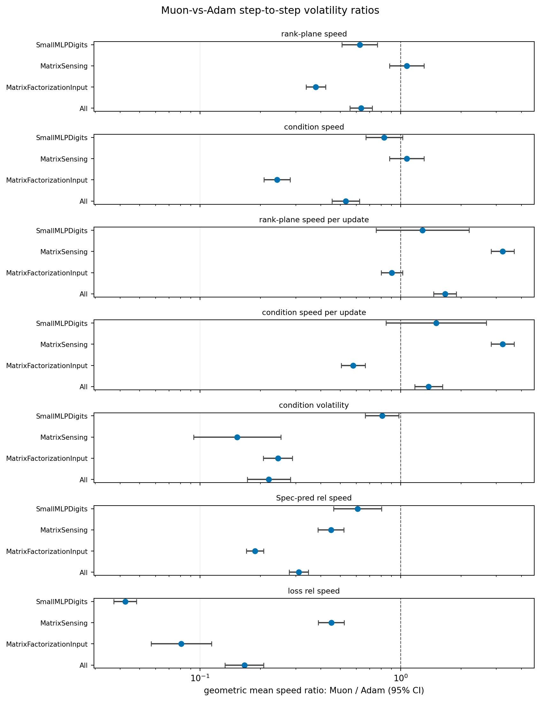

| metric | problem_family | n_pairs | muon_lower_pairs | geomean_ratio_muon_over_adam | ratio_ci95_low | ratio_ci95_high | ratio_ci95_below_one | mean_delta_muon_minus_adam | delta_ci95_low | delta_ci95_high |
|---|---|---|---|---|---|---|---|---|---|---|
| norm_rank_plane_mean_speed | All | 165 | 95 | 0.9134 | 0.8276 | 1.008 | False | -0.02512 | -0.115 | 0.06478 |
| norm_rank_plane_mean_speed | MatrixFactorizationInput | 75 | 56 | 0.6981 | 0.5993 | 0.8133 | True | -0.299 | -0.4174 | -0.1806 |
| norm_rank_plane_mean_speed | MatrixSensing | 75 | 25 | 1.292 | 1.16 | 1.44 | False | 0.3112 | 0.1928 | 0.4296 |
| norm_rank_plane_mean_speed | SmallMLPDigits | 15 | 14 | 0.6175 | 0.505 | 0.7549 | True | -0.3371 | -0.462 | -0.2122 |
| norm_condition_mean_speed | All | 165 | 99 | 0.7201 | 0.6382 | 0.8126 | True | -0.02787 | -0.09534 | 0.0396 |
| norm_condition_mean_speed | MatrixFactorizationInput | 75 | 66 | 0.3919 | 0.3391 | 0.4528 | True | -0.3012 | -0.3608 | -0.2416 |
| norm_condition_mean_speed | MatrixSensing | 75 | 25 | 1.292 | 1.16 | 1.44 | False | 0.2588 | 0.1587 | 0.359 |
| norm_condition_mean_speed | SmallMLPDigits | 15 | 8 | 0.8115 | 0.6546 | 1.006 | False | -0.09473 | -0.1991 | 0.009599 |
| condition_score_std_speed | All | 165 | 93 | 0.7307 | 0.6424 | 0.8311 | True | -0.04894 | -0.06249 | -0.03538 |
| condition_score_std_speed | MatrixFactorizationInput | 75 | 64 | 0.4076 | 0.3389 | 0.4903 | True | -0.08732 | -0.1073 | -0.06738 |
| condition_score_std_speed | MatrixSensing | 75 | 18 | 1.286 | 1.156 | 1.432 | False | 0.0004042 | 0.0002458 | 0.0005626 |
| condition_score_std_speed | SmallMLPDigits | 15 | 11 | 0.8004 | 0.6594 | 0.9716 | True | -0.1037 | -0.1873 | -0.02019 |
| delta_gd_pred_mean_rel_speed | All | 165 | 155 | 0.375 | 0.3354 | 0.4192 | True | -0.8403 | -1.001 | -0.6795 |
| delta_gd_pred_mean_rel_speed | MatrixFactorizationInput | 75 | 69 | 0.3927 | 0.3389 | 0.4551 | True | -1.148 | -1.429 | -0.8674 |
| delta_gd_pred_mean_rel_speed | MatrixSensing | 75 | 75 | 0.3182 | 0.266 | 0.3808 | True | -0.6833 | -0.8705 | -0.4961 |
| delta_gd_pred_mean_rel_speed | SmallMLPDigits | 15 | 11 | 0.6757 | 0.5138 | 0.8887 | True | -0.08663 | -0.1422 | -0.03105 |
| delta_spec_pred_mean_rel_speed | All | 165 | 157 | 0.3337 | 0.2977 | 0.3741 | True | -1.197 | -1.449 | -0.946 |
| delta_spec_pred_mean_rel_speed | MatrixFactorizationInput | 75 | 70 | 0.3069 | 0.2628 | 0.3586 | True | -1.936 | -2.402 | -1.469 |
| delta_spec_pred_mean_rel_speed | MatrixSensing | 75 | 75 | 0.3206 | 0.2671 | 0.3847 | True | -0.6826 | -0.8702 | -0.4951 |
| delta_spec_pred_mean_rel_speed | SmallMLPDigits | 15 | 12 | 0.6199 | 0.4668 | 0.8233 | True | -0.08026 | -0.126 | -0.03456 |
| loss_mean_rel_speed | All | 165 | 153 | 0.3736 | 0.3213 | 0.4344 | True | -0.3371 | -0.4305 | -0.2437 |
| loss_mean_rel_speed | MatrixFactorizationInput | 75 | 64 | 0.6733 | 0.6164 | 0.7355 | True | -0.07675 | -0.09476 | -0.05874 |
| loss_mean_rel_speed | MatrixSensing | 75 | 74 | 0.3205 | 0.2668 | 0.385 | True | -0.656 | -0.8364 | -0.4756 |
| loss_mean_rel_speed | SmallMLPDigits | 15 | 15 | 0.04227 | 0.0371 | 0.04817 | True | -0.0442 | -0.06677 | -0.02164 |
| median_relative_update_fro_norm | All | 165 | 160 | 0.4398 | 0.4102 | 0.4716 | True | -0.06786 | -0.07768 | -0.05804 |
| median_relative_update_fro_norm | MatrixFactorizationInput | 75 | 75 | 0.4224 | 0.3958 | 0.4508 | True | -0.01528 | -0.01691 | -0.01364 |
| median_relative_update_fro_norm | MatrixSensing | 75 | 75 | 0.4321 | 0.3828 | 0.4879 | True | -0.1255 | -0.1355 | -0.1156 |
| median_relative_update_fro_norm | SmallMLPDigits | 15 | 10 | 0.588 | 0.4117 | 0.8397 | True | -0.04246 | -0.07738 | -0.007543 |
| per_update_rank_plane_mean_speed | All | 165 | 34 | 2.121 | 1.857 | 2.422 | False | 29.62 | 20.29 | 38.94 |
| per_update_rank_plane_mean_speed | MatrixFactorizationInput | 75 | 23 | 1.652 | 1.36 | 2.007 | False | 53.06 | 34.09 | 72.04 |
| per_update_rank_plane_mean_speed | MatrixSensing | 75 | 6 | 3.021 | 2.562 | 3.562 | False | 11.25 | 7.958 | 14.54 |
| per_update_rank_plane_mean_speed | SmallMLPDigits | 15 | 5 | 1.263 | 0.7351 | 2.168 | False | 4.237 | 0.4042 | 8.07 |
| per_update_condition_mean_speed | All | 165 | 60 | 1.645 | 1.421 | 1.905 | False | 11.53 | 6.088 | 16.98 |
| per_update_condition_mean_speed | MatrixFactorizationInput | 75 | 49 | 0.9179 | 0.7725 | 1.091 | False | 14.73 | 3.128 | 26.33 |
| per_update_condition_mean_speed | MatrixSensing | 75 | 6 | 3.021 | 2.562 | 3.562 | False | 9.656 | 6.8 | 12.51 |
| per_update_condition_mean_speed | SmallMLPDigits | 15 | 5 | 1.461 | 0.8114 | 2.632 | False | 4.927 | 0.9745 | 8.88 |

This result should still be read as a trajectory diagnostic, not a performance claim. The equal-update control below tests whether this volatility gap survives after Adam and Muon are forced to have the same global relative update norm at every matched step.

### Equal-Update Control

**Finding:** After per-step relative update norms are matched, the all-family Muon-vs-Adam rank/condition speed advantage disappears.

**Interpretation:** The strongest current evidence is that Muon changes the realized optimization path partly through update-scale control; a task-independent intrinsic rank-geometry smoothing claim is not yet supported.

**Reasoning:** In the control, Adam and Muon start from the same initialization for each setting/seed. Each step first computes the optimizer's proposed update direction, then rescales both optimizers to the smaller proposed global relative update norm. Therefore `median_relative_update_fro_norm` should have ratio 1, and remaining differences reflect direction/geometry rather than update size.

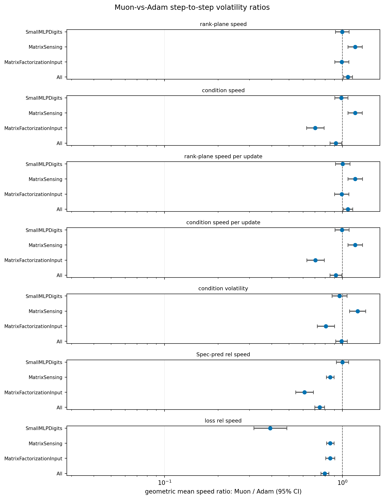

| metric | problem_family | n_pairs | muon_lower_pairs | geomean_ratio_muon_over_adam | ratio_ci95_low | ratio_ci95_high | ratio_ci95_below_one |
|---|---|---|---|---|---|---|---|
| norm_rank_plane_mean_speed | All | 165 | 77 | 1.072 | 1.009 | 1.138 | False |
| norm_rank_plane_mean_speed | MatrixFactorizationInput | 75 | 41 | 0.9904 | 0.9039 | 1.085 | False |
| norm_rank_plane_mean_speed | MatrixSensing | 75 | 29 | 1.177 | 1.073 | 1.29 | False |
| norm_rank_plane_mean_speed | SmallMLPDigits | 15 | 7 | 0.9972 | 0.9129 | 1.089 | False |
| norm_condition_mean_speed | All | 165 | 91 | 0.916 | 0.849 | 0.9884 | True |
| norm_condition_mean_speed | MatrixFactorizationInput | 75 | 56 | 0.7026 | 0.6275 | 0.7868 | True |
| norm_condition_mean_speed | MatrixSensing | 75 | 29 | 1.177 | 1.073 | 1.29 | False |
| norm_condition_mean_speed | SmallMLPDigits | 15 | 6 | 0.9854 | 0.9048 | 1.073 | False |
| condition_score_std_speed | All | 165 | 82 | 0.9866 | 0.915 | 1.064 | False |
| condition_score_std_speed | MatrixFactorizationInput | 75 | 49 | 0.805 | 0.7199 | 0.9002 | True |
| condition_score_std_speed | MatrixSensing | 75 | 25 | 1.215 | 1.095 | 1.349 | False |
| condition_score_std_speed | SmallMLPDigits | 15 | 8 | 0.9612 | 0.8731 | 1.058 | False |
| delta_spec_pred_mean_rel_speed | All | 165 | 130 | 0.7439 | 0.6981 | 0.7928 | True |
| delta_spec_pred_mean_rel_speed | MatrixFactorizationInput | 75 | 67 | 0.6117 | 0.545 | 0.6865 | True |
| delta_spec_pred_mean_rel_speed | MatrixSensing | 75 | 55 | 0.8529 | 0.8109 | 0.8971 | True |
| delta_spec_pred_mean_rel_speed | SmallMLPDigits | 15 | 8 | 0.9991 | 0.9233 | 1.081 | False |
| loss_mean_rel_speed | All | 165 | 127 | 0.795 | 0.7552 | 0.837 | True |
| loss_mean_rel_speed | MatrixFactorizationInput | 75 | 52 | 0.853 | 0.804 | 0.9051 | True |
| loss_mean_rel_speed | MatrixSensing | 75 | 60 | 0.8532 | 0.8135 | 0.8948 | True |
| loss_mean_rel_speed | SmallMLPDigits | 15 | 15 | 0.3927 | 0.3172 | 0.4862 | True |
| median_relative_update_fro_norm | All | 165 | 55 | 1 | 1 | 1 | False |
| median_relative_update_fro_norm | MatrixFactorizationInput | 75 | 22 | 1 | 1 | 1 | False |
| median_relative_update_fro_norm | MatrixSensing | 75 | 27 | 1 | 1 | 1 | False |
| median_relative_update_fro_norm | SmallMLPDigits | 15 | 6 | 1 | 1 | 1 | False |
| per_update_rank_plane_mean_speed | All | 165 | 75 | 1.073 | 1.009 | 1.14 | False |
| per_update_rank_plane_mean_speed | MatrixFactorizationInput | 75 | 41 | 0.9897 | 0.9022 | 1.086 | False |
| per_update_rank_plane_mean_speed | MatrixSensing | 75 | 28 | 1.179 | 1.073 | 1.295 | False |
| per_update_rank_plane_mean_speed | SmallMLPDigits | 15 | 6 | 1.002 | 0.9112 | 1.101 | False |
| per_update_condition_mean_speed | All | 165 | 91 | 0.9184 | 0.8507 | 0.9914 | True |
| per_update_condition_mean_speed | MatrixFactorizationInput | 75 | 56 | 0.7046 | 0.6293 | 0.789 | True |
| per_update_condition_mean_speed | MatrixSensing | 75 | 28 | 1.179 | 1.073 | 1.295 | False |
| per_update_condition_mean_speed | SmallMLPDigits | 15 | 7 | 0.9926 | 0.906 | 1.088 | False |

## Finding 4: Update-Matrix Spectrum

**Finding:** The most optimizer-intrinsic spectral difference is in the update matrices themselves: Muon updates have higher effective rank, higher stable rank, and flatter singular spectra than Adam updates across the current tasks.

**Interpretation:** This is a stronger geometry-shaping statement than the raw trajectory-volatility claim, but it is partly by construction: ExactMuon applies the polar direction \(UV^\top\), whose nonzero singular values are equal.

**Reasoning:** For every non-final step and layer, the code records singular values of \(\Delta W_i\). The summary compares run-mean `nrUpdate`, `stUpdate`, their ceiling-normalized forms `nrUpdateFrac = nrUpdate / min(shape)` and `stUpdateFrac = stUpdate / min(shape)`, and `update_flatness = stUpdate / nrUpdate`. Ratios above 1 mean the Muon update matrix is spectrally more spread or closer to full-rank flatness.

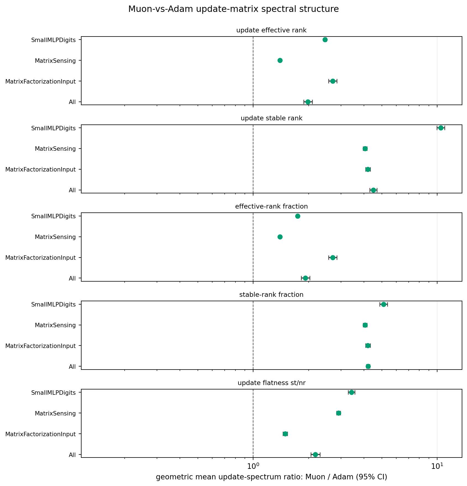

| metric | problem_family | n_pairs | muon_higher_pairs | geomean_ratio_muon_over_adam | ratio_ci95_low | ratio_ci95_high | ratio_ci95_above_one | mean_delta_muon_minus_adam | delta_ci95_low | delta_ci95_high |
|---|---|---|---|---|---|---|---|---|---|---|
| nrUpdate | All | 165 | 165 | 1.985 | 1.879 | 2.096 | True | 11.14 | 10 | 12.29 |
| nrUpdate | MatrixFactorizationInput | 75 | 75 | 2.703 | 2.568 | 2.846 | True | 3.103 | 3.004 | 3.203 |
| nrUpdate | MatrixSensing | 75 | 75 | 1.396 | 1.394 | 1.398 | True | 17.02 | 16.96 | 17.09 |
| nrUpdate | SmallMLPDigits | 15 | 15 | 2.457 | 2.418 | 2.496 | True | 21.93 | 21.72 | 22.15 |
| stUpdate | All | 165 | 165 | 4.495 | 4.298 | 4.702 | True | 25.29 | 22.24 | 28.33 |
| stUpdate | MatrixFactorizationInput | 75 | 75 | 4.203 | 4.081 | 4.329 | True | 3.8 | 3.763 | 3.838 |
| stUpdate | MatrixSensing | 75 | 75 | 4.06 | 3.962 | 4.16 | True | 45.14 | 44.8 | 45.48 |
| stUpdate | SmallMLPDigits | 15 | 15 | 10.47 | 9.973 | 10.98 | True | 33.45 | 33.3 | 33.6 |
| nrUpdateFrac | All | 165 | 165 | 1.924 | 1.823 | 2.031 | True | 0.4499 | 0.4237 | 0.4761 |
| nrUpdateFrac | MatrixFactorizationInput | 75 | 75 | 2.703 | 2.568 | 2.846 | True | 0.6207 | 0.6009 | 0.6405 |
| nrUpdateFrac | MatrixSensing | 75 | 75 | 1.396 | 1.394 | 1.398 | True | 0.2837 | 0.2827 | 0.2848 |
| nrUpdateFrac | SmallMLPDigits | 15 | 15 | 1.744 | 1.717 | 1.771 | True | 0.4264 | 0.4184 | 0.4343 |
| stUpdateFrac | All | 165 | 165 | 4.212 | 4.128 | 4.298 | True | 0.7605 | 0.7557 | 0.7654 |
| stUpdateFrac | MatrixFactorizationInput | 75 | 75 | 4.203 | 4.081 | 4.329 | True | 0.7601 | 0.7526 | 0.7675 |
| stUpdateFrac | MatrixSensing | 75 | 75 | 4.06 | 3.962 | 4.16 | True | 0.7523 | 0.7466 | 0.7581 |
| stUpdateFrac | SmallMLPDigits | 15 | 15 | 5.111 | 4.865 | 5.37 | True | 0.8036 | 0.795 | 0.8123 |
| update_flatness | All | 165 | 165 | 2.179 | 2.06 | 2.305 | True | 0.5096 | 0.4822 | 0.5369 |
| update_flatness | MatrixFactorizationInput | 75 | 75 | 1.492 | 1.452 | 1.532 | True | 0.3251 | 0.307 | 0.3431 |
| update_flatness | MatrixSensing | 75 | 75 | 2.909 | 2.842 | 2.978 | True | 0.6545 | 0.6469 | 0.6621 |
| update_flatness | SmallMLPDigits | 15 | 15 | 3.423 | 3.289 | 3.563 | True | 0.7071 | 0.6966 | 0.7177 |

The equal-update control preserves this update-spectrum diagnostic because rescaling an update changes singular values by a scalar but does not change effective rank, stable rank, rank fractions, or flatness. The substantive takeaway is therefore not that the update spectrum is surprising, but that this construction-level update geometry does not automatically imply smoother state trajectories or better short-horizon performance.

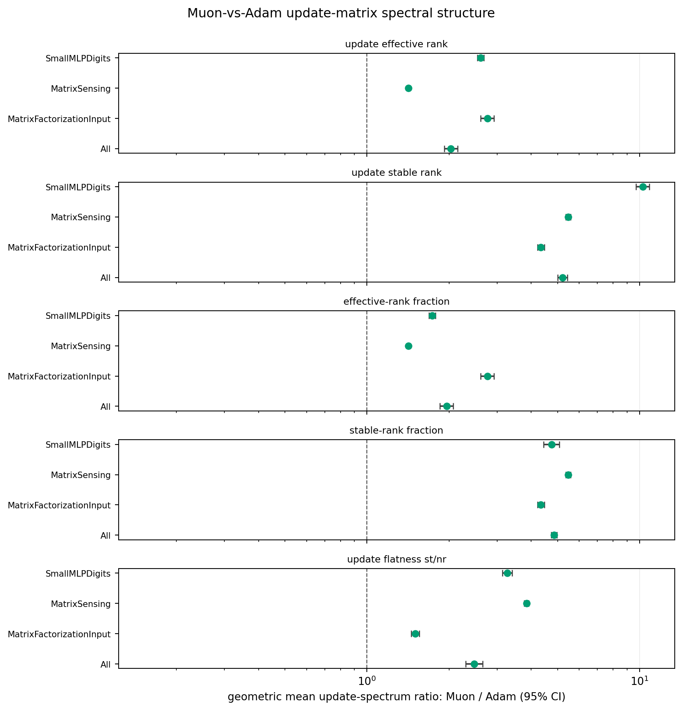

| metric | problem_family | n_pairs | muon_higher_pairs | geomean_ratio_muon_over_adam | ratio_ci95_low | ratio_ci95_high | ratio_ci95_above_one |
|---|---|---|---|---|---|---|---|
| nrUpdate | All | 165 | 165 | 2.017 | 1.905 | 2.136 | True |
| nrUpdate | MatrixFactorizationInput | 75 | 75 | 2.8 | 2.648 | 2.96 | True |
| nrUpdate | MatrixSensing | 75 | 75 | 1.405 | 1.404 | 1.406 | True |
| nrUpdate | SmallMLPDigits | 15 | 15 | 2.39 | 2.335 | 2.445 | True |
| stUpdate | All | 165 | 165 | 4.765 | 4.582 | 4.955 | True |
| stUpdate | MatrixFactorizationInput | 75 | 75 | 4.335 | 4.206 | 4.468 | True |
| stUpdate | MatrixSensing | 75 | 75 | 4.525 | 4.46 | 4.592 | True |
| stUpdate | SmallMLPDigits | 15 | 15 | 9.903 | 9.383 | 10.45 | True |
| nrUpdateFrac | All | 165 | 165 | 1.953 | 1.845 | 2.068 | True |
| nrUpdateFrac | MatrixFactorizationInput | 75 | 75 | 2.8 | 2.648 | 2.96 | True |
| nrUpdateFrac | MatrixSensing | 75 | 75 | 1.405 | 1.404 | 1.406 | True |
| nrUpdateFrac | SmallMLPDigits | 15 | 15 | 1.674 | 1.632 | 1.718 | True |
| stUpdateFrac | All | 165 | 165 | 4.451 | 4.378 | 4.525 | True |
| stUpdateFrac | MatrixFactorizationInput | 75 | 75 | 4.335 | 4.206 | 4.468 | True |
| stUpdateFrac | MatrixSensing | 75 | 75 | 4.525 | 4.46 | 4.592 | True |
| stUpdateFrac | SmallMLPDigits | 15 | 15 | 4.68 | 4.382 | 4.998 | True |
| update_flatness | All | 165 | 165 | 2.268 | 2.131 | 2.413 | True |
| update_flatness | MatrixFactorizationInput | 75 | 75 | 1.479 | 1.432 | 1.528 | True |
| update_flatness | MatrixSensing | 75 | 75 | 3.224 | 3.179 | 3.269 | True |
| update_flatness | SmallMLPDigits | 15 | 15 | 3.308 | 3.173 | 3.447 | True |

## Finding 5: Transmission From Update Geometry

**Finding:** The full-rank flat update spectrum is easy to detect, but its transmission to next-step loss decrease or state-geometry movement is not uniformly monotone across tasks and optimizers.

**Interpretation:** This narrows the open research question: Muon has a construction-level update geometry, but we still need conditions under which that update geometry becomes useful optimization progress.

**Reasoning:** The transmission table correlates current-step update diagnostics with next-step outcomes: relative loss decrease, normalized rank-plane movement, and normalized condition-score movement. It includes both spectrum-only diagnostics and first-order descent diagnostics such as `update_grad_inner = <G, W_t-W_{t+1}>`. Undefined correlations are expected when a predictor is nearly constant, as with Muon's rank fractions under exact polar updates.

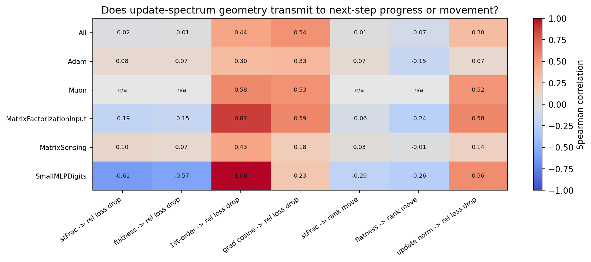

| group | predictor | outcome | points | spearman | spearman_ci95_low | spearman_ci95_high | ci95_excludes_zero |
|---|---|---|---|---|---|---|---|
| All | stUpdateFrac | relative_loss_decrease | 2550 | -0.03361 | -0.07235 | 0.005228 | False |
| All | stUpdateFrac | norm_rank_movement | 2550 | 0.08571 | 0.04703 | 0.1241 | True |
| All | stUpdateFrac | norm_condition_movement | 2550 | -0.01013 | -0.04895 | 0.02871 | False |
| All | update_flatness | relative_loss_decrease | 2550 | -0.09857 | -0.1369 | -0.05997 | True |
| All | update_flatness | norm_rank_movement | 2550 | -0.05296 | -0.09161 | -0.01416 | True |
| All | update_flatness | norm_condition_movement | 2550 | -0.08274 | -0.1212 | -0.04405 | True |
| All | relative_update_fro_norm | relative_loss_decrease | 2550 | 0.5284 | 0.4999 | 0.5559 | True |
| All | relative_update_fro_norm | norm_rank_movement | 2550 | 0.2711 | 0.2347 | 0.3067 | True |
| All | relative_update_fro_norm | norm_condition_movement | 2550 | 0.3908 | 0.3574 | 0.4232 | True |
| All | update_grad_inner | relative_loss_decrease | 2550 | 0.6127 | 0.5878 | 0.6364 | True |
| All | update_grad_inner | norm_rank_movement | 2550 | 0.1777 | 0.1399 | 0.2151 | True |
| All | update_grad_inner | norm_condition_movement | 2550 | 0.4025 | 0.3695 | 0.4346 | True |
| All | update_grad_cosine | relative_loss_decrease | 2550 | 0.5773 | 0.5508 | 0.6026 | True |
| All | update_grad_cosine | norm_rank_movement | 2550 | 0.1128 | 0.07433 | 0.151 | True |
| All | update_grad_cosine | norm_condition_movement | 2550 | 0.3956 | 0.3623 | 0.4278 | True |
| All | update_grad_per_update_norm | relative_loss_decrease | 2550 | 0.6139 | 0.5891 | 0.6375 | True |
| All | update_grad_per_update_norm | norm_rank_movement | 2550 | 0.1257 | 0.08734 | 0.1638 | True |
| All | update_grad_per_update_norm | norm_condition_movement | 2550 | 0.3909 | 0.3575 | 0.4233 | True |
| MatrixFactorizationInput | stUpdateFrac | relative_loss_decrease | 1500 | -0.2232 | -0.2708 | -0.1745 | True |
| MatrixFactorizationInput | stUpdateFrac | norm_rank_movement | 1500 | 0.06961 | 0.01902 | 0.1198 | True |
| MatrixFactorizationInput | stUpdateFrac | norm_condition_movement | 1500 | -0.276 | -0.3222 | -0.2286 | True |
| MatrixFactorizationInput | update_flatness | relative_loss_decrease | 1500 | -0.1608 | -0.2097 | -0.111 | True |
| MatrixFactorizationInput | update_flatness | norm_rank_movement | 1500 | -0.1606 | -0.2096 | -0.1109 | True |
| MatrixFactorizationInput | update_flatness | norm_condition_movement | 1500 | -0.3322 | -0.3765 | -0.2864 | True |
| MatrixFactorizationInput | relative_update_fro_norm | relative_loss_decrease | 1500 | 0.5368 | 0.4997 | 0.5719 | True |
| MatrixFactorizationInput | relative_update_fro_norm | norm_rank_movement | 1500 | 0.1529 | 0.103 | 0.202 | True |
| MatrixFactorizationInput | relative_update_fro_norm | norm_condition_movement | 1500 | 0.2099 | 0.161 | 0.2578 | True |
| MatrixFactorizationInput | update_grad_inner | relative_loss_decrease | 1500 | 0.8712 | 0.8585 | 0.8829 | True |
| MatrixFactorizationInput | update_grad_inner | norm_rank_movement | 1500 | -0.08827 | -0.1383 | -0.03778 | True |
| MatrixFactorizationInput | update_grad_inner | norm_condition_movement | 1500 | 0.2553 | 0.2074 | 0.3021 | True |
| MatrixFactorizationInput | update_grad_cosine | relative_loss_decrease | 1500 | 0.5784 | 0.5437 | 0.6112 | True |
| MatrixFactorizationInput | update_grad_cosine | norm_rank_movement | 1500 | -0.1187 | -0.1684 | -0.06848 | True |
| MatrixFactorizationInput | update_grad_cosine | norm_condition_movement | 1500 | 0.3242 | 0.2781 | 0.3688 | True |
| MatrixFactorizationInput | update_grad_per_update_norm | relative_loss_decrease | 1500 | 0.8418 | 0.8263 | 0.8559 | True |
| MatrixFactorizationInput | update_grad_per_update_norm | norm_rank_movement | 1500 | -0.2433 | -0.2904 | -0.1951 | True |
| MatrixFactorizationInput | update_grad_per_update_norm | norm_condition_movement | 1500 | 0.1995 | 0.1504 | 0.2477 | True |
| MatrixSensing | stUpdateFrac | relative_loss_decrease | 750 | 0.01363 | -0.05813 | 0.08526 | False |
| MatrixSensing | stUpdateFrac | norm_rank_movement | 750 | 0.1248 | 0.05362 | 0.1948 | True |
| MatrixSensing | stUpdateFrac | norm_condition_movement | 750 | 0.1213 | 0.05007 | 0.1914 | True |
| MatrixSensing | update_flatness | relative_loss_decrease | 750 | -0.05959 | -0.1307 | 0.01217 | False |
| MatrixSensing | update_flatness | norm_rank_movement | 750 | 0.1379 | 0.06683 | 0.2075 | True |
| MatrixSensing | update_flatness | norm_condition_movement | 750 | 0.1384 | 0.06735 | 0.208 | True |
| MatrixSensing | relative_update_fro_norm | relative_loss_decrease | 750 | 0.5328 | 0.4794 | 0.5822 | True |
| MatrixSensing | relative_update_fro_norm | norm_rank_movement | 750 | -0.1 | -0.1705 | -0.02853 | True |
| MatrixSensing | relative_update_fro_norm | norm_condition_movement | 750 | -0.1383 | -0.2079 | -0.06724 | True |
| MatrixSensing | update_grad_inner | relative_loss_decrease | 750 | 0.505 | 0.4496 | 0.5566 | True |
| MatrixSensing | update_grad_inner | norm_rank_movement | 750 | -0.07729 | -0.1482 | -0.00562 | True |
| MatrixSensing | update_grad_inner | norm_condition_movement | 750 | -0.1104 | -0.1807 | -0.03904 | True |
| MatrixSensing | update_grad_cosine | relative_loss_decrease | 750 | -0.008899 | -0.08055 | 0.06285 | False |
| MatrixSensing | update_grad_cosine | norm_rank_movement | 750 | 0.1064 | 0.03501 | 0.1768 | True |
| MatrixSensing | update_grad_cosine | norm_condition_movement | 750 | 0.1014 | 0.02991 | 0.1719 | True |
| MatrixSensing | update_grad_per_update_norm | relative_loss_decrease | 750 | -0.0005453 | -0.07225 | 0.07116 | False |
| MatrixSensing | update_grad_per_update_norm | norm_rank_movement | 750 | -0.04928 | -0.1206 | 0.02251 | False |
| MatrixSensing | update_grad_per_update_norm | norm_condition_movement | 750 | -0.06131 | -0.1324 | 0.01044 | False |
| SmallMLPDigits | stUpdateFrac | relative_loss_decrease | 300 | -0.6352 | -0.6985 | -0.5621 | True |
| SmallMLPDigits | stUpdateFrac | norm_rank_movement | 300 | -0.1701 | -0.2784 | -0.05749 | True |
| SmallMLPDigits | stUpdateFrac | norm_condition_movement | 300 | -0.02334 | -0.1367 | 0.0906 | False |
| SmallMLPDigits | update_flatness | relative_loss_decrease | 300 | -0.5905 | -0.6599 | -0.5111 | True |
| SmallMLPDigits | update_flatness | norm_rank_movement | 300 | -0.222 | -0.3275 | -0.1111 | True |
| SmallMLPDigits | update_flatness | norm_condition_movement | 300 | -0.03296 | -0.1461 | 0.08104 | False |
| SmallMLPDigits | relative_update_fro_norm | relative_loss_decrease | 300 | 0.5436 | 0.4582 | 0.619 | True |
| SmallMLPDigits | relative_update_fro_norm | norm_rank_movement | 300 | 0.2232 | 0.1123 | 0.3286 | True |
| SmallMLPDigits | relative_update_fro_norm | norm_condition_movement | 300 | -0.04791 | -0.1607 | 0.06615 | False |
| SmallMLPDigits | update_grad_inner | relative_loss_decrease | 300 | 0.9977 | 0.997 | 0.9981 | True |
| SmallMLPDigits | update_grad_inner | norm_rank_movement | 300 | 0.1031 | -0.01069 | 0.2143 | False |
| SmallMLPDigits | update_grad_inner | norm_condition_movement | 300 | -0.06307 | -0.1755 | 0.05099 | False |
| SmallMLPDigits | update_grad_cosine | relative_loss_decrease | 300 | 0.1836 | 0.0714 | 0.2912 | True |
| SmallMLPDigits | update_grad_cosine | norm_rank_movement | 300 | 0.06146 | -0.05261 | 0.1739 | False |
| SmallMLPDigits | update_grad_cosine | norm_condition_movement | 300 | -0.01413 | -0.1276 | 0.09973 | False |
| SmallMLPDigits | update_grad_per_update_norm | relative_loss_decrease | 300 | 0.9171 | 0.897 | 0.9335 | True |
| SmallMLPDigits | update_grad_per_update_norm | norm_rank_movement | 300 | -0.02874 | -0.142 | 0.08524 | False |
| SmallMLPDigits | update_grad_per_update_norm | norm_condition_movement | 300 | -0.1039 | -0.2151 | 0.009898 | False |
| Adam | stUpdateFrac | relative_loss_decrease | 1275 | 0.1419 | 0.08759 | 0.1953 | True |
| Adam | stUpdateFrac | norm_rank_movement | 1275 | 0.2067 | 0.1535 | 0.2587 | True |
| Adam | stUpdateFrac | norm_condition_movement | 1275 | 0.09879 | 0.04408 | 0.1529 | True |
| Adam | update_flatness | relative_loss_decrease | 1275 | -0.1699 | -0.2227 | -0.116 | True |
| Adam | update_flatness | norm_rank_movement | 1275 | -0.3035 | -0.3526 | -0.2528 | True |
| Adam | update_flatness | norm_condition_movement | 1275 | -0.2165 | -0.2683 | -0.1635 | True |
| Adam | relative_update_fro_norm | relative_loss_decrease | 1275 | 0.3736 | 0.3253 | 0.4199 | True |
| Adam | relative_update_fro_norm | norm_rank_movement | 1275 | 0.2898 | 0.2386 | 0.3393 | True |
| Adam | relative_update_fro_norm | norm_condition_movement | 1275 | 0.2586 | 0.2066 | 0.3092 | True |
| Adam | update_grad_inner | relative_loss_decrease | 1275 | 0.498 | 0.4555 | 0.5382 | True |
| Adam | update_grad_inner | norm_rank_movement | 1275 | 0.1495 | 0.09534 | 0.2028 | True |
| Adam | update_grad_inner | norm_condition_movement | 1275 | 0.1945 | 0.141 | 0.2468 | True |
| Adam | update_grad_cosine | relative_loss_decrease | 1275 | 0.07428 | 0.0194 | 0.1287 | True |
| Adam | update_grad_cosine | norm_rank_movement | 1275 | -0.2768 | -0.3268 | -0.2253 | True |
| Adam | update_grad_cosine | norm_condition_movement | 1275 | -0.08596 | -0.1402 | -0.03115 | True |
| Adam | update_grad_per_update_norm | relative_loss_decrease | 1275 | 0.5081 | 0.4661 | 0.5477 | True |
| Adam | update_grad_per_update_norm | norm_rank_movement | 1275 | 0.02409 | -0.0309 | 0.07894 | False |
| Adam | update_grad_per_update_norm | norm_condition_movement | 1275 | 0.1204 | 0.06593 | 0.1742 | True |
| Muon | stUpdateFrac | relative_loss_decrease | 1275 | n/a | n/a | n/a | False |
| Muon | stUpdateFrac | norm_rank_movement | 1275 | n/a | n/a | n/a | False |
| Muon | stUpdateFrac | norm_condition_movement | 1275 | n/a | n/a | n/a | False |
| Muon | update_flatness | relative_loss_decrease | 1275 | n/a | n/a | n/a | False |
| Muon | update_flatness | norm_rank_movement | 1275 | n/a | n/a | n/a | False |
| Muon | update_flatness | norm_condition_movement | 1275 | n/a | n/a | n/a | False |
| Muon | relative_update_fro_norm | relative_loss_decrease | 1275 | 0.6522 | 0.6194 | 0.6826 | True |
| Muon | relative_update_fro_norm | norm_rank_movement | 1275 | 0.2247 | 0.1719 | 0.2762 | True |
| Muon | relative_update_fro_norm | norm_condition_movement | 1275 | 0.4588 | 0.4143 | 0.5011 | True |
| Muon | update_grad_inner | relative_loss_decrease | 1275 | 0.72 | 0.6924 | 0.7455 | True |
| Muon | update_grad_inner | norm_rank_movement | 1275 | 0.1706 | 0.1168 | 0.2235 | True |
| Muon | update_grad_inner | norm_condition_movement | 1275 | 0.4938 | 0.4511 | 0.5343 | True |
| Muon | update_grad_cosine | relative_loss_decrease | 1275 | 0.6564 | 0.624 | 0.6866 | True |
| Muon | update_grad_cosine | norm_rank_movement | 1275 | 0.2293 | 0.1765 | 0.2807 | True |
| Muon | update_grad_cosine | norm_condition_movement | 1275 | 0.5913 | 0.5543 | 0.6259 | True |
| Muon | update_grad_per_update_norm | relative_loss_decrease | 1275 | 0.6793 | 0.6485 | 0.7078 | True |
| Muon | update_grad_per_update_norm | norm_rank_movement | 1275 | 0.1382 | 0.08385 | 0.1917 | True |
| Muon | update_grad_per_update_norm | norm_condition_movement | 1275 | 0.5093 | 0.4674 | 0.5488 | True |

In the current results, Muon's update-spectrum fractions and flatness are effectively constant within the optimizer, so they cannot explain within-Muon variation in progress. Relative update norm and the first-order gradient-update inner product are the more directly predictive step-level quantities. The same diagnostic under equal-update control checks whether these relations survive after update scale is matched.

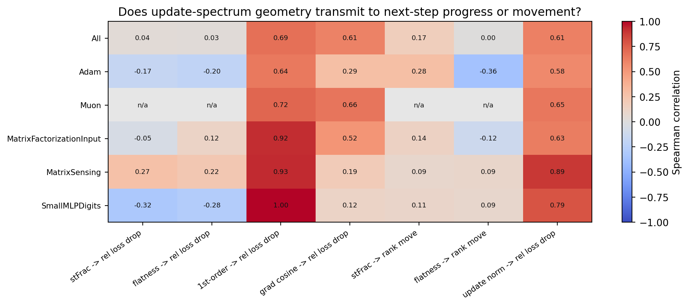

| group | predictor | outcome | points | spearman | spearman_ci95_low | spearman_ci95_high | ci95_excludes_zero |
|---|---|---|---|---|---|---|---|
| All | stUpdateFrac | relative_loss_decrease | 2550 | 0.03822 | -0.000617 | 0.07694 | False |
| All | stUpdateFrac | norm_rank_movement | 2550 | 0.1662 | 0.1282 | 0.2037 | True |
| All | stUpdateFrac | norm_condition_movement | 2550 | 0.05569 | 0.0169 | 0.09432 | True |
| All | update_flatness | relative_loss_decrease | 2550 | 0.02971 | -0.009132 | 0.06847 | False |
| All | update_flatness | norm_rank_movement | 2550 | 0.001757 | -0.03708 | 0.04059 | False |
| All | update_flatness | norm_condition_movement | 2550 | -0.03774 | -0.07646 | 0.001099 | False |
| All | relative_update_fro_norm | relative_loss_decrease | 2550 | 0.6102 | 0.5852 | 0.634 | True |
| All | relative_update_fro_norm | norm_rank_movement | 2550 | 0.2027 | 0.1652 | 0.2396 | True |
| All | relative_update_fro_norm | norm_condition_movement | 2550 | 0.2607 | 0.2241 | 0.2965 | True |
| All | update_grad_inner | relative_loss_decrease | 2550 | 0.6853 | 0.6641 | 0.7054 | True |
| All | update_grad_inner | norm_rank_movement | 2550 | 0.1162 | 0.0777 | 0.1543 | True |
| All | update_grad_inner | norm_condition_movement | 2550 | 0.2748 | 0.2386 | 0.3104 | True |
| All | update_grad_cosine | relative_loss_decrease | 2550 | 0.6082 | 0.5832 | 0.6321 | True |
| All | update_grad_cosine | norm_rank_movement | 2550 | 0.04998 | 0.01117 | 0.08864 | True |
| All | update_grad_cosine | norm_condition_movement | 2550 | 0.2874 | 0.2513 | 0.3226 | True |
| All | update_grad_per_update_norm | relative_loss_decrease | 2550 | 0.6558 | 0.6331 | 0.6774 | True |
| All | update_grad_per_update_norm | norm_rank_movement | 2550 | 0.08478 | 0.0461 | 0.1232 | True |
| All | update_grad_per_update_norm | norm_condition_movement | 2550 | 0.3078 | 0.2723 | 0.3426 | True |
| MatrixFactorizationInput | stUpdateFrac | relative_loss_decrease | 1500 | -0.04826 | -0.09867 | 0.002404 | False |
| MatrixFactorizationInput | stUpdateFrac | norm_rank_movement | 1500 | 0.1398 | 0.08979 | 0.1891 | True |
| MatrixFactorizationInput | stUpdateFrac | norm_condition_movement | 1500 | -0.178 | -0.2266 | -0.1285 | True |
| MatrixFactorizationInput | update_flatness | relative_loss_decrease | 1500 | 0.1197 | 0.06943 | 0.1693 | True |
| MatrixFactorizationInput | update_flatness | norm_rank_movement | 1500 | -0.1177 | -0.1674 | -0.06745 | True |
| MatrixFactorizationInput | update_flatness | norm_condition_movement | 1500 | -0.226 | -0.2735 | -0.1773 | True |
| MatrixFactorizationInput | relative_update_fro_norm | relative_loss_decrease | 1500 | 0.6316 | 0.6002 | 0.6611 | True |
| MatrixFactorizationInput | relative_update_fro_norm | norm_rank_movement | 1500 | -0.07256 | -0.1228 | -0.02199 | True |
| MatrixFactorizationInput | relative_update_fro_norm | norm_condition_movement | 1500 | -0.1555 | -0.2045 | -0.1057 | True |
| MatrixFactorizationInput | update_grad_inner | relative_loss_decrease | 1500 | 0.9173 | 0.9088 | 0.9249 | True |
| MatrixFactorizationInput | update_grad_inner | norm_rank_movement | 1500 | -0.3347 | -0.3789 | -0.2889 | True |
| MatrixFactorizationInput | update_grad_inner | norm_condition_movement | 1500 | -0.1165 | -0.1661 | -0.06619 | True |
| MatrixFactorizationInput | update_grad_cosine | relative_loss_decrease | 1500 | 0.5204 | 0.4825 | 0.5564 | True |
| MatrixFactorizationInput | update_grad_cosine | norm_rank_movement | 1500 | -0.2486 | -0.2955 | -0.2005 | True |
| MatrixFactorizationInput | update_grad_cosine | norm_condition_movement | 1500 | 0.1563 | 0.1065 | 0.2053 | True |
| MatrixFactorizationInput | update_grad_per_update_norm | relative_loss_decrease | 1500 | 0.8103 | 0.7922 | 0.827 | True |
| MatrixFactorizationInput | update_grad_per_update_norm | norm_rank_movement | 1500 | -0.4311 | -0.4715 | -0.389 | True |
| MatrixFactorizationInput | update_grad_per_update_norm | norm_condition_movement | 1500 | -0.03794 | -0.08843 | 0.01273 | False |
| MatrixSensing | stUpdateFrac | relative_loss_decrease | 750 | 0.2708 | 0.203 | 0.3359 | True |
| MatrixSensing | stUpdateFrac | norm_rank_movement | 750 | 0.08898 | 0.01738 | 0.1597 | True |
| MatrixSensing | stUpdateFrac | norm_condition_movement | 750 | 0.08996 | 0.01838 | 0.1606 | True |
| MatrixSensing | update_flatness | relative_loss_decrease | 750 | 0.2211 | 0.1518 | 0.2882 | True |
| MatrixSensing | update_flatness | norm_rank_movement | 750 | 0.0942 | 0.02265 | 0.1648 | True |
| MatrixSensing | update_flatness | norm_condition_movement | 750 | 0.09866 | 0.02714 | 0.1692 | True |
| MatrixSensing | relative_update_fro_norm | relative_loss_decrease | 750 | 0.8867 | 0.8703 | 0.9011 | True |
| MatrixSensing | relative_update_fro_norm | norm_rank_movement | 750 | -0.1034 | -0.1738 | -0.03194 | True |
| MatrixSensing | relative_update_fro_norm | norm_condition_movement | 750 | -0.1566 | -0.2258 | -0.08586 | True |
| MatrixSensing | update_grad_inner | relative_loss_decrease | 750 | 0.9253 | 0.9143 | 0.935 | True |
| MatrixSensing | update_grad_inner | norm_rank_movement | 750 | -0.001581 | -0.07328 | 0.07013 | False |
| MatrixSensing | update_grad_inner | norm_condition_movement | 750 | -0.04848 | -0.1198 | 0.02331 | False |
| MatrixSensing | update_grad_cosine | relative_loss_decrease | 750 | 0.1923 | 0.1223 | 0.2604 | True |
| MatrixSensing | update_grad_cosine | norm_rank_movement | 750 | 0.06947 | -0.002244 | 0.1405 | False |
| MatrixSensing | update_grad_cosine | norm_condition_movement | 750 | 0.07235 | 0.0006474 | 0.1433 | True |
| MatrixSensing | update_grad_per_update_norm | relative_loss_decrease | 750 | -0.1415 | -0.211 | -0.07048 | True |
| MatrixSensing | update_grad_per_update_norm | norm_rank_movement | 750 | -0.05472 | -0.1259 | 0.01705 | False |
| MatrixSensing | update_grad_per_update_norm | norm_condition_movement | 750 | -0.02514 | -0.09667 | 0.04665 | False |
| SmallMLPDigits | stUpdateFrac | relative_loss_decrease | 300 | -0.318 | -0.4166 | -0.2119 | True |
| SmallMLPDigits | stUpdateFrac | norm_rank_movement | 300 | 0.105 | -0.008765 | 0.2162 | False |
| SmallMLPDigits | stUpdateFrac | norm_condition_movement | 300 | 0.08221 | -0.03179 | 0.1941 | False |
| SmallMLPDigits | update_flatness | relative_loss_decrease | 300 | -0.281 | -0.3825 | -0.1728 | True |
| SmallMLPDigits | update_flatness | norm_rank_movement | 300 | 0.08904 | -0.02491 | 0.2007 | False |
| SmallMLPDigits | update_flatness | norm_condition_movement | 300 | 0.07479 | -0.03925 | 0.1869 | False |
| SmallMLPDigits | relative_update_fro_norm | relative_loss_decrease | 300 | 0.7896 | 0.7425 | 0.8289 | True |
| SmallMLPDigits | relative_update_fro_norm | norm_rank_movement | 300 | -0.1383 | -0.2481 | -0.02497 | True |
| SmallMLPDigits | relative_update_fro_norm | norm_condition_movement | 300 | -0.1776 | -0.2855 | -0.06521 | True |
| SmallMLPDigits | update_grad_inner | relative_loss_decrease | 300 | 0.9995 | 0.9994 | 0.9996 | True |
| SmallMLPDigits | update_grad_inner | norm_rank_movement | 300 | -0.3041 | -0.4038 | -0.1972 | True |
| SmallMLPDigits | update_grad_inner | norm_condition_movement | 300 | -0.2964 | -0.3968 | -0.1891 | True |
| SmallMLPDigits | update_grad_cosine | relative_loss_decrease | 300 | 0.124 | 0.01048 | 0.2344 | True |
| SmallMLPDigits | update_grad_cosine | norm_rank_movement | 300 | -0.08505 | -0.1968 | 0.02893 | False |
| SmallMLPDigits | update_grad_cosine | norm_condition_movement | 300 | -0.0638 | -0.1762 | 0.05026 | False |
| SmallMLPDigits | update_grad_per_update_norm | relative_loss_decrease | 300 | 0.8345 | 0.7963 | 0.866 | True |
| SmallMLPDigits | update_grad_per_update_norm | norm_rank_movement | 300 | -0.337 | -0.4341 | -0.2322 | True |
| SmallMLPDigits | update_grad_per_update_norm | norm_condition_movement | 300 | -0.2913 | -0.392 | -0.1837 | True |
| Adam | stUpdateFrac | relative_loss_decrease | 1275 | -0.1718 | -0.2246 | -0.118 | True |
| Adam | stUpdateFrac | norm_rank_movement | 1275 | 0.2836 | 0.2322 | 0.3333 | True |
| Adam | stUpdateFrac | norm_condition_movement | 1275 | 0.1199 | 0.06533 | 0.1737 | True |
| Adam | update_flatness | relative_loss_decrease | 1275 | -0.1966 | -0.2489 | -0.1432 | True |
| Adam | update_flatness | norm_rank_movement | 1275 | -0.3622 | -0.409 | -0.3135 | True |
| Adam | update_flatness | norm_condition_movement | 1275 | -0.2768 | -0.3268 | -0.2253 | True |
| Adam | relative_update_fro_norm | relative_loss_decrease | 1275 | 0.5774 | 0.5395 | 0.6129 | True |
| Adam | relative_update_fro_norm | norm_rank_movement | 1275 | 0.2059 | 0.1526 | 0.2579 | True |
| Adam | relative_update_fro_norm | norm_condition_movement | 1275 | 0.2325 | 0.1799 | 0.2839 | True |
| Adam | update_grad_inner | relative_loss_decrease | 1275 | 0.6437 | 0.6104 | 0.6748 | True |
| Adam | update_grad_inner | norm_rank_movement | 1275 | 0.08288 | 0.02806 | 0.1372 | True |
| Adam | update_grad_inner | norm_condition_movement | 1275 | 0.195 | 0.1415 | 0.2473 | True |
| Adam | update_grad_cosine | relative_loss_decrease | 1275 | 0.2874 | 0.2362 | 0.3371 | True |
| Adam | update_grad_cosine | norm_rank_movement | 1275 | -0.2994 | -0.3486 | -0.2485 | True |
| Adam | update_grad_cosine | norm_condition_movement | 1275 | -0.0141 | -0.06899 | 0.04089 | False |
| Adam | update_grad_per_update_norm | relative_loss_decrease | 1275 | 0.6062 | 0.5703 | 0.6399 | True |
| Adam | update_grad_per_update_norm | norm_rank_movement | 1275 | 0.01739 | -0.03759 | 0.07228 | False |
| Adam | update_grad_per_update_norm | norm_condition_movement | 1275 | 0.2 | 0.1467 | 0.2522 | True |
| Muon | stUpdateFrac | relative_loss_decrease | 1275 | n/a | n/a | n/a | False |
| Muon | stUpdateFrac | norm_rank_movement | 1275 | n/a | n/a | n/a | False |
| Muon | stUpdateFrac | norm_condition_movement | 1275 | n/a | n/a | n/a | False |
| Muon | update_flatness | relative_loss_decrease | 1275 | n/a | n/a | n/a | False |
| Muon | update_flatness | norm_rank_movement | 1275 | n/a | n/a | n/a | False |
| Muon | update_flatness | norm_condition_movement | 1275 | n/a | n/a | n/a | False |
| Muon | relative_update_fro_norm | relative_loss_decrease | 1275 | 0.6522 | 0.6194 | 0.6826 | True |
| Muon | relative_update_fro_norm | norm_rank_movement | 1275 | 0.1992 | 0.1458 | 0.2514 | True |
| Muon | relative_update_fro_norm | norm_condition_movement | 1275 | 0.2937 | 0.2426 | 0.3431 | True |
| Muon | update_grad_inner | relative_loss_decrease | 1275 | 0.72 | 0.6925 | 0.7455 | True |
| Muon | update_grad_inner | norm_rank_movement | 1275 | 0.1391 | 0.08478 | 0.1926 | True |
| Muon | update_grad_inner | norm_condition_movement | 1275 | 0.3206 | 0.2705 | 0.3691 | True |
| Muon | update_grad_cosine | relative_loss_decrease | 1275 | 0.6564 | 0.624 | 0.6866 | True |
| Muon | update_grad_cosine | norm_rank_movement | 1275 | 0.1804 | 0.1267 | 0.233 | True |
| Muon | update_grad_cosine | norm_condition_movement | 1275 | 0.4344 | 0.3887 | 0.4779 | True |
| Muon | update_grad_per_update_norm | relative_loss_decrease | 1275 | 0.6793 | 0.6485 | 0.7078 | True |
| Muon | update_grad_per_update_norm | norm_rank_movement | 1275 | 0.09358 | 0.03882 | 0.1478 | True |
| Muon | update_grad_per_update_norm | norm_condition_movement | 1275 | 0.3462 | 0.2969 | 0.3937 | True |

### First-Order Calibration

**Finding:** The gradient-update inner product is a strong one-step progress predictor, especially under equal-update control.

**Interpretation:** The immediate mechanism is not update flatness by itself; it is how the chosen update direction converts the current gradient into descent.

**Reasoning:** The scatter compares observed \(\Delta L\) with \(\langle G, W_t-W_{t+1}\rangle\). The table reports rank correlation, log-log correlation on positive points, and how close the observed decrease is to the first-order term.

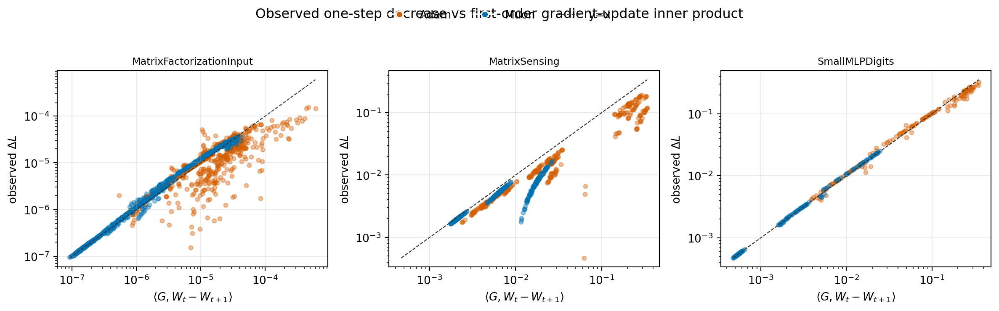

| group | points | positive_points | spearman_delta_vs_first_order | spearman_ci95_low | spearman_ci95_high | pearson_log_positive | geomean_observed_over_first_order | ratio_ci95_low | ratio_ci95_high | within_factor_2 |
|---|---|---|---|---|---|---|---|---|---|---|
| All | 2550 | 2424 | 0.8715 | 0.8618 | 0.8805 | 0.9938 | 0.8237 | 0.8073 | 0.8404 | 0.8626 |
| MatrixFactorizationInput | 1500 | 1421 | 0.852 | 0.8375 | 0.8653 | 0.9603 | 0.8972 | 0.8721 | 0.923 | 0.8804 |
| MatrixSensing | 750 | 703 | 0.6986 | 0.6599 | 0.7335 | 0.9634 | 0.6358 | 0.6165 | 0.6557 | 0.7681 |
| SmallMLPDigits | 300 | 300 | 0.999 | 0.9987 | 0.9992 | 0.999 | 1.007 | 0.9971 | 1.018 | 1 |
| Adam | 1275 | 1149 | 0.7781 | 0.7555 | 0.7989 | 0.9887 | 0.7107 | 0.6856 | 0.7368 | 0.7903 |
| Muon | 1275 | 1275 | 0.996 | 0.9955 | 0.9964 | 0.9981 | 0.9407 | 0.9248 | 0.9569 | 0.9278 |

The equal-update version isolates direction/alignment from global update scale.

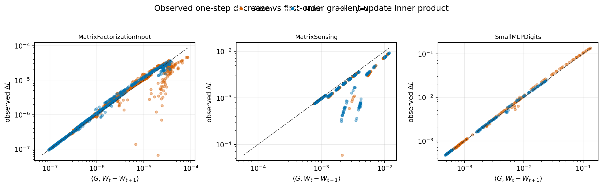

| group | points | positive_points | spearman_delta_vs_first_order | spearman_ci95_low | spearman_ci95_high | pearson_log_positive | geomean_observed_over_first_order | ratio_ci95_low | ratio_ci95_high | within_factor_2 |
|---|---|---|---|---|---|---|---|---|---|---|
| All | 2550 | 2496 | 0.9803 | 0.9787 | 0.9817 | 0.997 | 0.922 | 0.9095 | 0.9347 | 0.9207 |
| MatrixFactorizationInput | 1500 | 1446 | 0.9153 | 0.9067 | 0.9231 | 0.985 | 1.031 | 1.015 | 1.048 | 0.9661 |
| MatrixSensing | 750 | 750 | 0.9588 | 0.9526 | 0.9643 | 0.9475 | 0.7107 | 0.693 | 0.7289 | 0.8013 |
| SmallMLPDigits | 300 | 300 | 0.9995 | 0.9993 | 0.9996 | 0.9996 | 1.031 | 1.025 | 1.037 | 1 |
| Adam | 1275 | 1221 | 0.9688 | 0.9652 | 0.972 | 0.9956 | 0.9028 | 0.8836 | 0.9225 | 0.9132 |
| Muon | 1275 | 1275 | 0.996 | 0.9955 | 0.9964 | 0.9981 | 0.9407 | 0.9248 | 0.9569 | 0.9278 |

### Polar Alignment Identity

**Finding:** For ExactMuon, the gradient-update cosine is determined by the gradient spectrum: \(\cos^2(G_i, \Delta W_i) = nr(G_i)/r_i\), up to numerical error.

**Interpretation:** This connects the construction-level flat update to the first-order progress mechanism. Muon does not merely make a flat update; its alignment with the gradient is controlled by the gradient effective-rank fraction.

**Reasoning:** ExactMuon uses the polar direction \(UV^\top\). Therefore \(\langle G, UV^\top\rangle = \|G\|_*\), \(\|UV^\top\|_F=\sqrt{r}\), and the squared cosine is \(\|G\|_*^2/(\|G\|_F^2 r)=nr(G)/r\).

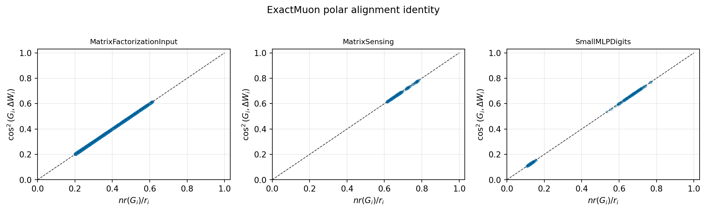

| group | points | median_cosine_sq | median_gradient_rank_fraction | median_abs_identity_error | max_abs_identity_error | mean_abs_identity_error |
|---|---|---|---|---|---|---|
| All | 8175 | 0.2571 | 0.2571 | 5.829e-16 | 1.477e-14 | 1.307e-15 |
| MatrixFactorizationInput | 7500 | 0.2528 | 0.2528 | 6.106e-16 | 1.477e-14 | 1.378e-15 |
| MatrixSensing | 375 | 0.7146 | 0.7146 | 6.661e-16 | 2.665e-15 | 7.298e-16 |
| SmallMLPDigits | 300 | 0.3454 | 0.3454 | 1.943e-16 | 1.332e-15 | 2.487e-16 |

The equal-update control leaves this identity unchanged.

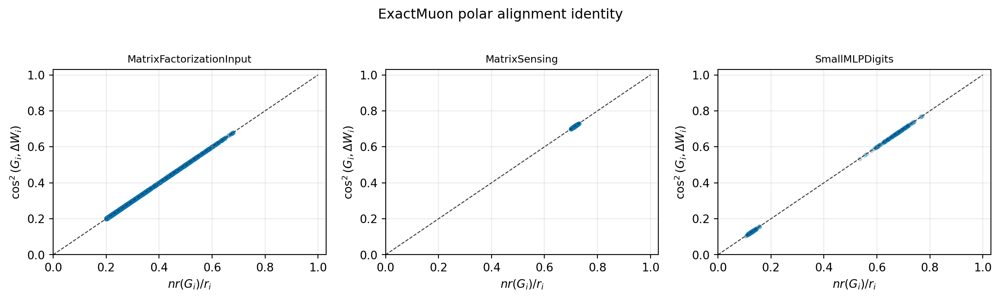

| group | points | median_cosine_sq | median_gradient_rank_fraction | median_abs_identity_error | max_abs_identity_error | mean_abs_identity_error |
|---|---|---|---|---|---|---|
| All | 8175 | 0.2571 | 0.2571 | 5.551e-16 | 1.432e-14 | 1.294e-15 |
| MatrixFactorizationInput | 7500 | 0.2528 | 0.2528 | 6.106e-16 | 1.432e-14 | 1.365e-15 |
| MatrixSensing | 375 | 0.7146 | 0.7146 | 5.551e-16 | 2.442e-15 | 7.108e-16 |
| SmallMLPDigits | 300 | 0.3454 | 0.3454 | 2.22e-16 | 1.443e-15 | 2.564e-16 |

### Matched First-Order Comparison

**Finding:** Under equal-update control, Muon does not uniformly dominate Adam in first-order descent; the comparison is task-dependent.

**Interpretation:** Polar geometry changes the alignment formula, but whether that produces a larger one-step descent than Adam depends on the gradient spectrum and the competing Adam direction.

**Reasoning:** The table compares matched setting/seed/step pairs. Ratios above 1 mean Muon has a larger first-order term, cosine, observed loss decrease, or update norm than Adam.

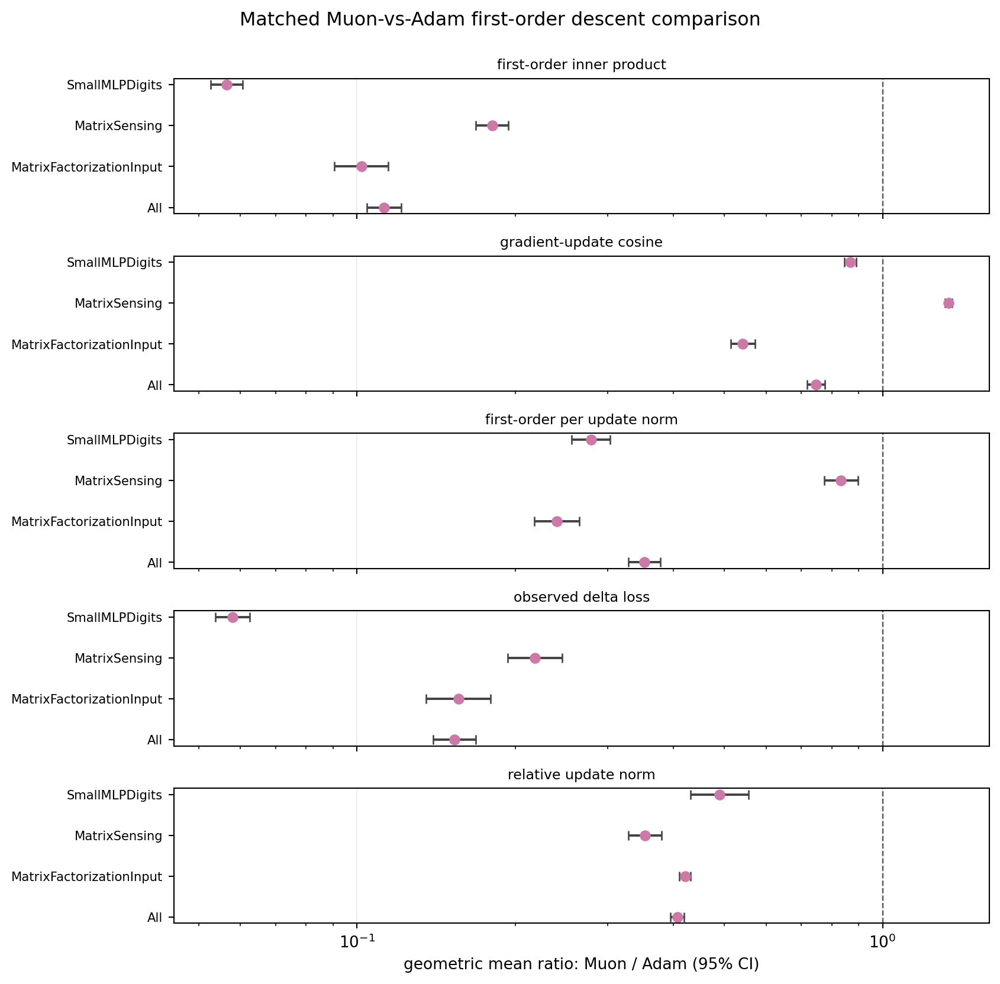

| metric | problem_family | n_pairs | muon_higher_pairs | geomean_ratio_muon_over_adam | ratio_ci95_low | ratio_ci95_high | ratio_ci95_above_one |
|---|---|---|---|---|---|---|---|
| delta_loss | All | 1275 | 251 | 0.1531 | 0.1395 | 0.168 | False |
| delta_loss | MatrixFactorizationInput | 750 | 201 | 0.1559 | 0.1353 | 0.1795 | False |
| delta_loss | MatrixSensing | 375 | 50 | 0.218 | 0.1934 | 0.2457 | False |
| delta_loss | SmallMLPDigits | 150 | 0 | 0.05801 | 0.0538 | 0.06254 | False |
| update_grad_inner | All | 1275 | 102 | 0.1126 | 0.1044 | 0.1214 | False |
| update_grad_inner | MatrixFactorizationInput | 750 | 102 | 0.1019 | 0.09057 | 0.1147 | False |
| update_grad_inner | MatrixSensing | 375 | 0 | 0.1808 | 0.1684 | 0.1942 | False |
| update_grad_inner | SmallMLPDigits | 150 | 0 | 0.05654 | 0.05271 | 0.06064 | False |
| update_grad_cosine | All | 1275 | 518 | 0.747 | 0.7185 | 0.7766 | False |
| update_grad_cosine | MatrixFactorizationInput | 750 | 118 | 0.5421 | 0.5139 | 0.5719 | False |
| update_grad_cosine | MatrixSensing | 375 | 375 | 1.335 | 1.314 | 1.356 | True |
| update_grad_cosine | SmallMLPDigits | 150 | 25 | 0.8687 | 0.8467 | 0.8913 | False |
| update_grad_per_update_norm | All | 1275 | 339 | 0.3524 | 0.3287 | 0.3779 | False |
| update_grad_per_update_norm | MatrixFactorizationInput | 750 | 120 | 0.2401 | 0.2176 | 0.265 | False |
| update_grad_per_update_norm | MatrixSensing | 375 | 219 | 0.8337 | 0.7748 | 0.897 | False |
| update_grad_per_update_norm | SmallMLPDigits | 150 | 0 | 0.2788 | 0.2563 | 0.3033 | False |
| relative_update_fro_norm | All | 1275 | 70 | 0.4069 | 0.3948 | 0.4194 | False |
| relative_update_fro_norm | MatrixFactorizationInput | 750 | 0 | 0.4208 | 0.4107 | 0.4311 | False |
| relative_update_fro_norm | MatrixSensing | 375 | 36 | 0.3534 | 0.3285 | 0.3801 | False |
| relative_update_fro_norm | SmallMLPDigits | 150 | 34 | 0.4897 | 0.4311 | 0.5564 | False |

The equal-update version removes global update-scale differences, so remaining differences are directional.

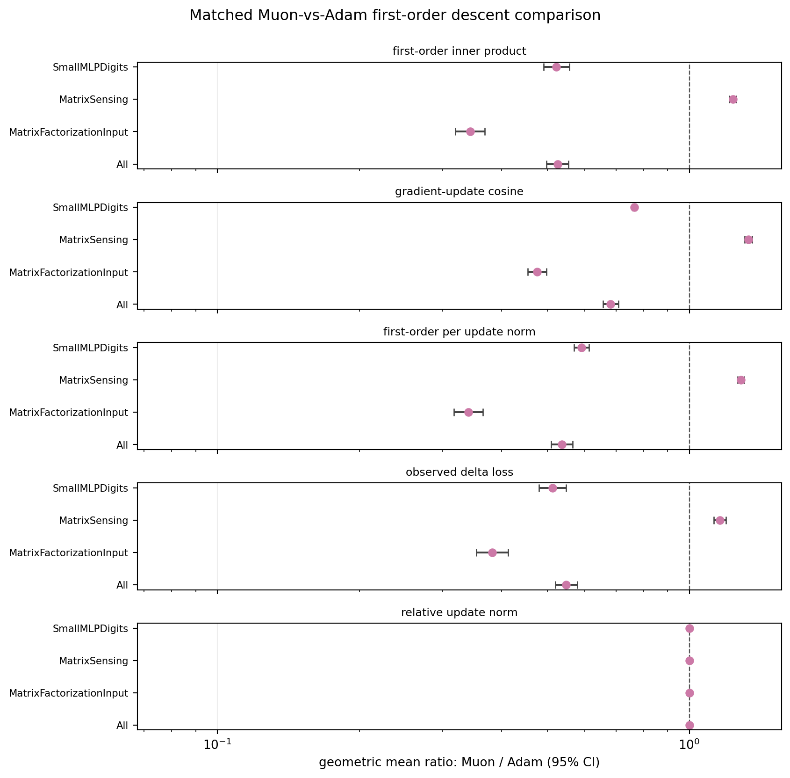

| metric | problem_family | n_pairs | muon_higher_pairs | geomean_ratio_muon_over_adam | ratio_ci95_low | ratio_ci95_high | ratio_ci95_above_one |
|---|---|---|---|---|---|---|---|
| delta_loss | All | 1275 | 437 | 0.5488 | 0.5197 | 0.5795 | False |
| delta_loss | MatrixFactorizationInput | 750 | 96 | 0.3823 | 0.3537 | 0.4133 | False |
| delta_loss | MatrixSensing | 375 | 341 | 1.162 | 1.127 | 1.197 | True |
| delta_loss | SmallMLPDigits | 150 | 0 | 0.5128 | 0.48 | 0.5478 | False |
| update_grad_inner | All | 1275 | 407 | 0.5257 | 0.4985 | 0.5545 | False |
| update_grad_inner | MatrixFactorizationInput | 750 | 54 | 0.3432 | 0.3194 | 0.3687 | False |
| update_grad_inner | MatrixSensing | 375 | 353 | 1.236 | 1.215 | 1.258 | True |
| update_grad_inner | SmallMLPDigits | 150 | 0 | 0.5232 | 0.4909 | 0.5576 | False |
| update_grad_cosine | All | 1275 | 423 | 0.6814 | 0.6564 | 0.7074 | False |
| update_grad_cosine | MatrixFactorizationInput | 750 | 48 | 0.4758 | 0.4543 | 0.4983 | False |
| update_grad_cosine | MatrixSensing | 375 | 375 | 1.335 | 1.311 | 1.359 | True |
| update_grad_cosine | SmallMLPDigits | 150 | 0 | 0.7647 | 0.7578 | 0.7716 | False |
| update_grad_per_update_norm | All | 1275 | 420 | 0.5372 | 0.5095 | 0.5665 | False |
| update_grad_per_update_norm | MatrixFactorizationInput | 750 | 53 | 0.3405 | 0.3173 | 0.3654 | False |
| update_grad_per_update_norm | MatrixSensing | 375 | 367 | 1.287 | 1.267 | 1.307 | True |
| update_grad_per_update_norm | SmallMLPDigits | 150 | 0 | 0.5911 | 0.5694 | 0.6137 | False |
| relative_update_fro_norm | All | 1275 | 513 | 1 | 1 | 1 | False |
| relative_update_fro_norm | MatrixFactorizationInput | 750 | 280 | 1 | 1 | 1 | False |
| relative_update_fro_norm | MatrixSensing | 375 | 165 | 1 | 1 | 1 | False |
| relative_update_fro_norm | SmallMLPDigits | 150 | 68 | 1 | 1 | 1 | False |

### Conditional Win Analysis

**Finding:** The current equal-update evidence does not support a task-independent rule such as "larger Muon gradient rank fraction always means larger one-step progress."

**Interpretation:** The more defensible research direction is conditional: Muon's polar update creates a clean spectral-alignment mechanism, but task structure determines whether that mechanism beats Adam's direction.

**Reasoning:** The table bins matched setting/seed/step pairs by gradient-rank fraction diagnostics. The reported win rates ask whether Muon has larger \(\langle G, W_t-W_{t+1}\rangle\) or observed \(\Delta L\) than Adam within the same bin.

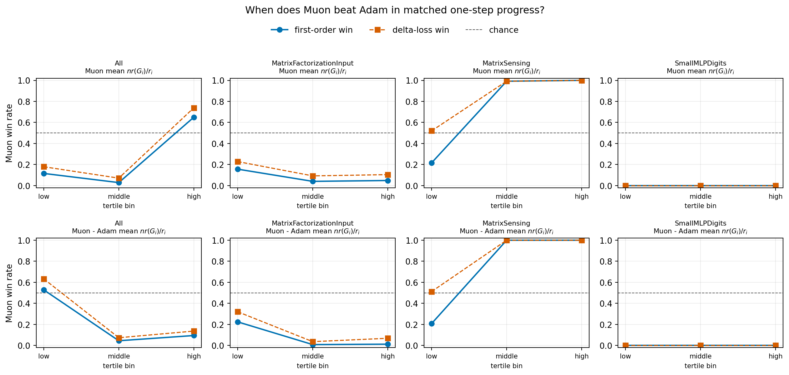

| condition | problem_family | bin | bin_min | bin_max | n_pairs | muon_first_order_win_rate | muon_delta_loss_win_rate | geomean_first_order_ratio_muon_over_adam | first_order_ratio_ci95_low | first_order_ratio_ci95_high |
|---|---|---|---|---|---|---|---|---|---|---|
| muon_grad_rank_fraction | All | middle | 0.2648 | 0.5023 | 425 | 0.02353 | 0.06118 | 0.4032 | 0.3815 | 0.4261 |
| muon_grad_rank_fraction | All | high | 0.503 | 0.7313 | 425 | 0.8306 | 0.8024 | 1.078 | 1.036 | 1.122 |
| muon_grad_rank_fraction | All | low | 0.2011 | 0.2644 | 425 | 0.1035 | 0.1647 | 0.3343 | 0.2973 | 0.3759 |
| muon_grad_rank_fraction | MatrixFactorizationInput | high | 0.2988 | 0.6749 | 250 | 0.04 | 0.088 | 0.3899 | 0.3627 | 0.4192 |
| muon_grad_rank_fraction | MatrixFactorizationInput | middle | 0.2284 | 0.2972 | 250 | 0.024 | 0.068 | 0.2862 | 0.2608 | 0.3142 |
| muon_grad_rank_fraction | MatrixFactorizationInput | low | 0.2011 | 0.2279 | 250 | 0.152 | 0.228 | 0.3622 | 0.3028 | 0.4331 |
| muon_grad_rank_fraction | MatrixSensing | low | 0.6993 | 0.7119 | 125 | 0.936 | 0.904 | 1.237 | 1.198 | 1.278 |
| muon_grad_rank_fraction | MatrixSensing | high | 0.7166 | 0.7313 | 125 | 0.952 | 0.944 | 1.23 | 1.197 | 1.263 |
| muon_grad_rank_fraction | MatrixSensing | middle | 0.712 | 0.7166 | 125 | 0.936 | 0.88 | 1.242 | 1.204 | 1.28 |
| muon_grad_rank_fraction | SmallMLPDigits | low | 0.3263 | 0.3896 | 50 | 0 | 0 | 0.6077 | 0.5604 | 0.659 |
| muon_grad_rank_fraction | SmallMLPDigits | middle | 0.3897 | 0.4073 | 50 | 0 | 0 | 0.4964 | 0.4406 | 0.5593 |
| muon_grad_rank_fraction | SmallMLPDigits | high | 0.4074 | 0.4541 | 50 | 0 | 0 | 0.4747 | 0.4208 | 0.5356 |
| delta_mean_grad_rank_fraction | All | low | -0.1085 | 2.491e-05 | 425 | 0.6635 | 0.6776 | 1.148 | 1.056 | 1.247 |
| delta_mean_grad_rank_fraction | All | middle | 2.734e-05 | 0.01969 | 425 | 0.28 | 0.3012 | 0.4385 | 0.4033 | 0.4769 |
| delta_mean_grad_rank_fraction | All | high | 0.01975 | 0.2754 | 425 | 0.01412 | 0.04941 | 0.2887 | 0.2744 | 0.3038 |
| delta_mean_grad_rank_fraction | MatrixFactorizationInput | low | -0.1085 | 0.006871 | 250 | 0.192 | 0.292 | 0.637 | 0.5363 | 0.7565 |
| delta_mean_grad_rank_fraction | MatrixFactorizationInput | middle | 0.006877 | 0.03516 | 250 | 0.008 | 0.028 | 0.2294 | 0.2141 | 0.2458 |
| delta_mean_grad_rank_fraction | MatrixFactorizationInput | high | 0.0352 | 0.2754 | 250 | 0.016 | 0.064 | 0.2766 | 0.2614 | 0.2927 |
| delta_mean_grad_rank_fraction | MatrixSensing | middle | -0.0003656 | 2.491e-05 | 125 | 1 | 0.992 | 1.132 | 1.114 | 1.15 |
| delta_mean_grad_rank_fraction | MatrixSensing | high | 2.734e-05 | 0.01528 | 125 | 0.944 | 0.92 | 1.301 | 1.264 | 1.34 |
| delta_mean_grad_rank_fraction | MatrixSensing | low | -0.01733 | -0.000366 | 125 | 0.88 | 0.816 | 1.282 | 1.238 | 1.328 |
| delta_mean_grad_rank_fraction | SmallMLPDigits | low | -0.01329 | 0.006675 | 50 | 0 | 0 | 0.7345 | 0.7141 | 0.7555 |
| delta_mean_grad_rank_fraction | SmallMLPDigits | middle | 0.00687 | 0.06431 | 50 | 0 | 0 | 0.5799 | 0.5511 | 0.6102 |
| delta_mean_grad_rank_fraction | SmallMLPDigits | high | 0.06466 | 0.1119 | 50 | 0 | 0 | 0.3362 | 0.3068 | 0.3683 |

The leave-family-out check asks whether a simple rule learned from two problem families predicts Muon wins in the held-out family. This is a direct stress test for cross-task generalization of the rank/spectral explanation.

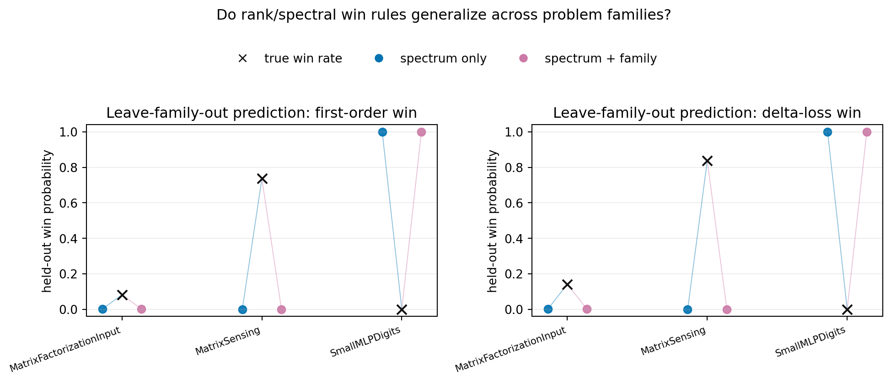

| target | model | held_out_family | test_pairs | test_positive_rate | mean_predicted_probability | calibration_error | auc | accuracy | brier | baseline_brier |
|---|---|---|---|---|---|---|---|---|---|---|
| muon_first_order_win | spectrum_only | MatrixFactorizationInput | 750 | 0.072 | 0.006504 | -0.0655 | 0.4716 | 0.9253 | 0.07406 | 0.06682 |
| muon_first_order_win | spectrum_only | MatrixSensing | 375 | 0.9413 | 0 | -0.9413 | 0.5 | 0.05867 | 0.9413 | 0.05522 |
| muon_first_order_win | spectrum_only | SmallMLPDigits | 150 | 0 | 1 | 1 | n/a | 0 | 1 | 0 |
| muon_first_order_win | spectrum_plus_family | MatrixFactorizationInput | 750 | 0.072 | 0.007214 | -0.06479 | 0.4712 | 0.9253 | 0.07418 | 0.06682 |
| muon_first_order_win | spectrum_plus_family | MatrixSensing | 375 | 0.9413 | 0 | -0.9413 | 0.5 | 0.05867 | 0.9413 | 0.05522 |
| muon_first_order_win | spectrum_plus_family | SmallMLPDigits | 150 | 0 | 1 | 1 | n/a | 0 | 1 | 0 |
| muon_delta_loss_win | spectrum_only | MatrixFactorizationInput | 750 | 0.128 | 0.004461 | -0.1235 | 0.3923 | 0.8707 | 0.1294 | 0.1116 |
| muon_delta_loss_win | spectrum_only | MatrixSensing | 375 | 0.9093 | 2.388e-120 | -0.9093 | 0.5267 | 0.09067 | 0.9093 | 0.08245 |
| muon_delta_loss_win | spectrum_only | SmallMLPDigits | 150 | 0 | 1 | 1 | n/a | 0 | 1 | 0 |
| muon_delta_loss_win | spectrum_plus_family | MatrixFactorizationInput | 750 | 0.128 | 0.005179 | -0.1228 | 0.3921 | 0.8707 | 0.1295 | 0.1116 |
| muon_delta_loss_win | spectrum_plus_family | MatrixSensing | 375 | 0.9093 | 9.707e-117 | -0.9093 | 0.5261 | 0.09067 | 0.9093 | 0.08245 |
| muon_delta_loss_win | spectrum_plus_family | SmallMLPDigits | 150 | 0 | 1 | 1 | n/a | 0 | 1 | 0 |

The feature-overlap diagnostic checks whether the held-out family is interpolation or extrapolation relative to the two training families. Large outside-range fractions mean that poor leave-family-out prediction should be read as lack of current cross-task support, not as a fitted rule failing under interpolation.

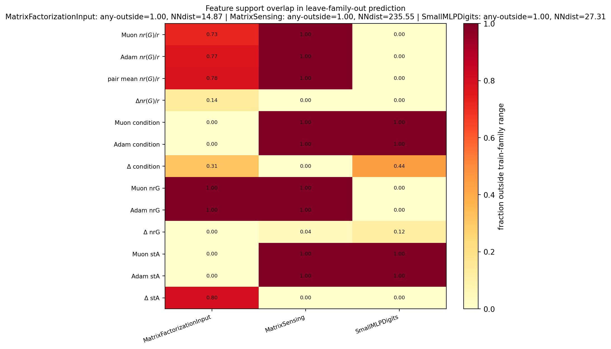

| held_out_family | test_pairs | mean_feature_outside_fraction | frac_pairs_with_any_feature_outside | median_min_standardized_distance | p90_min_standardized_distance |
|---|---|---|---|---|---|
| MatrixFactorizationInput | 750 | 0.4251 | 1 | 14.87 | 44.36 |
| MatrixSensing | 375 | 0.6956 | 1 | 235.6 | 238 |
| SmallMLPDigits | 150 | 0.3508 | 1 | 27.31 | 30.31 |

## Finding 6: Optimization Performance Is Separate

**Finding:** Geometry separation does not automatically imply better final loss, recovery error, or classification error.

**Interpretation:** The current claim should be that Muon changes spectral/rank geometry; whether that helps performance depends on problem family and short-horizon setting.

**Reasoning:** The performance table directly measures final outcomes, while the geometry table measures the path taken through diagnostics.

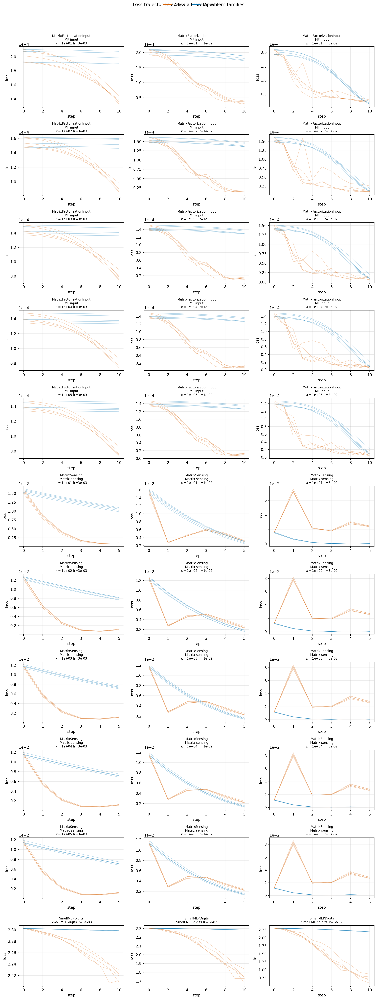

| problem_family | setting | algo | runs | median_final_loss | median_recovery | median_nrG | median_stA | median_condition_score | median_delta_loss |
|---|---|---|---|---|---|---|---|---|---|
| MatrixFactorizationInput | MF input kappa=1e+01 lr=1e-02 | Adam | 5 | 3.738e-05 | 0.4457 | 2.048 | 5.118 | 1.143 | 1.555e-05 |
| MatrixFactorizationInput | MF input kappa=1e+01 lr=1e-02 | Muon | 5 | 0.000193 | 0.9614 | 2.615 | 6.584 | 0.7148 | 1.744e-06 |
| MatrixFactorizationInput | MF input kappa=1e+01 lr=3e-02 | Adam | 5 | 3.747e-05 | 0.4173 | 1.955 | 5.142 | 1.043 | 7.467e-06 |
| MatrixFactorizationInput | MF input kappa=1e+01 lr=3e-02 | Muon | 5 | 3.712e-05 | 0.4671 | 1.893 | 5.795 | 0.7146 | 2.119e-05 |
| MatrixFactorizationInput | MF input kappa=1e+01 lr=3e-03 | Adam | 5 | 0.0001521 | 0.8698 | 1.451 | 4.846 | 0.8849 | 5.178e-06 |
| MatrixFactorizationInput | MF input kappa=1e+01 lr=3e-03 | Muon | 5 | 0.0002058 | 0.9944 | 2.472 | 6.558 | 0.6756 | 2.596e-07 |
| MatrixFactorizationInput | MF input kappa=1e+02 lr=1e-02 | Adam | 5 | 2.099e-05 | 0.37 | 1.279 | 4.779 | 0.9528 | 1.482e-05 |
| MatrixFactorizationInput | MF input kappa=1e+02 lr=1e-02 | Muon | 5 | 0.0001485 | 0.9672 | 1.569 | 6.289 | 0.5003 | 1.246e-06 |
| MatrixFactorizationInput | MF input kappa=1e+02 lr=3e-02 | Adam | 5 | 1.463e-05 | 0.3013 | 1.627 | 4.9 | 1.016 | 7.658e-06 |
| MatrixFactorizationInput | MF input kappa=1e+02 lr=3e-02 | Muon | 5 | 3.209e-05 | 0.4692 | 1.272 | 5.075 | 0.68 | 1.52e-05 |
| MatrixFactorizationInput | MF input kappa=1e+02 lr=3e-03 | Adam | 5 | 0.0001012 | 0.8177 | 1.077 | 4.67 | 0.8472 | 5.452e-06 |
| MatrixFactorizationInput | MF input kappa=1e+02 lr=3e-03 | Muon | 5 | 0.0001576 | 0.9951 | 1.498 | 6.411 | 0.4031 | 1.842e-07 |
| MatrixFactorizationInput | MF input kappa=1e+03 lr=1e-02 | Adam | 5 | 1.604e-05 | 0.328 | 1.139 | 4.623 | 0.8798 | 1.525e-05 |
| MatrixFactorizationInput | MF input kappa=1e+03 lr=1e-02 | Muon | 5 | 0.0001382 | 0.9689 | 1.243 | 5.854 | 0.4534 | 1.081e-06 |
| MatrixFactorizationInput | MF input kappa=1e+03 lr=3e-02 | Adam | 5 | 1.471e-05 | 0.3064 | 1.154 | 4.704 | 0.8349 | 7.899e-06 |
| MatrixFactorizationInput | MF input kappa=1e+03 lr=3e-02 | Muon | 5 | 3.02e-05 | 0.4669 | 1.105 | 4.835 | 0.7299 | 1.325e-05 |
| MatrixFactorizationInput | MF input kappa=1e+03 lr=3e-03 | Adam | 5 | 9.304e-05 | 0.803 | 1.031 | 4.615 | 0.8277 | 5.324e-06 |
| MatrixFactorizationInput | MF input kappa=1e+03 lr=3e-03 | Muon | 5 | 0.0001464 | 0.9956 | 1.244 | 6.118 | 0.3888 | 1.558e-07 |
| MatrixFactorizationInput | MF input kappa=1e+04 lr=1e-02 | Adam | 5 | 1.44e-05 | 0.3094 | 1.09 | 4.554 | 0.8808 | 1.532e-05 |
| MatrixFactorizationInput | MF input kappa=1e+04 lr=1e-02 | Muon | 5 | 0.0001353 | 0.9692 | 1.103 | 5.618 | 0.4686 | 9.793e-07 |
| MatrixFactorizationInput | MF input kappa=1e+04 lr=3e-02 | Adam | 5 | 1.559e-05 | 0.3288 | 1.082 | 4.646 | 0.8205 | 1.016e-05 |
| MatrixFactorizationInput | MF input kappa=1e+04 lr=3e-02 | Muon | 5 | 2.934e-05 | 0.4645 | 1.039 | 4.727 | 0.767 | 1.265e-05 |
| MatrixFactorizationInput | MF input kappa=1e+04 lr=3e-03 | Adam | 5 | 9.179e-05 | 0.7827 | 1.013 | 4.569 | 0.8302 | 5.307e-06 |
| MatrixFactorizationInput | MF input kappa=1e+04 lr=3e-03 | Muon | 5 | 0.0001432 | 0.9958 | 1.124 | 5.974 | 0.4095 | 1.427e-07 |
| MatrixFactorizationInput | MF input kappa=1e+05 lr=1e-02 | Adam | 5 | 1.351e-05 | 0.299 | 1.08 | 4.543 | 0.8794 | 1.546e-05 |
| MatrixFactorizationInput | MF input kappa=1e+05 lr=1e-02 | Muon | 5 | 0.0001345 | 0.9695 | 1.036 | 5.417 | 0.4895 | 9.421e-07 |
| MatrixFactorizationInput | MF input kappa=1e+05 lr=3e-02 | Adam | 5 | 1.479e-05 | 0.3224 | 1.139 | 4.706 | 0.9 | 1.018e-05 |
| MatrixFactorizationInput | MF input kappa=1e+05 lr=3e-02 | Muon | 5 | 2.904e-05 | 0.4628 | 1.024 | 4.671 | 0.7868 | 1.239e-05 |
| MatrixFactorizationInput | MF input kappa=1e+05 lr=3e-03 | Adam | 5 | 8.955e-05 | 0.7782 | 1.007 | 4.562 | 0.8322 | 5.304e-06 |
| MatrixFactorizationInput | MF input kappa=1e+05 lr=3e-03 | Muon | 5 | 0.0001422 | 0.9958 | 1.062 | 5.913 | 0.3973 | 1.379e-07 |
| MatrixSensing | Matrix sensing kappa=1e+01 lr=1e-02 | Adam | 5 | 0.02903 | 1.273 | 42.86 | 304.1 | 0.1418 | 0.01415 |
| MatrixSensing | Matrix sensing kappa=1e+01 lr=1e-02 | Muon | 5 | 0.008715 | 1.086 | 42.84 | 304.1 | 0.142 | 0.006231 |
| MatrixSensing | Matrix sensing kappa=1e+01 lr=3e-02 | Adam | 5 | 0.2007 | 2.349 | 43.18 | 304.1 | 0.1435 | 0.1027 |
| MatrixSensing | Matrix sensing kappa=1e+01 lr=3e-02 | Muon | 5 | 0.005953 | 1.088 | 43.26 | 304.1 | 0.1425 | 0.01019 |
| MatrixSensing | Matrix sensing kappa=1e+01 lr=3e-03 | Adam | 5 | 0.006833 | 1.079 | 43.07 | 304.1 | 0.1426 | 0.005544 |
| MatrixSensing | Matrix sensing kappa=1e+01 lr=3e-03 | Muon | 5 | 0.01283 | 1.103 | 42.67 | 304.1 | 0.1416 | 0.002221 |
| MatrixSensing | Matrix sensing kappa=1e+02 lr=1e-02 | Adam | 5 | 0.02726 | 1.365 | 42.91 | 304.1 | 0.1415 | 0.01173 |
| MatrixSensing | Matrix sensing kappa=1e+02 lr=1e-02 | Muon | 5 | 0.006185 | 1.125 | 42.73 | 304.1 | 0.1416 | 0.00547 |
| MatrixSensing | Matrix sensing kappa=1e+02 lr=3e-02 | Adam | 5 | 0.1896 | 2.654 | 43 | 304.1 | 0.1427 | 0.1001 |
| MatrixSensing | Matrix sensing kappa=1e+02 lr=3e-02 | Muon | 5 | 0.004572 | 1.137 | 43.16 | 304.1 | 0.1422 | 0.008496 |
| MatrixSensing | Matrix sensing kappa=1e+02 lr=3e-03 | Adam | 5 | 0.005575 | 1.124 | 43.2 | 304.1 | 0.1416 | 0.004588 |
| MatrixSensing | Matrix sensing kappa=1e+02 lr=3e-03 | Muon | 5 | 0.009735 | 1.141 | 42.57 | 304.1 | 0.1412 | 0.001977 |
| MatrixSensing | Matrix sensing kappa=1e+03 lr=1e-02 | Adam | 5 | 0.02677 | 1.397 | 43.1 | 304.1 | 0.1418 | 0.01136 |
| MatrixSensing | Matrix sensing kappa=1e+03 lr=1e-02 | Muon | 5 | 0.005775 | 1.138 | 42.8 | 304.1 | 0.1417 | 0.005185 |
| MatrixSensing | Matrix sensing kappa=1e+03 lr=3e-02 | Adam | 5 | 0.1945 | 2.724 | 42.95 | 304.1 | 0.1422 | 0.09476 |
| MatrixSensing | Matrix sensing kappa=1e+03 lr=3e-02 | Muon | 5 | 0.004691 | 1.153 | 42.88 | 304.1 | 0.1423 | 0.007561 |
| MatrixSensing | Matrix sensing kappa=1e+03 lr=3e-03 | Adam | 5 | 0.005452 | 1.137 | 43.23 | 304.1 | 0.1421 | 0.00428 |
| MatrixSensing | Matrix sensing kappa=1e+03 lr=3e-03 | Muon | 5 | 0.009297 | 1.153 | 42.7 | 304.1 | 0.1414 | 0.001927 |
| MatrixSensing | Matrix sensing kappa=1e+04 lr=1e-02 | Adam | 5 | 0.02477 | 1.404 | 43.12 | 304.1 | 0.142 | 0.01188 |
| MatrixSensing | Matrix sensing kappa=1e+04 lr=1e-02 | Muon | 5 | 0.005677 | 1.142 | 42.84 | 304.1 | 0.1419 | 0.005091 |
| MatrixSensing | Matrix sensing kappa=1e+04 lr=3e-02 | Adam | 5 | 0.1898 | 2.734 | 43.08 | 304.1 | 0.1418 | 0.09387 |
| MatrixSensing | Matrix sensing kappa=1e+04 lr=3e-02 | Muon | 5 | 0.004742 | 1.159 | 42.77 | 304.1 | 0.1419 | 0.007637 |
| MatrixSensing | Matrix sensing kappa=1e+04 lr=3e-03 | Adam | 5 | 0.005448 | 1.142 | 43.23 | 304.1 | 0.1422 | 0.004204 |
| MatrixSensing | Matrix sensing kappa=1e+04 lr=3e-03 | Muon | 5 | 0.00921 | 1.157 | 42.75 | 304.1 | 0.1415 | 0.001897 |
| MatrixSensing | Matrix sensing kappa=1e+05 lr=1e-02 | Adam | 5 | 0.02496 | 1.404 | 43.15 | 304.1 | 0.1419 | 0.0118 |
| MatrixSensing | Matrix sensing kappa=1e+05 lr=1e-02 | Muon | 5 | 0.005611 | 1.143 | 42.87 | 304.1 | 0.142 | 0.005078 |
| MatrixSensing | Matrix sensing kappa=1e+05 lr=3e-02 | Adam | 5 | 0.1845 | 2.745 | 43.08 | 304.1 | 0.1422 | 0.09534 |
| MatrixSensing | Matrix sensing kappa=1e+05 lr=3e-02 | Muon | 5 | 0.004696 | 1.161 | 42.78 | 304.1 | 0.142 | 0.007433 |
| MatrixSensing | Matrix sensing kappa=1e+05 lr=3e-03 | Adam | 5 | 0.005584 | 1.144 | 43.24 | 304.1 | 0.1422 | 0.004174 |
| MatrixSensing | Matrix sensing kappa=1e+05 lr=3e-03 | Muon | 5 | 0.009192 | 1.159 | 42.77 | 304.1 | 0.1415 | 0.001883 |
| SmallMLPDigits | Small MLP digits lr=1e-02 | Adam | 5 | 1.744 | 0.3584 | 6.198 | 1.434 | 4.312 | 0.06391 |
| SmallMLPDigits | Small MLP digits lr=1e-02 | Muon | 5 | 2.283 | 0.2109 | 7.73 | 1.433 | 5.423 | 0.002451 |
| SmallMLPDigits | Small MLP digits lr=3e-02 | Adam | 5 | 0.6995 | 0.1729 | 3.761 | 1.43 | 2.646 | 0.2014 |
| SmallMLPDigits | Small MLP digits lr=3e-02 | Muon | 5 | 2.19 | 0.1865 | 7.562 | 1.457 | 5.199 | 0.01433 |
| SmallMLPDigits | Small MLP digits lr=3e-03 | Adam | 5 | 2.218 | 0.4932 | 6.094 | 1.375 | 4.384 | 0.008646 |
| SmallMLPDigits | Small MLP digits lr=3e-03 | Muon | 5 | 2.298 | 0.4971 | 7.457 | 1.38 | 5.472 | 0.0005479 |

## Trajectory Evidence

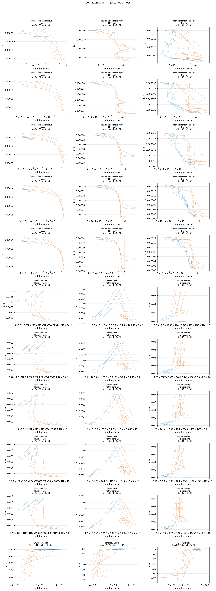

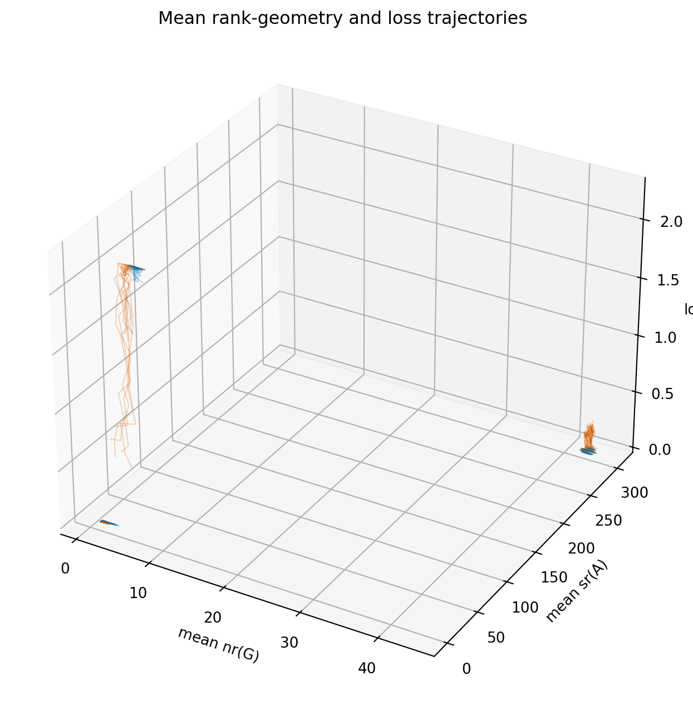

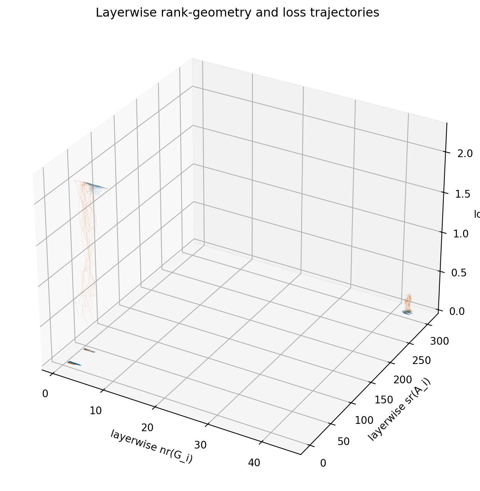

## Next Experiment Candidate Scan

The current cross-task failure is largely an extrapolation problem: the three problem families occupy separated spectral supports. A lightweight initialization scan therefore searches for intermediate settings whose `nrG`, `stA`, condition score, and mean `nr(G_i)/r_i` sit inside the current global support. The scan output is kept separate from the main experiment because it is a candidate-selection diagnostic, not a trained-result claim.

See [E11 candidate overlap scan](e11_candidate_overlap_scan.md) for the ranked candidate settings.

An initial selected follow-up has also been run with equal-update control on a small number of overlap settings. See [E11 overlap follow-up](e11_overlap_followup.md). The short version is that Matrix Sensing still gives Muon a small first-order advantage, SmallMLPDigits becomes Muon-favorable after moving to a smaller hidden layer, and MF-with-input remains Adam-favorable in first-order descent.

The SmallMLP flip has been isolated with a width sweep. See [E11 SmallMLP width sweep](e11_mlp_width_sweep.md). In that sweep, hidden widths 8 and 16 are Muon-favorable, while widths 32, 64, and 128 are Adam-favorable under equal-update control. The layerwise diagnostic points to a first-layer bottleneck: the second layer stays mildly Muon-favorable, but as width grows Muon's first-layer `nr(G_i)/r_i` and gradient-update cosine fall sharply while Adam's first-layer cosine stays comparatively flat.

A layerwise hybrid test shows that this bottleneck is not fixed by simply assigning Adam to the first layer and Muon to the second. See [E11 SmallMLP layerwise hybrid test](e11_mlp_layer_hybrid.md). The hybrid results suggest that pure Muon uses a coupled two-layer update geometry in narrow networks; `AdamFirstMuonSecond` keeps the first layer closer to Adam but starves the second layer of equalized update budget, while `MuonFirstAdamSecond` allocates most update budget to the second layer but loses too much first-layer contribution. This makes the mechanism a layer-coupling effect, not a single-layer replacement rule.

A representative hyperparameter sweep has been run to check whether the current conclusions are artifacts of one learning-rate choice. See [E11 hyperparameter sweep](e11_hyperparam_sweep.md). The sweep keeps the update-spectrum claim intact under both raw and equal-update modes, but it still does not support a global optimization-superiority claim for Muon after best-lr selection. It reduces the learning-rate-artifact concern, but it is not an exhaustive tuning protocol.

A target-update-norm sweep has also been run to decouple update direction from update magnitude. See [E11 target-update-norm sweep](e11_target_update_sweep.md). At fixed global relative update norm, Muon's direction remains favorable for Matrix Sensing and SmallMLPDigits with hidden width 16, but unfavorable for MF-with-input and SmallMLPDigits with hidden width 64. This is the cleanest current evidence that the optimizer difference is not only a learning-rate artifact: the direction itself is task- and layer-condition dependent.

A SmallMLP per-layer update-control follow-up fixes each layer's relative update norm separately. See [E11 SmallMLP per-layer update control](e11_mlp_per_layer_control.md). This makes the hidden-64 Adam advantage robust to both global update-size and layer-allocation controls. The hidden-16 Muon advantage is more fragile: it appears at small per-layer targets, becomes near-neutral overall, and reverses at larger targets. This means the narrow-network advantage should be described as direction-plus-scale dependent, not as a pure direction-only effect.

The current intervention sequence is consolidated in [E11 mechanism ladder](e11_mechanism_ladder.md). The ladder separates raw performance, best-lr robustness, global update-size control, per-layer update-size control, within-layer spectral allocation, and the still-open singular-vector/trajectory question.

A within-layer spectral-allocation probe has now been run. See [E11 spectral allocation probe](e11_spectral_allocation_probe.md). It fixes gradient singular vectors and changes only singular-value allocation under either Frobenius or operator-norm budgets. The result is sharp: flat/polar allocation loses to GD-spectrum allocation under a fixed Frobenius budget, but wins under a fixed operator-norm budget. This makes the Muon mechanism more precise: polar updates are not universally better directions; they are favorable under an operator-norm-like geometry when spreading update mass across singular directions is useful.

A singular-vector trajectory diagnostic has also been run. See [E11 singular-vector trajectory diagnostic](e11_singular_vector_trajectory.md). MF-with-input keeps high Adam/Muon gradient-subspace overlap through the short horizon, so MF is closer to a shared-geometry singular-value-allocation story. Matrix Sensing and SmallMLP show much stronger gradient/parameter subspace divergence, so their optimizer difference includes trajectory-level singular-vector geometry.

A singular-vector swap probe strengthens that diagnostic. See [E11 singular-vector swap probe](e11_singular_vector_swap_probe.md). At a fixed Adam or Muon state, replacing the state's own gradient polar singular vectors with the other optimizer's matched-state singular vectors systematically reduces one-step progress; in Matrix Sensing, the swapped vectors often become ascent directions. This suggests the trajectory-level singular-vector geometry is relevant to local descent, not just a visualization artifact.

A natural update-vector swap probe has also been run. See [E11 natural update-vector swap probe](e11_natural_update_swap_probe.md). This probe extracts each optimizer's actual proposed update vector by temporarily stepping and restoring the optimizer state, then evaluates own-update vs other-update directions at the same state under matched per-layer Frobenius or operator-norm budgets across five target scales. Overall, the other update gives lower one-step progress, including for observed `delta_loss`, but the result is not monotone across settings, budgets, and evaluation states. This makes the interpretation sharper: Adam/Muon update vectors are locally consequential, but the evidence does not support a universal statement that each optimizer's own update is always best.

A trajectory-level optimizer switch probe gives an important negative control. See [E11 optimizer switch probe](e11_optimizer_switch_probe.md). After taking Adam or Muon to a checkpoint, the remaining short horizon is continued either with the original optimizer state or by switching to the other optimizer. This does not support a simple own-optimizer continuation story: switching from Muon checkpoints to Adam often improves the remaining-horizon outcome, while switching from Adam checkpoints to Muon usually hurts.

A reset-control version of the switch probe reduces the optimizer-state-reset confound. See [E11 optimizer switch reset-control probe](e11_optimizer_switch_reset_control.md). It compares `own_preserved`, `own_fresh`, and `switched_fresh` from the same checkpoint. Adam state reset does hurt Adam continuations, but it does not explain away the qualitative pattern: from Muon checkpoints, fresh Adam often still gives lower final loss than fresh Muon. The current thesis should therefore separate local update-vector geometry from longer-horizon optimizer performance.

A fresh-continuation horizon sweep further sharpens the trajectory-level caveat. See [E11 optimizer switch horizon sweep](e11_optimizer_switch_horizon_sweep.md). Both continuations use fresh optimizer state, and the continuation horizon is varied over 1, 3, 10, and 30 steps. The switch effect is not horizon-invariant: aggregate switching is worse at horizon 10, while Muon-source checkpoints become Adam-favorable again at horizon 30. This means the trajectory-level story is source-, task-, and horizon-dependent rather than a direct consequence of the one-step update geometry.

A continuation-learning-rate sweep checks whether the horizon-30 result is just a fixed-LR artifact. See [E11 optimizer switch continuation-LR sweep](e11_optimizer_switch_lr_sweep.md). Each fresh continuation gets its best final loss over a small LR grid. The result remains non-monotone: Matrix Sensing and SmallMLP prefer opposite switch directions, and aggregate ratios are sensitive to task-family scale. Thus the trajectory-level evidence should be used mainly as a warning against overclaiming from one-step geometry, not as a positive universal switching rule.

## Caveats

1. MF-with-input has the strict theory-aligned activation product; Matrix Sensing and MLP use problem-specific `A` diagnostics.
2. The horizons are short: 10 steps for MF and MLP, 5 steps for Matrix Sensing.
3. Larger `nrG` or `stA` should not be interpreted as better optimization unless it is tied to loss, recovery, or classification metrics.
4. The MLP experiment is a small torch sanity benchmark on sklearn digits, not a broad neural-network benchmark.
5. The hyperparameter sweep is representative and oracle-style, not exhaustive.
6. The target-update-norm sweep controls global update size, not per-layer update allocation.
7. The per-layer update-control follow-up only covers two SmallMLP widths and does not control within-layer spectral allocation.
8. The spectral-allocation probe is an artificial one-step probe that fixes gradient singular vectors.
9. The singular-vector and natural-update swap probes are artificial one-step interventions.
10. The optimizer-switch probes are trajectory-level but still use fresh-continuation interventions; the horizon and continuation-LR sweeps show the result itself is horizon-, task-, and tuning-dependent.
