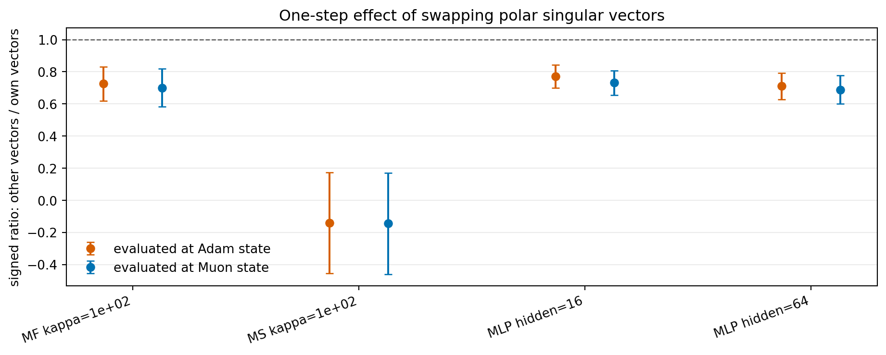

# E11 Singular-Vector Swap Probe

## Purpose

The singular-vector trajectory diagnostic shows that Adam and Muon can move into different gradient subspaces, but that is only diagnostic. This probe asks a more causal one-step question: at a fixed Adam or Muon state, does replacing the state's own gradient polar singular vectors with the other optimizer's matched-state gradient polar singular vectors reduce first-order progress?

For each layer, both candidate updates use a flat polar spectrum and the same per-layer operator-norm budget `0.001`. Only the singular vectors are swapped.

## Swap Ratio

Signed ratios below 1 mean that using the other optimizer's singular vectors gives less one-step first-order progress than using the state's own singular vectors. Negative ratios mean the swapped-vector update is locally ascent while the own-vector update is descent.

| group_type       | problem_family           | base_setting               | eval_algo   | metric            |   n_pairs |   other_positive_pairs |   other_better_pairs |   mean_signed_other_over_own |   signed_ratio_ci95_low |   signed_ratio_ci95_high |
|:-----------------|:-------------------------|:---------------------------|:------------|:------------------|----------:|-----------------------:|---------------------:|-----------------------------:|------------------------:|-------------------------:|
| setting_eval     | MatrixFactorizationInput | MF input kappa=1e+02       | Adam        | update_grad_inner |        20 |                     20 |                    0 |                       0.7253 |                  0.6186 |                   0.832  |
| setting_eval     | MatrixFactorizationInput | MF input kappa=1e+02       | Muon        | update_grad_inner |        20 |                     20 |                    0 |                       0.7003 |                  0.5826 |                   0.8179 |
| setting_eval     | MatrixSensing            | Matrix sensing kappa=1e+02 | Adam        | update_grad_inner |        20 |                      5 |                    0 |                      -0.1405 |                 -0.454  |                   0.173  |
| setting_eval     | MatrixSensing            | Matrix sensing kappa=1e+02 | Muon        | update_grad_inner |        20 |                      5 |                    0 |                      -0.1452 |                 -0.4608 |                   0.1704 |
| setting_eval     | SmallMLPDigits           | Small MLP digits hidden=16 | Adam        | update_grad_inner |        20 |                     20 |                    0 |                       0.7725 |                  0.7007 |                   0.8442 |
| setting_eval     | SmallMLPDigits           | Small MLP digits hidden=16 | Muon        | update_grad_inner |        20 |                     20 |                    0 |                       0.7312 |                  0.6537 |                   0.8086 |
| setting_eval     | SmallMLPDigits           | Small MLP digits hidden=64 | Adam        | update_grad_inner |        20 |                     20 |                    0 |                       0.7103 |                  0.6271 |                   0.7935 |
| setting_eval     | SmallMLPDigits           | Small MLP digits hidden=64 | Muon        | update_grad_inner |        20 |                     20 |                    0 |                       0.6882 |                  0.5998 |                   0.7766 |
| setting_all_eval | MatrixFactorizationInput | MF input kappa=1e+02       | All         | update_grad_inner |        40 |                     40 |                    0 |                       0.7128 |                  0.6343 |                   0.7913 |
| setting_all_eval | MatrixSensing            | Matrix sensing kappa=1e+02 | All         | update_grad_inner |        40 |                     10 |                    0 |                      -0.1429 |                 -0.3624 |                   0.0767 |
| setting_all_eval | SmallMLPDigits           | Small MLP digits hidden=16 | All         | update_grad_inner |        40 |                     40 |                    0 |                       0.7518 |                  0.6993 |                   0.8043 |
| setting_all_eval | SmallMLPDigits           | Small MLP digits hidden=64 | All         | update_grad_inner |        40 |                     40 |                    0 |                       0.6993 |                  0.6392 |                   0.7593 |
| all              | All                      | All                        | All         | update_grad_inner |       160 |                    130 |                    0 |                       0.5053 |                  0.4209 |                   0.5896 |

## Step-Level Means

| problem_family           | base_setting               | eval_algo   |   step | vector_source   |   points |   mean_delta_loss |   mean_update_grad_inner |   mean_update_grad_cosine |
|:-------------------------|:---------------------------|:------------|-------:|:----------------|---------:|------------------:|-------------------------:|--------------------------:|
| MatrixFactorizationInput | MF input kappa=1e+02       | Adam        |      0 | other_vectors   |        5 |         9.03e-09  |                9.031e-09 |                   0.05457 |
| MatrixFactorizationInput | MF input kappa=1e+02       | Adam        |      0 | own_vectors     |        5 |         9.03e-09  |                9.031e-09 |                   0.05457 |
| MatrixFactorizationInput | MF input kappa=1e+02       | Adam        |      1 | other_vectors   |        5 |         3.175e-08 |                3.169e-08 |                   0.07684 |
| MatrixFactorizationInput | MF input kappa=1e+02       | Adam        |      1 | own_vectors     |        5 |         6.451e-08 |                6.432e-08 |                   0.158   |
| MatrixFactorizationInput | MF input kappa=1e+02       | Adam        |      3 | other_vectors   |        5 |         3.252e-07 |                3.244e-07 |                   0.2585  |
| MatrixFactorizationInput | MF input kappa=1e+02       | Adam        |      3 | own_vectors     |        5 |         3.592e-07 |                3.582e-07 |                   0.2861  |
| MatrixFactorizationInput | MF input kappa=1e+02       | Adam        |     10 | other_vectors   |        5 |         1.844e-07 |                1.942e-07 |                   0.1938  |
| MatrixFactorizationInput | MF input kappa=1e+02       | Adam        |     10 | own_vectors     |        5 |         3.625e-07 |                3.704e-07 |                   0.3712  |
| MatrixFactorizationInput | MF input kappa=1e+02       | Muon        |      0 | other_vectors   |        5 |         9.03e-09  |                9.031e-09 |                   0.05457 |
| MatrixFactorizationInput | MF input kappa=1e+02       | Muon        |      0 | own_vectors     |        5 |         9.03e-09  |                9.031e-09 |                   0.05457 |
| MatrixFactorizationInput | MF input kappa=1e+02       | Muon        |      1 | other_vectors   |        5 |         5.106e-09 |                5.096e-09 |                   0.02889 |
| MatrixFactorizationInput | MF input kappa=1e+02       | Muon        |      1 | own_vectors     |        5 |         1.013e-08 |                1.01e-08  |                   0.05809 |
| MatrixFactorizationInput | MF input kappa=1e+02       | Muon        |      3 | other_vectors   |        5 |         1.798e-08 |                1.79e-08  |                   0.07132 |
| MatrixFactorizationInput | MF input kappa=1e+02       | Muon        |      3 | own_vectors     |        5 |         2.073e-08 |                2.063e-08 |                   0.08246 |
| MatrixFactorizationInput | MF input kappa=1e+02       | Muon        |     10 | other_vectors   |        5 |         6.146e-08 |                6.117e-08 |                   0.07339 |
| MatrixFactorizationInput | MF input kappa=1e+02       | Muon        |     10 | own_vectors     |        5 |         1.373e-07 |                1.367e-07 |                   0.1646  |
| MatrixSensing            | Matrix sensing kappa=1e+02 | Adam        |      0 | other_vectors   |        5 |         5.214e-05 |                5.221e-05 |                   0.8267  |
| MatrixSensing            | Matrix sensing kappa=1e+02 | Adam        |      0 | own_vectors     |        5 |         5.214e-05 |                5.221e-05 |                   0.8267  |
| MatrixSensing            | Matrix sensing kappa=1e+02 | Adam        |      1 | other_vectors   |        5 |        -1.088e-05 |               -1.075e-05 |                  -0.2505  |
| MatrixSensing            | Matrix sensing kappa=1e+02 | Adam        |      1 | own_vectors     |        5 |         3.597e-05 |                3.611e-05 |                   0.8447  |
| MatrixSensing            | Matrix sensing kappa=1e+02 | Adam        |      3 | other_vectors   |        5 |        -5.99e-05  |               -5.966e-05 |                  -0.7406  |
| MatrixSensing            | Matrix sensing kappa=1e+02 | Adam        |      3 | own_vectors     |        5 |         6.681e-05 |                6.706e-05 |                   0.8323  |
| MatrixSensing            | Matrix sensing kappa=1e+02 | Adam        |      5 | other_vectors   |        5 |        -1.322e-05 |               -1.308e-05 |                  -0.3173  |
| MatrixSensing            | Matrix sensing kappa=1e+02 | Adam        |      5 | own_vectors     |        5 |         3.463e-05 |                3.479e-05 |                   0.8444  |
| MatrixSensing            | Matrix sensing kappa=1e+02 | Muon        |      0 | other_vectors   |        5 |         5.214e-05 |                5.221e-05 |                   0.8267  |
| MatrixSensing            | Matrix sensing kappa=1e+02 | Muon        |      0 | own_vectors     |        5 |         5.214e-05 |                5.221e-05 |                   0.8267  |
| MatrixSensing            | Matrix sensing kappa=1e+02 | Muon        |      1 | other_vectors   |        5 |        -1.282e-05 |               -1.275e-05 |                  -0.2419  |
| MatrixSensing            | Matrix sensing kappa=1e+02 | Muon        |      1 | own_vectors     |        5 |         4.299e-05 |                4.305e-05 |                   0.8179  |
| MatrixSensing            | Matrix sensing kappa=1e+02 | Muon        |      3 | other_vectors   |        5 |        -2.59e-05  |               -2.584e-05 |                  -0.7241  |
| MatrixSensing            | Matrix sensing kappa=1e+02 | Muon        |      3 | own_vectors     |        5 |         2.845e-05 |                2.851e-05 |                   0.7989  |
| MatrixSensing            | Matrix sensing kappa=1e+02 | Muon        |      5 | other_vectors   |        5 |        -6.42e-06  |               -6.363e-06 |                  -0.2964  |
| MatrixSensing            | Matrix sensing kappa=1e+02 | Muon        |      5 | own_vectors     |        5 |         1.669e-05 |                1.674e-05 |                   0.7822  |
| SmallMLPDigits           | Small MLP digits hidden=16 | Adam        |      0 | other_vectors   |        5 |         6.759e-06 |                6.766e-06 |                   0.6261  |
| SmallMLPDigits           | Small MLP digits hidden=16 | Adam        |      0 | own_vectors     |        5 |         6.759e-06 |                6.766e-06 |                   0.6261  |
| SmallMLPDigits           | Small MLP digits hidden=16 | Adam        |      1 | other_vectors   |        5 |         1.123e-05 |                1.122e-05 |                   0.2985  |
| SmallMLPDigits           | Small MLP digits hidden=16 | Adam        |      1 | own_vectors     |        5 |         1.884e-05 |                1.885e-05 |                   0.506   |
| SmallMLPDigits           | Small MLP digits hidden=16 | Adam        |      3 | other_vectors   |        5 |         5.218e-05 |                5.218e-05 |                   0.3417  |
| SmallMLPDigits           | Small MLP digits hidden=16 | Adam        |      3 | own_vectors     |        5 |         7.164e-05 |                7.16e-05  |                   0.4675  |
| SmallMLPDigits           | Small MLP digits hidden=16 | Adam        |     10 | other_vectors   |        5 |         0.0004503 |                0.0004503 |                   0.3404  |
| SmallMLPDigits           | Small MLP digits hidden=16 | Adam        |     10 | own_vectors     |        5 |         0.000586  |                0.0005861 |                   0.4437  |
| SmallMLPDigits           | Small MLP digits hidden=16 | Muon        |      0 | other_vectors   |        5 |         6.759e-06 |                6.766e-06 |                   0.6261  |
| SmallMLPDigits           | Small MLP digits hidden=16 | Muon        |      0 | own_vectors     |        5 |         6.759e-06 |                6.766e-06 |                   0.6261  |
| SmallMLPDigits           | Small MLP digits hidden=16 | Muon        |      1 | other_vectors   |        5 |         4.044e-06 |                4.043e-06 |                   0.3392  |
| SmallMLPDigits           | Small MLP digits hidden=16 | Muon        |      1 | own_vectors     |        5 |         7.185e-06 |                7.174e-06 |                   0.6063  |
| SmallMLPDigits           | Small MLP digits hidden=16 | Muon        |      3 | other_vectors   |        5 |         7.995e-06 |                7.99e-06  |                   0.4358  |
| SmallMLPDigits           | Small MLP digits hidden=16 | Muon        |      3 | own_vectors     |        5 |         1.187e-05 |                1.186e-05 |                   0.6472  |
| SmallMLPDigits           | Small MLP digits hidden=16 | Muon        |     10 | other_vectors   |        5 |         3.057e-05 |                3.055e-05 |                   0.4939  |
| SmallMLPDigits           | Small MLP digits hidden=16 | Muon        |     10 | own_vectors     |        5 |         4.403e-05 |                4.4e-05   |                   0.7116  |
| SmallMLPDigits           | Small MLP digits hidden=64 | Adam        |      0 | other_vectors   |        5 |         2.302e-05 |                2.303e-05 |                   0.3983  |
| SmallMLPDigits           | Small MLP digits hidden=64 | Adam        |      0 | own_vectors     |        5 |         2.302e-05 |                2.303e-05 |                   0.3983  |
| SmallMLPDigits           | Small MLP digits hidden=64 | Adam        |      1 | other_vectors   |        5 |         3.937e-05 |                3.935e-05 |                   0.1526  |
| SmallMLPDigits           | Small MLP digits hidden=64 | Adam        |      1 | own_vectors     |        5 |         7.684e-05 |                7.682e-05 |                   0.2985  |
| SmallMLPDigits           | Small MLP digits hidden=64 | Adam        |      3 | other_vectors   |        5 |         0.0001806 |                0.0001805 |                   0.17    |
| SmallMLPDigits           | Small MLP digits hidden=64 | Adam        |      3 | own_vectors     |        5 |         0.0002851 |                0.0002851 |                   0.2697  |
| SmallMLPDigits           | Small MLP digits hidden=64 | Adam        |     10 | other_vectors   |        5 |         0.001411  |                0.001411  |                   0.1865  |
| SmallMLPDigits           | Small MLP digits hidden=64 | Adam        |     10 | own_vectors     |        5 |         0.00202   |                0.002021  |                   0.2663  |
| SmallMLPDigits           | Small MLP digits hidden=64 | Muon        |      0 | other_vectors   |        5 |         2.302e-05 |                2.303e-05 |                   0.3983  |
| SmallMLPDigits           | Small MLP digits hidden=64 | Muon        |      0 | own_vectors     |        5 |         2.302e-05 |                2.303e-05 |                   0.3983  |
| SmallMLPDigits           | Small MLP digits hidden=64 | Muon        |      1 | other_vectors   |        5 |         1.138e-05 |                1.137e-05 |                   0.1917  |
| SmallMLPDigits           | Small MLP digits hidden=64 | Muon        |      1 | own_vectors     |        5 |         2.363e-05 |                2.364e-05 |                   0.399   |
| SmallMLPDigits           | Small MLP digits hidden=64 | Muon        |      3 | other_vectors   |        5 |         1.696e-05 |                1.695e-05 |                   0.2394  |
| SmallMLPDigits           | Small MLP digits hidden=64 | Muon        |      3 | own_vectors     |        5 |         2.856e-05 |                2.854e-05 |                   0.4034  |
| SmallMLPDigits           | Small MLP digits hidden=64 | Muon        |     10 | other_vectors   |        5 |         4.545e-05 |                4.542e-05 |                   0.2928  |
| SmallMLPDigits           | Small MLP digits hidden=64 | Muon        |     10 | own_vectors     |        5 |         6.716e-05 |                6.714e-05 |                   0.4305  |

## Interpretation

This is still an artificial intervention, but it is stronger than measuring subspace overlap alone. If other-vector updates are worse than own-vector updates at the same state and norm budget, then the natural Adam/Muon singular-vector divergence is relevant to one-step descent, not merely a visual trajectory difference.

The result should be read together with the spectral-allocation probe. The allocation probe fixes singular vectors and changes singular values; this swap probe fixes the flat/polar singular values and changes singular vectors.

## Caveats

1. This is a one-step artificial intervention, not a natural optimizer.
2. It swaps gradient polar singular vectors, not full Adam update singular vectors.
3. It uses a small representative setting set and a single operator-norm target.
