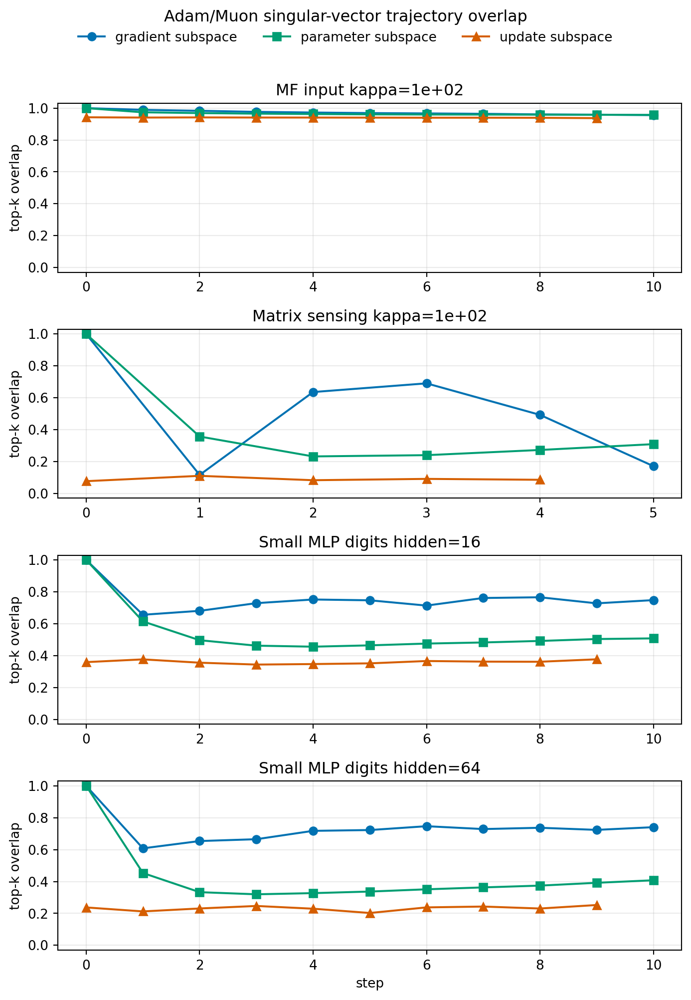

# E11 Singular-Vector Trajectory Diagnostic

## Purpose

The spectral-allocation probe fixes gradient singular vectors, so it isolates singular-value allocation but not natural trajectory effects. This diagnostic asks whether Adam and Muon move into different gradient, parameter, and update singular subspaces over time.

For each matched seed, both optimizers start from the same initialization. At each step and layer, the diagnostic computes top-5 left/right singular subspace overlap between Adam and Muon. A value near 1 means the subspaces match; a value near 0 means they are nearly orthogonal.

## Trajectory Plot

## Final Overlap Summary

| problem_family           | base_setting               |   step |   initial_grad_overlap |   mean_grad_overlap |   grad_overlap_drop |   mean_param_overlap |   mean_adam_loss |   mean_muon_loss |
|:-------------------------|:---------------------------|-------:|-----------------------:|--------------------:|--------------------:|---------------------:|-----------------:|-----------------:|
| MatrixSensing            | Matrix sensing kappa=1e+02 |      5 |                      1 |              0.1714 |             0.8286  |               0.3094 |        0.002402  |        0.001741  |
| MatrixFactorizationInput | MF input kappa=1e+02       |     10 |                      1 |              0.9562 |             0.04375 |               0.9574 |        1.663e-05 |        0.0001406 |
| SmallMLPDigits           | Small MLP digits hidden=16 |     10 |                      1 |              0.7482 |             0.2518  |               0.5082 |        2.139     |        2.289     |
| SmallMLPDigits           | Small MLP digits hidden=64 |     10 |                      1 |              0.741  |             0.259   |               0.408  |        1.747     |        2.283     |

## Selected Step Summary

| base_setting               |   step |   mean_grad_overlap |   mean_param_overlap | mean_update_overlap   |   mean_adam_loss |   mean_muon_loss |
|:---------------------------|-------:|--------------------:|---------------------:|:----------------------|-----------------:|-----------------:|
| MF input kappa=1e+02       |      0 |              1      |               1      | 0.9425                |        0.0001544 |        0.0001544 |
| MF input kappa=1e+02       |      1 |              0.9891 |               0.9738 | 0.9408                |        0.0001506 |        0.000154  |
| MF input kappa=1e+02       |      3 |              0.9766 |               0.9655 | 0.941                 |        0.0001157 |        0.0001527 |
| MF input kappa=1e+02       |      5 |              0.9689 |               0.9609 | 0.9404                |        5.978e-05 |        0.0001508 |
| MF input kappa=1e+02       |     10 |              0.9562 |               0.9574 | n/a                   |        1.663e-05 |        0.0001406 |
| Matrix sensing kappa=1e+02 |      0 |              1      |               1      | 0.07712               |        0.0125    |        0.0125    |
| Matrix sensing kappa=1e+02 |      1 |              0.1163 |               0.3572 | 0.1106                |        0.00273   |        0.009333  |
| Matrix sensing kappa=1e+02 |      3 |              0.6907 |               0.2403 | 0.09144               |        0.005104  |        0.004607  |
| Matrix sensing kappa=1e+02 |      5 |              0.1714 |               0.3094 | n/a                   |        0.002402  |        0.001741  |
| Small MLP digits hidden=16 |      0 |              1      |               1      | 0.3592                |        2.303     |        2.303     |
| Small MLP digits hidden=16 |      1 |              0.6562 |               0.6145 | 0.3764                |        2.3       |        2.302     |
| Small MLP digits hidden=16 |      3 |              0.7291 |               0.4624 | 0.3438                |        2.289     |        2.301     |
| Small MLP digits hidden=16 |      5 |              0.747  |               0.4644 | 0.3515                |        2.263     |        2.298     |
| Small MLP digits hidden=16 |     10 |              0.7482 |               0.5082 | n/a                   |        2.139     |        2.289     |
| Small MLP digits hidden=64 |      0 |              1      |               1      | 0.2375                |        2.303     |        2.303     |
| Small MLP digits hidden=64 |      1 |              0.6083 |               0.4535 | 0.2126                |        2.294     |        2.301     |
| Small MLP digits hidden=64 |      3 |              0.6655 |               0.32   | 0.2468                |        2.247     |        2.298     |
| Small MLP digits hidden=64 |      5 |              0.723  |               0.3372 | 0.2027                |        2.155     |        2.295     |
| Small MLP digits hidden=64 |     10 |              0.741  |               0.408  | n/a                   |        1.747     |        2.283     |

## Interpretation

This diagnostic separates two mechanisms. If gradient subspace overlap stays high, then Adam and Muon mostly differ by singular-value allocation within a shared geometry. If gradient subspace overlap decays, then the optimizers also move into different singular-vector geometries, and the one-step spectral-allocation probe is only part of the story.

The current representative settings split into two regimes. MF-with-input keeps high gradient and parameter subspace overlap through the short horizon, so the Adam/Muon difference there is closer to a within-geometry singular-value allocation difference. Matrix Sensing and both SmallMLP widths show much larger subspace divergence, so their Adam/Muon differences include trajectory-level singular-vector geometry, not just singular-value allocation at a fixed state.

The update subspace overlap is expected to be lower because Adam and Muon implement different update maps even at the same state. The more important signal is whether the gradient and parameter subspaces diverge after several natural steps.

## Caveats

1. Top-k subspace overlap is a coarse diagnostic and ignores lower singular directions.
2. It measures matched Adam/Muon divergence, not causality.
3. It is still short-horizon and uses representative settings only.
