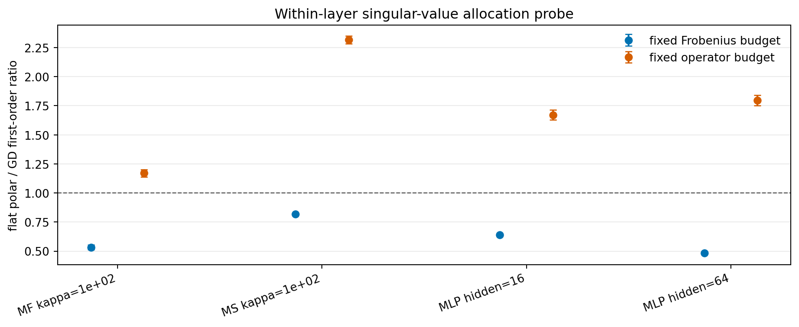

# E11 Within-Layer Spectral Allocation Probe

## Purpose

This probe addresses the remaining gap in the mechanism ladder: per-layer update-size control fixes how much each layer moves, but not how each layer's update singular values are allocated.

For each current gradient matrix \(G_i = U_i \Sigma_i V_i^\top\), the probe constructs three descent directions with the same gradient singular vectors:

- `gd_spectrum`: \(U_i \Sigma_i V_i^\top\), the gradient-descent singular-value allocation.
- `flat_polar`: \(U_i V_i^\top\), the Muon/polar singular-value allocation.
- `top_singular`: \(u_{i,1} v_{i,1}^\top\), a rank-one allocation.

Each direction is evaluated under either a fixed per-layer Frobenius-norm budget or a fixed per-layer operator-norm budget. The probe is run at initial, Adam-step-3, and Muon-step-3 states, with targets `(0.001, 0.01)` and 5 seeds.

## Flat Polar Versus GD Spectrum

Ratios above 1 mean the flat/polar singular-value allocation gives larger one-step first-order progress than the GD singular-value allocation under the same norm budget.

| group_type     | problem_family           | base_setting               | budget   |   n_pairs |   geomean_ratio |   ratio_ci95_low |   ratio_ci95_high | ratio_ci95_above_one   | ratio_ci95_below_one   |
|:---------------|:-------------------------|:---------------------------|:---------|----------:|----------------:|-----------------:|------------------:|:-----------------------|:-----------------------|
| setting_budget | MatrixFactorizationInput | MF input kappa=1e+02       | fro      |        30 |          0.5341 |           0.5154 |            0.5535 | False                  | True                   |
| setting_budget | MatrixFactorizationInput | MF input kappa=1e+02       | op       |        30 |          1.17   |           1.139  |            1.203  | True                   | False                  |
| setting_budget | MatrixSensing            | Matrix sensing kappa=1e+02 | fro      |        30 |          0.8192 |           0.8135 |            0.8249 | False                  | True                   |
| setting_budget | MatrixSensing            | Matrix sensing kappa=1e+02 | op       |        30 |          2.316  |           2.282  |            2.35   | True                   | False                  |
| setting_budget | SmallMLPDigits           | Small MLP digits hidden=16 | fro      |        30 |          0.6402 |           0.6285 |            0.652  | False                  | True                   |
| setting_budget | SmallMLPDigits           | Small MLP digits hidden=16 | op       |        30 |          1.672  |           1.63   |            1.714  | True                   | False                  |
| setting_budget | SmallMLPDigits           | Small MLP digits hidden=64 | fro      |        30 |          0.4849 |           0.4763 |            0.4936 | False                  | True                   |
| setting_budget | SmallMLPDigits           | Small MLP digits hidden=64 | op       |        30 |          1.797  |           1.752  |            1.842  | True                   | False                  |
| budget_all     | All                      | All                        | fro      |       120 |          0.6071 |           0.5846 |            0.6304 | False                  | True                   |
| budget_all     | All                      | All                        | op       |       120 |          1.689  |           1.614  |            1.768  | True                   | False                  |

## Rank-One Control

| group_type   | budget   | comparison                    | metric            |   n_pairs |   geomean_ratio |   ratio_ci95_low |   ratio_ci95_high | ratio_ci95_above_one   | ratio_ci95_below_one   |
|:-------------|:---------|:------------------------------|:------------------|----------:|----------------:|-----------------:|------------------:|:-----------------------|:-----------------------|
| budget_all   | fro      | top_singular_over_gd_spectrum | update_grad_inner |       120 |          0.6444 |           0.6035 |            0.688  | False                  | True                   |
| budget_all   | op       | top_singular_over_gd_spectrum | update_grad_inner |       120 |          0.413  |           0.3624 |            0.4706 | False                  | True                   |

## Direction-Level Diagnostics

| problem_family           | base_setting               | budget   | direction   |   points |   mean_delta_loss |   mean_update_grad_inner |   mean_update_grad_cosine |   mean_nr_update |   mean_st_update |   mean_grad_rank_fraction |
|:-------------------------|:---------------------------|:---------|:------------|---------:|------------------:|-------------------------:|--------------------------:|-----------------:|-----------------:|--------------------------:|
| MatrixFactorizationInput | MF input kappa=1e+02       | fro      | flat_polar  |       30 |         6.19e-07  |                6.053e-07 |                    0.1287 |            5     |            5     |                    0.2869 |
| MatrixFactorizationInput | MF input kappa=1e+02       | fro      | gd_spectrum |       30 |         1.312e-06 |                1.252e-06 |                    0.256  |            1.434 |            1.046 |                    0.2869 |
| MatrixFactorizationInput | MF input kappa=1e+02       | op       | flat_polar  |       30 |         7.306e-07 |                7.11e-07  |                    0.1411 |            5     |            5     |                    0.2869 |
| MatrixFactorizationInput | MF input kappa=1e+02       | op       | gd_spectrum |       30 |         6.761e-07 |                6.587e-07 |                    0.2802 |            1.434 |            1.046 |                    0.2869 |
| MatrixSensing            | Matrix sensing kappa=1e+02 | fro      | flat_polar  |       30 |         0.0001274 |                0.0001287 |                    0.8193 |           60     |           60     |                    0.6715 |
| MatrixSensing            | Matrix sensing kappa=1e+02 | fro      | gd_spectrum |       30 |         0.0001546 |                0.0001564 |                    1      |           40.29  |            7.547 |                    0.6715 |
| MatrixSensing            | Matrix sensing kappa=1e+02 | op       | flat_polar  |       30 |         0.0002646 |                0.0002709 |                    0.8193 |           60     |           60     |                    0.6715 |
| MatrixSensing            | Matrix sensing kappa=1e+02 | op       | gd_spectrum |       30 |         0.0001169 |                0.0001181 |                    1      |           40.29  |            7.547 |                    0.6715 |
| SmallMLPDigits           | Small MLP digits hidden=16 | fro      | flat_polar  |       30 |         9.465e-05 |                9.445e-05 |                    0.5847 |           13     |           13     |                    0.4483 |
| SmallMLPDigits           | Small MLP digits hidden=16 | fro      | gd_spectrum |       30 |         0.0001509 |                0.0001507 |                    0.9109 |            5.572 |            2.064 |                    0.4483 |
| SmallMLPDigits           | Small MLP digits hidden=16 | op       | flat_polar  |       30 |         0.000166  |                0.0001654 |                    0.5803 |           13     |           13     |                    0.4483 |
| SmallMLPDigits           | Small MLP digits hidden=16 | op       | gd_spectrum |       30 |         0.0001051 |                0.0001049 |                    0.9265 |            5.572 |            2.064 |                    0.4483 |
| SmallMLPDigits           | Small MLP digits hidden=64 | fro      | flat_polar  |       30 |         0.0002818 |                0.0002814 |                    0.4348 |           37     |           37     |                    0.3697 |
| SmallMLPDigits           | Small MLP digits hidden=64 | fro      | gd_spectrum |       30 |         0.0005665 |                0.0005669 |                    0.8976 |            7.007 |            2.25  |                    0.3697 |
| SmallMLPDigits           | Small MLP digits hidden=64 | op       | flat_polar  |       30 |         0.0006178 |                0.0006171 |                    0.3571 |           37     |           37     |                    0.3697 |
| SmallMLPDigits           | Small MLP digits hidden=64 | op       | gd_spectrum |       30 |         0.0003654 |                0.0003653 |                    0.9276 |            7.007 |            2.25  |                    0.3697 |

## Interpretation

The norm constraint matters. Under a fixed Frobenius budget, the GD singular-value allocation is expected to be first-order optimal by Cauchy-Schwarz, so flat/polar should not beat it. Under a fixed operator-norm budget, flat/polar can use more singular directions at the same operator norm, so it can be favorable when the gradient has useful multi-directional spectral mass.

This gives a more precise version of the Muon mechanism: Muon's flat polar update is not universally better as a direction; it is a particular answer to an operator-norm-like geometry. Whether that helps depends on whether the task/layer gradient spectrum rewards spreading update mass across singular directions.

## Caveats

1. These are artificial one-step probes, not natural optimizer trajectories.
2. The probe reuses gradient singular vectors, so it isolates singular-value allocation rather than singular-vector mismatch.
3. Adam's actual direction is not modeled here; this only compares gradient-spectrum, flat-polar, and rank-one allocations.
