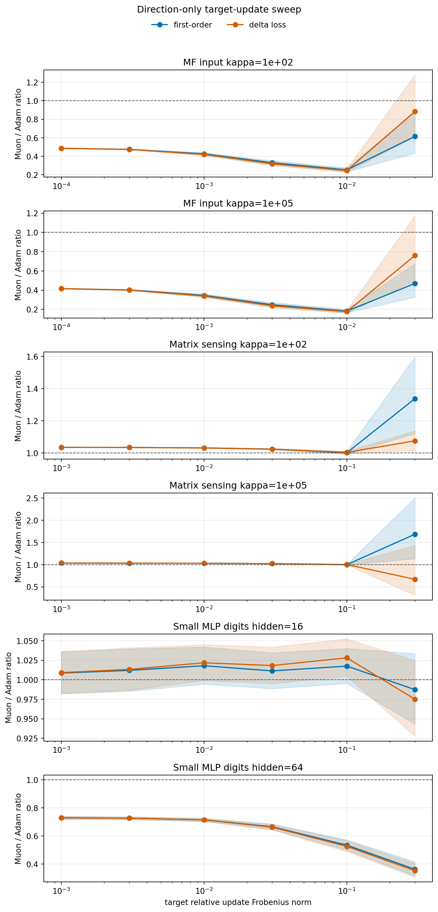
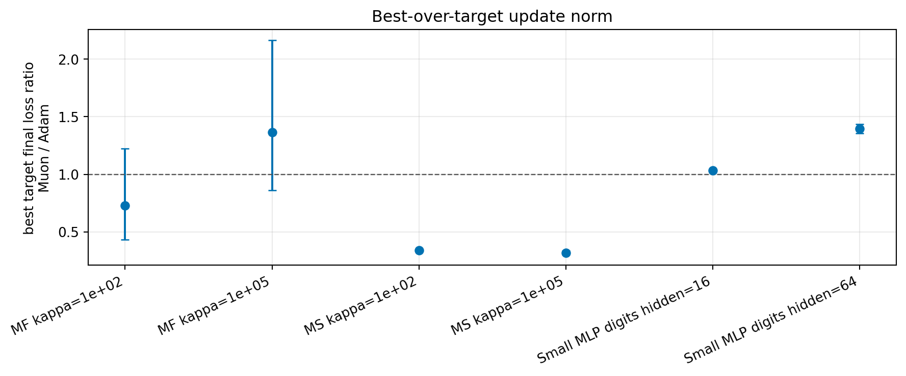

# E11 Target-Update-Norm Sweep

## Purpose

The equal-update experiments force Adam and Muon to have the same global update norm, but the chosen norm is inherited from each candidate learning rate. This sweep decouples update direction from update magnitude by directly setting the global relative Frobenius norm of each proposed update.

MF targets are `(0.0001, 0.0003, 0.001, 0.003, 0.01, 0.03)`. Matrix Sensing and SmallMLP targets are `(0.001, 0.003, 0.01, 0.03, 0.1, 0.3)`. Each setting uses 5 seeds and the same diagnostic pipeline as the main experiments.

## Direction-Only First-Order Ratios

Ratios above 1 mean Muon's rescaled update direction produces larger one-step progress than Adam's rescaled update direction at the same target update norm.

| problem_family           | base_setting               | metric            |   n_pairs |   muon_win_rate |   geomean_ratio_muon_over_adam |   ratio_ci95_low |   ratio_ci95_high | ratio_ci95_above_one   | ratio_ci95_below_one   |
|:-------------------------|:---------------------------|:------------------|----------:|----------------:|-------------------------------:|-----------------:|------------------:|:-----------------------|:-----------------------|
| MatrixFactorizationInput | MF input kappa=1e+02       | update_grad_inner |       300 |         0.03667 |                         0.4143 |           0.3868 |            0.4438 | False                  | True                   |
| MatrixFactorizationInput | MF input kappa=1e+02       | delta_loss        |       300 |         0.06333 |                         0.4345 |           0.4023 |            0.4693 | False                  | True                   |
| MatrixFactorizationInput | MF input kappa=1e+05       | update_grad_inner |       300 |         0.03333 |                         0.3266 |           0.3035 |            0.3515 | False                  | True                   |
| MatrixFactorizationInput | MF input kappa=1e+05       | delta_loss        |       300 |         0.06    |                         0.3483 |           0.3182 |            0.3812 | False                  | True                   |
| MatrixSensing            | Matrix sensing kappa=1e+02 | update_grad_inner |       150 |         0.8533  |                         1.072  |           1.038  |            1.107  | True                   | False                  |
| MatrixSensing            | Matrix sensing kappa=1e+02 | delta_loss        |       150 |         0.88    |                         1.031  |           1.025  |            1.038  | True                   | False                  |
| MatrixSensing            | Matrix sensing kappa=1e+05 | update_grad_inner |       150 |         0.86    |                         1.113  |           1.039  |            1.192  | True                   | False                  |
| MatrixSensing            | Matrix sensing kappa=1e+05 | delta_loss        |       150 |         0.8667  |                         0.9739 |           0.8936 |            1.061  | False                  | False                  |
| SmallMLPDigits           | Small MLP digits hidden=16 | update_grad_inner |       300 |         0.5     |                         1.009  |           0.9975 |            1.021  | False                  | False                  |
| SmallMLPDigits           | Small MLP digits hidden=16 | delta_loss        |       300 |         0.5367  |                         1.011  |           0.9986 |            1.023  | False                  | False                  |
| SmallMLPDigits           | Small MLP digits hidden=64 | update_grad_inner |       300 |         0       |                         0.6047 |           0.5818 |            0.6285 | False                  | True                   |
| SmallMLPDigits           | Small MLP digits hidden=64 | delta_loss        |       300 |         0       |                         0.5996 |           0.5762 |            0.624  | False                  | True                   |

## Best-Over-Target Result

For each seed and optimizer, the best target update norm is selected by lowest final loss. This is an oracle diagnostic for direction-plus-step-size robustness.

| problem_family           | base_setting               |   n_seed_pairs |   muon_lower_final_loss_pairs |   final_loss_ratio_muon_over_adam |   final_loss_ratio_ci95_low |   final_loss_ratio_ci95_high | final_loss_ratio_ci95_below_one   |   total_decrease_ratio_muon_over_adam |   total_decrease_ratio_ci95_low |   total_decrease_ratio_ci95_high |   mean_best_target_adam |   mean_best_target_muon |
|:-------------------------|:---------------------------|---------------:|------------------------------:|----------------------------------:|----------------------------:|-----------------------------:|:----------------------------------|--------------------------------------:|--------------------------------:|---------------------------------:|------------------------:|------------------------:|
| MatrixFactorizationInput | MF input kappa=1e+02       |              5 |                             3 |                            0.7288 |                      0.4345 |                       1.222  | False                             |                                1.053  |                          0.9636 |                           1.15   |                  0.03   |                    0.03 |
| MatrixFactorizationInput | MF input kappa=1e+05       |              5 |                             0 |                            1.364  |                      0.8601 |                       2.164  | False                             |                                0.9304 |                          0.826  |                           1.048  |                  0.03   |                    0.03 |
| MatrixSensing            | Matrix sensing kappa=1e+02 |              5 |                             5 |                            0.3379 |                      0.3287 |                       0.3473 | True                              |                                1.226  |                          1.21   |                           1.241  |                  0.1    |                    0.3  |
| MatrixSensing            | Matrix sensing kappa=1e+05 |              5 |                             5 |                            0.3197 |                      0.303  |                       0.3373 | True                              |                                1.208  |                          1.196  |                           1.221  |                  0.1    |                    0.3  |
| SmallMLPDigits           | Small MLP digits hidden=16 |              5 |                             0 |                            1.032  |                      1.021  |                       1.043  | False                             |                                0.736  |                          0.6813 |                           0.7952 |                  0.3    |                    0.3  |
| SmallMLPDigits           | Small MLP digits hidden=64 |              5 |                             0 |                            1.395  |                      1.354  |                       1.437  | False                             |                                0.2159 |                          0.2046 |                           0.2278 |                  0.3    |                    0.3  |
| All                      | All                        |             30 |                            13 |                            0.7326 |                      0.5745 |                       0.9341 | True                              |                                0.783  |                          0.6226 |                           0.9848 |                  0.1433 |                    0.21 |

## First-Order Calibration

| group   |   points |   spearman_delta_vs_first_order |   spearman_ci95_low |   spearman_ci95_high |   within_factor_2 |
|:--------|---------:|--------------------------------:|--------------------:|---------------------:|------------------:|
| All     |     3000 |                          0.9593 |              0.9563 |               0.9621 |            0.9898 |
| Adam    |     1500 |                          0.9741 |              0.9714 |               0.9766 |            0.9809 |
| Muon    |     1500 |                          0.9443 |              0.9386 |               0.9496 |            0.9987 |

## Update-Spectrum Check

| metric       | problem_family   |   n_pairs |   geomean_ratio_muon_over_adam |   ratio_ci95_low |   ratio_ci95_high | ratio_ci95_above_one   |
|:-------------|:-----------------|----------:|-------------------------------:|-----------------:|------------------:|:-----------------------|
| nrUpdate     | All              |       180 |                          1.954 |            1.862 |             2.051 | True                   |
| stUpdate     | All              |       180 |                          5.482 |            5.241 |             5.734 | True                   |
| nrUpdateFrac | All              |       180 |                          1.817 |            1.736 |             1.902 | True                   |
| stUpdateFrac | All              |       180 |                          4.731 |            4.624 |             4.839 | True                   |

## Interpretation

This experiment asks a cleaner direction question than the learning-rate sweep. The main thing to inspect is whether a setting remains Muon-favorable across target norms, or only after selecting a favorable step size. If Muon wins only at particular target norms, then the update-spectrum story is still real but not sufficient: step-size scale is part of the mechanism.

The update-spectrum claim should remain true under this sweep because rescaling an update changes singular values by a scalar but does not change effective rank, stable rank, or normalized rank fractions.

## Caveats

1. This sweep controls global update norm, not per-layer update allocation.
2. The best-target rows are oracle diagnostics and should not be read as a validation protocol.
3. Very large target update norms can leave the local first-order regime, so the target-wise curves are more informative than the single best-target number.
